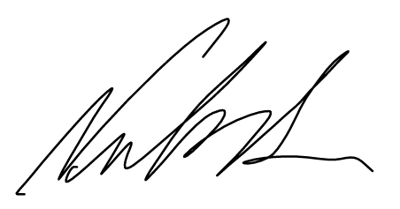
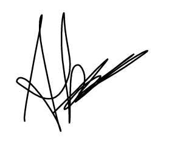
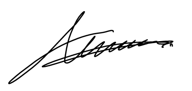
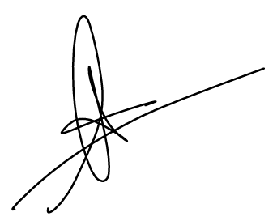
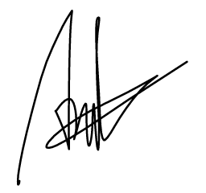

# Deklarasi Penggunaan AI

## Tugas Besar IF2150 - Rekayasa Perangkat Lunak

| Informasi | Keterangan |
|---|---|
| Kelas | K2 |
| Nomor Kelompok | 4 |
| Nama Kelompok | 0sks |
| Nama Perangkat Lunak | Ngaksara |

**Anggota Kelompok:**

| NIM | Nama |
|---|---|
| 13525029 | Muhammad Naufal Hilmi |
| 13525077 | Muhammad Abduh |
| 13525107 | Nathaniel Marvelo |
| 13525113 | Diandra Aria Yufana |
| 13525143 | Natan Danuarta Ariel Wicaksana |

---

### Daftar Isi
* [Milestone 1](#milestone-1)

---

### Log Penggunaan AI per Milestone

Silakan catat penggunaan AI yang berdampak signifikan pada pengerjaan tugas (misal: *generate* fungsi algoritma yang kompleks, *generate* draf dokumen SKPL/DPPL, atau *debugging* error utama). 
*Penggunaan sepele seperti memperbaiki *typo* atau auto-complete satu baris kode tidak perlu dicatat.*

### Milestone 1
| Tool AI | Tujuan Penggunaan | Contoh Prompt Utama | Modifikasi & Validasi Manusia |
| :--- | :--- | :--- | :--- |
| Claude | Memperbaiki diksi | "Kembangkan bahasa yang digunakan serta pertahankan diksi" | Mengecek apakah makna yang tertuai sesuai dengan makna awal |
| Gemini | Mengetahui aktor yang mungkin | "Saya sedang merancang perangkat lunak mengenai belajar aksara, siapa saja yang mungkin terlibat" | Digunakan untuk informasi tambahan dan memperbaiki apabila terdapat kesalahan pada daftar aktor, daftar aktor yang digunakan tetap berdasarkan hasil ide awal |
| Gemini | Mencari contoh aktivitas dari perangkat lunak lain sebagai referensi | "Apabila kamu membuat aplikasi untuk mencari pekerjaan, tentukan activity diagram dari aplikasi tersebut" | Digunakan untuk referensi aktivitas apa saja yang ada pada suatu aplikasi dan mengecek apakah ada kesalahan pada activity diagram yang telah dibuat |

### Milestone 2
| Tool AI | Tujuan Penggunaan | Contoh Prompt Utama | Modifikasi & Validasi Manusia |
| :--- | :--- | :--- | :--- |
| | | | | |

---
### Pernyataan Integritas dan Persetujuan

Kami yang bertanda tangan di bawah ini menyatakan bahwa seluruh log penggunaan AI di atas adalah benar. Kami telah memvalidasi seluruh hasil AI dan bertanggung jawab penuh atas orisinalitas, keamanan, dan kebenaran hasil akhir dari tugas ini.

| Tanda Tangan | Nama Anggota |
| :---: | :--- |
|  | 13525029 - Muhammad Naufal Hilmi |
|  | 13525077 - Muhammad Abduh |
|  | 13525107 - Nathaniel Marvelo |
|  | 13525113 - Diandra Aria Yufana |
|  | 13525143 - Natan Danuarta Ariel Wicaksana |
