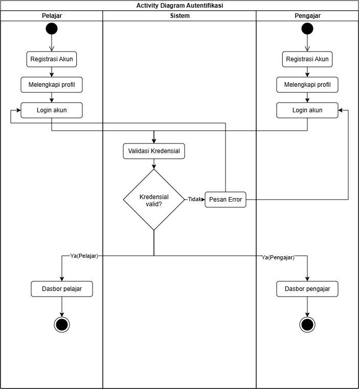
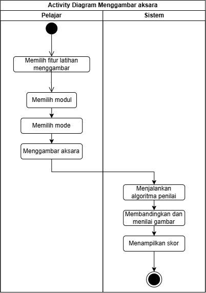
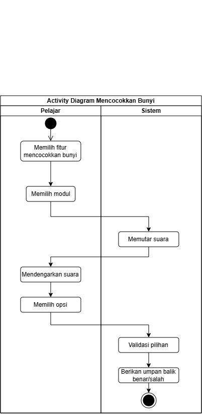

<h1>
IF2150 REKAYASA PERANGKAT LUNAK
 
TUGAS 1
 
TOPIC BRAINSTORMING
</h1>
 

## Ngaksara

### Untuk: Amanda Aurellia Salsabilla

Dipersiapkan oleh:
| Informasi | Keterangan |
| --- | --- |
| Kelas | K2 |
| Kelompok | 4  |

| NIM | Nama |
|---|---|
| 13525029 | Muhammad Naufal Hilmi |
| 13525077 | Muhammad Abduh |
| 13525107 | Nathaniel Marvelo |
| 13525113 | Diandra Aria Yufana |
| 13525143 | Natan Danuarta Ariel Wicaksana |
---

 
 

# BAB 1: Analisis Permasalahan

## 1.1 Latar Belakang Masalah
Indonesia adalah negara yang beragam. Keberagaman ini disebabkan oleh berbagai faktor, seperti letak negara, kondisi geografis sebagai negara kepulauan, serta kondisi sosial tiap daerah yang berbeda. Sebagai salah satu negara multikultural terbesar di dunia memiliki kurang lebih 1340 suku bangsa. Keberagaman yang dimiliki bangsa Indonesia ini menghasilkan berbagai kekayaan budaya, termasuk kurang lebih 700 bahasa daerah.

Bahasa-bahasa daerah yang dimiliki Indonesia ini bukanlah hanya menjadi alat komunikasi sehari-hari. Beberapa dari bahasa daerah yang ada di Indonesia memiliki sistem penulisan aksara yang khas. Dalam bahasa daerah juga memuat nilai-nilai adat istiadat yang dimiliki tiap daerah. Setiap nilai yang terkandung di bahasa daerah serta komponen bahasa itu sendiri, meliputi tata bahasa dan cara penulisannya adalah kekayaan bangsa yang patut untuk dipelajari dan dilestarikan.

Bahasa daerah adalah salah satu identitas yang dimiliki suatu daerah. Bahasa daerah ini memuat nilai-nilai luhur, cara hidup, dan pandangan dunia dari masyarakat daerah tersebut. Selain itu, dengan mempelajari bahasa daerah dapat menumbuhkan rasa memiliki dan kebanggaan akan daerah asal. Oleh karena itu, bahasa daerah harus dilestarikan agar tidak tergerus arus globalisasi sehingga keberagaman dan kekayaan bangsa tetap terjaga.

## 1.2 Analisis Kondisi Saat Ini
Bahasa daerah yang merupakan kekayaan bangsa ini sekarang tengah mengalami tantangan. Adanya ancaman, baik dari dalam maupun luar bangsa menjadikan penggunaan bahasa daerah semakin ditinggalkan. Padahal, bahasa daerah yang merupakan kekayaan bangsa seharusnya dilestarikan.

Menurut data dari Badan Pengembangan dan Pembinaan Bahasa Kementerian Pendidikan dan Kebudayaan, terdapat 11 bahasa daerah yang telah punah, dan puluhan lainnya terancam punah. Kondisi ini mencerminkan menurunnya partisipasi masyarakat dalam pelestarian bahasa daerah. Terancamnya keberlangsungan bahasa daerah ini disebabkan oleh beberapa faktor, seperti rendahnya kesadaran generasi muda untuk mempelajari dan melestarikan bahasa daerah, pengaruh globalisasi, dan kurangnya pewarisan antargenerasi.

Rendahnya keinginan generasi muda untuk mempelajari bahasa daerah disebabkan oleh beberapa hal. Salah satu penyebabnya adalah adanya anggapan bahwa bahasa daerah sudah ketinggalan zaman. Munculnya stigma tersebut didukung oleh globalisasi yang menjadikan bahasa asing lebih diminati oleh generasi muda. Selain itu, kurangnya niat generasi muda untuk mempelajari bahasa daerah juga disebabkan oleh metode pembelajaran bahasa daerah di sekolah yang terlalu kaku dan monoton. Hal ini menyebabkan minat atau ketertarikan untuk mempelajari dan melestarikan bahasa daerah berkurang.

---

# BAB 2: Analisis Solusi
## 2.1 Deskripsi Perangkat Lunak
Ngaksara merupakan solusi perangkat lunak yang kami usulkan sebagai upaya pemenuhan SDGs 4 (Quality Education) berbasis website. Alasan kami memilih media situs web adalah untuk memperluas aksesibilitas perangkat lunak kami serta tidak perlu ada prasyarat untuk mengunduh aplikasi terlebih dahulu. Situs ini dirancang untuk menunjang proses pembelajaran bahasa baru, dengan fokus pada bahasa dengan aksara/karakter yang rumit. Dengan aplikasi ini, kami berharap untuk dapat berkontribusi dalam pembelajaran berbagai bahasa, mulai dari bahasa lokal maupun global.

Salah satu fitur yang terdapat dalam Ngaksara adalah fitur menggambar suatu karakter sesuai dengan outline karakter tersebut, dengan opsi untuk menggambar tanpa outline bagi pengguna yang sudah mahir. Hasil gambar pengguna kemudian akan dinilai keakuratannya dengan karakter asli, sehingga pengguna dapat mengetahui sejauh mana bentuk goresan mereka sudah mendekati bentuk karakter yang benar. Penilaian ini juga dapat digunakan sebagai acuan bagi pengguna untuk mengulang latihan pada karakter tertentu apabila hasil yang didapatkan belum sesuai.

Selain itu, fitur mencocokkan aksara dengan pelafalan serta fitur menulis translasi dari rangkaian karakter merupakan solusi kami untuk meningkatkan familiaritas akan pelafalan karakter dan pemahaman dari bahasa tersebut. Kedua fitur ini kami rancang agar pengguna tidak hanya mampu menulis suatu karakter dengan baik, tetapi juga memahami cara pelafalannya, mengingat pada banyak bahasa dengan aksara rumit, bentuk tulisan dan cara baca suatu karakter tidak selalu berkaitan secara langsung.

Untuk mendukung proses belajar yang berkelanjutan, Ngaksara juga akan menyediakan materi pembelajaran yang disusun secara bertahap, mulai dari pengenalan karakter dasar hingga penggabungan karakter menjadi kata maupun kalimat sederhana. Dengan susunan materi seperti ini, kami berharap pengguna dapat mengikuti proses belajar sesuai dengan kemampuan mereka masing-masing, tanpa perlu merasa tertinggal maupun terlalu terbebani oleh materi yang diberikan.

## 2.2 Asumsi dan Batasan
Perancangan dan pengembangan Ngaksara dilandasi oleh sejumlah asumsi, baik secara teknis maupun kemampuan pengguna. Asumsi teknis mencakup kondisi sistem dan kapasitas perangkat lunak untuk menunjang keberlangsungan operasi, sedangkan asumsi pengguna mencakup kemampuan individu pengguna untuk dapat mengoperasikan perangkat lunak sesuai dengan tujuan yang dimaksudkan.
| Kategori | Asumsi |
| --- | --- |
| Teknis | Sistem dapat berjalan sesuai dengan fungsi yang dimaksudkan dan dapat diperbarui pada aspek fitur tertentu |
| Teknis | Sistem mampu berjalan secara berkesinambung dan melayani permintaan pengguna tanpa adanya gangguan yang berarti |
| Pengguna | Pengguna memiliki gawai serta infrastruktur yang memadai untuk menunjang penggunaan perangkat lunak |
| Pengguna | Pengguna memiliki kemampuan untuk mengoperasikan website, seperti mendaftarkan akun, menggunakan fitur-fitur yang tersedia, dan melaporkan permasalahan yang muncul |
| Pengguna | Pengguna memiliki kemampuan untuk mengunggah materi yang sesuai dan mampu mengelola data-data pelajar dibawahnya |

Asumsi-asumsi tersebut kami susun berdasarkan pertimbangan bahwa Ngaksara akan digunakan oleh dua kelompok pengguna dengan peran berbeda, yaitu pelajar yang berfokus pada latihan penulisan dan pelafalan karakter, serta pengajar atau pengelola materi yang bertanggung jawab atas keberlangsungan proses belajar di dalam sistem. Dengan adanya pembagian peran ini, asumsi teknis dan asumsi pengguna perlu dipenuhi secara berimbang agar sistem dapat berfungsi sebagaimana mestinya.

Selain asumsi di atas, terdapat sejumlah batasan yang melatarbelakangi pengembangan perangkat lunak akmi. Keterbatasan berasal dari penetapan fitur dan skema yang realistis, keterbatasan sumber daya, dan regulasi terkait.
| Kategori | Batasan |
| --- | --- |
| Fitur | Fitur yang ditawarkan harus dapat direalisasikan tanpa ada reduksi fitur yang berarti |
| Sumber Daya | Sistem harus dapat direalisasikan sesuai dengan constraint yang ada, sumber daya manusia dan kemampuan personil |
| Sumber Daya | Prioritas sistem diletakkan pada fitur inti, pemaparan pengetahuan dan penunjang pembelajaran |
| Regulasi | Perangkat lunak dapat dipergunakan sesuai dengan regulasi dari lembaga terkait untuk menunjang penggunaan Ngaksara sebagai sarana perolehan sertifikat kemahiran bahasa |

Batasan-batasan tersebut kami tetapkan agar pengembangan Ngaksara tetap berada dalam cakupan yang dapat kami penuhi, baik dari segi waktu pengerjaan maupun kapasitas tim pengembang. Penetapan prioritas pada fitur inti juga dimaksudkan agar fungsi utama dari Ngaksara, yaitu penunjang pembelajaran aksara, dapat terealisasi dengan baik sebelum penambahan fitur-fitur pendukung lainnya. Adapun aspek regulasi turut menjadi pertimbangan penting, mengingat Ngaksara diharapkan dapat berkembang lebih jauh sebagai sarana yang diakui dalam proses pembelajaran maupun penilaian kemahiran berbahasa.

---

# BAB 3: Spesifikasi Kebutuhan dan Proses Bisnis

## 3.1 Identifikasi Aktor

| Aktor | Deskripsi |
| :--- | :--- |
| Pelajar | Pengguna yang login ke aplikasi untuk belajar dan berlatih aksara Jawa dan Sunda. Pengguna ini dapat menggunakan fitur komunikasi untuk bertanya langsung kepada pengajar jika mengalami kesulitan dalam menjalankan aplikasi maupun kebingungan terkait materi.|
| Pengajar | Pengguna yang login sebagai fasilitator pembelajaran. Pengguna ini memiliki akses untuk melihat rekam jejak latihan pelajar, menganalisis kelemahan yang mereka hadapi berdasarkan data latihan, serta membalas pertanyaan yang diajukan oleh pelajar.|
| Tim Materi | Pengguna yang bertindak sebagai pengelola konten materi. Tim materi membutuhkan akses untuk mengelola modul. |
| Programmer | Pengguna yang bertindak sebagai teknisi pemelihara sistem aplikasi. Pengguna ini memantau kelancaran fitur fitur agar aplikasi berjalan lancar. |

## 3.2 Kebutuhan Pengguna Awal
| ID | Aktor | Kebutuhan / Aktivitas | Tujuan / Nilai |
| :--- | :--- | :--- | :--- |
| US-01 | Pelajar | Melihat bentuk dasar dan panduan baca aksara Jawa dan Sunda | Dapat mengenali bentuk dasar setiap huruf dari kedua aksara tersebut dengan benar. |
| US-02 | Pelajar | Melatih penulisan aksara dengan menebalkan garis. | Terbiasa dengan cara penulisan yang tepat |
| US-03 | Pelajar | Mengirimkan pertanyaan atau pesan kepada pengajar melalui aplikasi | Mendapatkan bantuan langsung dari pengajar saat kesulitan memahami materi |
| US-04 | Pengajar | Melihat rekam jejak dari riwayat penyelesaian latihan masing masing pelajar | Mengetahui perkembangan belajar pelajar secara berkala |
| US-05 | Pengajar | Menganalisis kelemahan penulisan pelajar | Dapat memberikan evaluasi dan bimbingan yang tepat sesuai kekurangan pelajar |
| US-06 | Pengajar | Membaca dan membalas pertanyaan yang dikirimkan oleh pelajar di dalam sistem | Memberikan solusi dan menjaga komunikasi interaktif selama proses pembelajaran |
| US-07 | Tim Materi | Mengunggah modul kurikulum untuk aksara Jawa dan Sunda | Memastikan materi yang disajikan selalu relevan dan lengkap |
| US-08 | Programmer | Memantau server dan fitur fiturnya | Memastikan materi yang disajikan lengkap dan mudah dipahami alurnya.|

## 3.3 Deskripsi Aktivitas
| ID | Aktivitas | Penjelasan | ID User Story |
| :--- | :--- | :--- | :--- |
| A01 | Melakukan login | Pengguna membuat akun untuk mendapatkan akses sesuai perannya (Pelajar, Pengajar, Tim Materi). | US-01, US-04, US-07 |
| A02 | Mempelajari Bentuk Aksara | Sistem menampilkan daftar materi dan panduan baca aksara Jawa dan Sunda untuk diakses oleh pelajar. | US-01 |
| A03 | Melakukan Latihan Penulisan | Pelajar menebalkan garis di layar, lalu aplikasi memproses penilaian dan memberikan koreksi.| US-02 |
| A04 | Mengajukan Pertanyaan | Pelajar mengirimkan pesan kendala materi kepada pengajar melalui fitur komunikasi | US-03 |
| A05 | Memantau Riwayat Latihan | Aplikasi memberikan rekam jejak latihan pelajar untuk dilihat oleh pengajar.| US-04 |
| A06 | Menjawab Pertanyaan Pelajar | Pengajar membaca pesan dari pelajar dan mengirimkan solusi atau penjelasan. | US-06 |
| A07 | Mengelola Konten Kurikulum | Tim materi mengunggah modul materi maupun latihan aksara yang telah dibuat ke database. | US-07 |
| A08 | Memelihara Aplkasi | Programmer memantau server supaya tidak ada kendala. | US-08 |

## 3.4 Model Proses Bisnis

 

<i>Gambar 1. Activity Diagram Autentikasi</i>

<i>Gambar 2. Activity Diagram Menggambar Aksara</i>

<i>Gambar 3. Activity Diagram Mencocokkan Bunyi Aksara</i>

 
# Referensi
- Diagram UML: https://www.drawio.com/, https://staruml.io/
