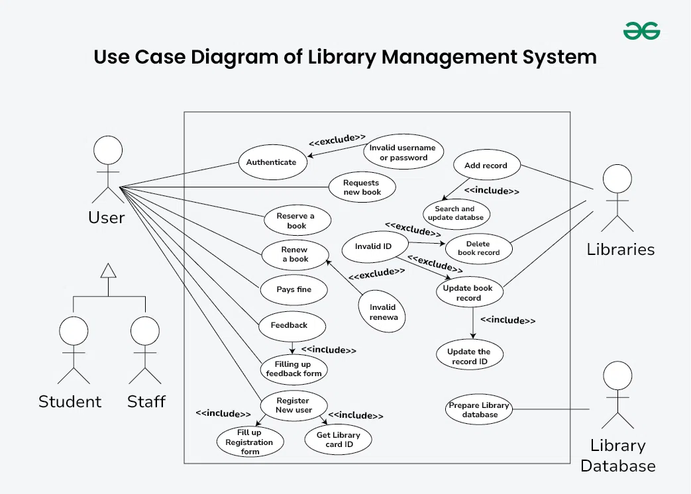

<h1>
IF2150 REKAYASA PERANGKAT LUNAK
 
TUGAS 3
 
USE CASE & SCENARIO USE CASE
</h1>
 

## Ngaksara

### Untuk: Amanda Aurellia Salsabilla

Dipersiapkan oleh:
| Informasi | Keterangan |
| --- | --- |
| Kelas | K2 |
| Kelompok | 4  |

| NIM | Nama |
|---|---|
| 13525026 | Ryuza Nadif Aldebaran |
| 13525029 | Muhammad Naufal Hilmi |
| 13525077 | Muhammad Abduh |
| 13525107 | Nathaniel Marvelo |
| 13525113 | Diandra Aria Yufana |
| 13525143 | Natan Danuarta Ariel Wicaksana |
---

## Daftar Perubahan

| Revisi | Deskripsi |
| :--- | :--- |
| *A* | *Deskripsikan perubahan yang dilakukan dari dokumen sebelumnya pada dokumen ini. Jika tidak terdapat perubahan, harap kosongkan tabel.* |
| *B* |  |
| *C* |  |
| ... |  |

 
 

# BAB 1: Deskripsi Perangkat Lunak
Ngaksara merupakan solusi perangkat lunak yang kami usulkan sebagai upaya pemenuhan SDGs 4 (Quality Education) berbasis website. Alasan kami memilih media situs web adalah untuk memperluas aksesibilitas perangkat lunak kami serta tidak perlu ada prasyarat untuk mengunduh aplikasi terlebih dahulu. Situs ini dirancang untuk menunjang proses pembelajaran bahasa baru, dengan fokus pada bahasa dengan aksara/karakter yang rumit. Dengan aplikasi ini, kami berharap untuk dapat berkontribusi dalam pembelajaran berbagai bahasa, mulai dari bahasa lokal maupun global.

Salah satu fitur yang terdapat dalam Ngaksara adalah fitur menggambar suatu karakter sesuai dengan outline karakter tersebut, dengan opsi untuk menggambar tanpa outline bagi pengguna yang sudah mahir. Hasil gambar pengguna kemudian akan dinilai keakuratannya dengan karakter asli, sehingga pengguna dapat mengetahui sejauh mana bentuk goresan mereka sudah mendekati bentuk karakter yang benar. Penilaian ini juga dapat digunakan sebagai acuan bagi pengguna untuk mengulang latihan pada karakter tertentu apabila hasil yang didapatkan belum sesuai.

Selain itu, fitur mencocokkan aksara dengan pelafalan serta fitur menulis translasi dari rangkaian karakter merupakan solusi kami untuk meningkatkan familiaritas akan pelafalan karakter dan pemahaman dari bahasa tersebut. Kedua fitur ini kami rancang agar pengguna tidak hanya mampu menulis suatu karakter dengan baik, tetapi juga memahami cara pelafalannya, mengingat pada banyak bahasa dengan aksara rumit, bentuk tulisan dan cara baca suatu karakter tidak selalu berkaitan secara langsung.

Untuk mendukung proses belajar yang berkelanjutan, Ngaksara juga akan menyediakan materi pembelajaran yang disusun secara bertahap, mulai dari pengenalan karakter dasar hingga penggabungan karakter menjadi kata maupun kalimat sederhana. Dengan susunan materi seperti ini, kami berharap pengguna dapat mengikuti proses belajar sesuai dengan kemampuan mereka masing-masing, tanpa perlu merasa tertinggal maupun terlalu terbebani oleh materi yang diberikan.

---

# BAB 2: Kebutuhan Fungsional (KF)
Salin ulang **seluruh Kebutuhan Fungsional (KF)** yang telah didefinisikan pada dokumen *Requirement Gathering*. Tabel ini menjadi acuan *traceability*, dimana setiap Use Case pada BAB 3 wajib ditelusuri ke satu atau lebih ID KF di tabel ini, dan sebaliknya setiap KF idealnya tercakup oleh minimal satu Use Case. Pastikan juga sudah menggunakan **format EARS** dalam penulisan KF.

| ID KF | Kebutuhan | Penjelasan |
| :--- | :--- | :--- |
| KF01 | R01 | Sistem harus menampilkan pilihan antarmuka pendaftaran akun untuk setiap opsi pengguna (pelajar, pengajar, maupun tim materi) |
| KF02 | R01 | Sistem harus memberikan akses kontrol/privilege berbeda untuk setiap jenis pengguna |
| KF03 | R02 | Sistem harus menampilkan pilihan antarmuka log-in untuk setiap opsi pengguna (pelajar, pengajar, maupun tim materi) |
| KF04 | R02 | Ketika pengguna melakukan pendaftaran akun, log in, atau logout, sistem harus memproses permintaan tersebut melalui pengecekan validitas kredensial |
| KF05 | R03 | Setelah pengguna membuat kata sandi, sistem harus mengenkripsi kata sandi tersebut sebelum disimpan di database |
| KF06 | R04 | Sistem harus menampilkan dokumen Terms & Conditions kepada pengguna saat membuat akun |
| KF07 | R04 | Bila pengguna belum mencapai akhir dokumen Terms & Conditions, maka sistem harus menolak melanjutkan pembuatan akun |
| KF08 | R05 | Sistem harus menampilkan tampilan antarmuka untuk setiap fitur pengajaran yang ditawarkan |
| KF09 | R06 | Ketika pengguna berada di halaman utama, sistem harus menampilkan daftar materi secara terurut berdasarkan jenis aksara atau tingkat kesulitan |
| KF10 | R08 | Jika tersedia opsi menampilkan outline, sistem harus menampilkan tampilan antarmuka fitur menggambar aksara sesuai dengan opsi outline yang dipilih pengguna |
| KF11 | R08 | Ketika pengguna berinteraksi dengan sistem dalam penggambaran aksara, sistem harus memproses interaksi tersebut |
| KF12 | R09 | Ketika pengguna menggoreskan aksara di layar, sistem harus menilai akurasi goresan tersebut terhadap template dengan algoritma yang sesuai |
| KF13 | R11 | Sistem harus menampilkan tampilan antarmuka riwayat pengerjaan latihan pelajar bagi pengajar |
| KF14 | R12 | Setelah pelajar melakukan aktivitas pembelajaran, sistem harus mencatat dan menyimpan riwayat aktivitas tersebut agar dapat diakses pengajar |
| KF15 | R13 | Ketika diperlukan pembaharuan materi, sistem harus mensinkronisasi data-data konten dari tim materi ke dalam database terpusat |
| KF16 | R14 | Ketika diperlukan pembaharuan materi, sistem harus memodifikasi konten pembelajaran sesuai dengan pilihan dan tingkat akses tim materi |
| KF17 | R16 | Dalam interval waktu yang rutin, sistem harus mencatat dan menyimpan log aktivitas dan error yang terjadi |
| KF18 | R18 | Saat pelajar memiliki keluhan atau feedback, sistem harus menerima keluhan tersebut melalui form yang tersedia |
| KF19 | R18 | Ketika sistem menerima keluhan atau feedback dari pelajar, sistem harus mengirimkannya ke server |
| KF20 | R18 | Ketika server menerima keluhan atau feedback dari pelajar, sistem harus menampilkan keluhan tersebut di tampilan antarmuka admin |

 ***Catatan***: *Jika ada KF dari ML2 yang berubah/bertambah/dihapus setelah asistensi, pastikan tabel ini konsisten dengan versi KF terbaru sebelum dikumpulkan.*

---

# BAB 3: Model Use Case

## 3.1 Identifikasi Aktor
Daftarkan seluruh aktor yang terlibat dalam use case yang akan dimodelkan. Aktor berupa pengguna manusia yang berinteraksi dengan solusi. Perlu diperhatikan bahwa Admin/Developer/ Pihak Eksternal lain yang bisa diotomisasi, tidak perlu dijadikan aktor.

| Aktor | Deskripsi |
| :--- | :--- |
| *Pelanggan* | *Pengguna yang melakukan transaksi pembelian dan pembayaran melalui sistem.* |
| *Kasir* | *Pengguna internal toko yang memverifikasi status pembayaran pelanggan sebelum menyerahkan barang.* |
| *...* | *...* |

## 3.2 Identifikasi Use Case
Identifikasi seluruh use case yang mencakup Kebutuhan Fungsional pada BAB 2. Satu use case boleh mencakup lebih dari satu KF, dan sebaliknya satu KF boleh muncul di lebih dari satu use case bila memang relevan.

| ID UC | Nama Use Case | Deskripsi Singkat | Aktor Terlibat | ID KF Terkait |
| :--- | :--- | :--- | :--- | :--- |
| *UC01* | *Melakukan Pembayaran Digital* | *Pelanggan memilih metode pembayaran dan menyelesaikan transaksi.* | *Pelanggan* | *KF01, KF02* |
| *UC02* | *Memverifikasi Status Pembayaran* | *Kasir mengecek status transaksi pelanggan sebelum menyerahkan barang.* | *Kasir* | *KF03* |
| *...* | *...* | *...* | *...* | *...* |

## 3.3 Use Case Diagram
Buatlah **satu** use case diagram yang mencakup seluruh aktor dan use case. Sertakan relasi *include*/*extend* apabila ada use case yang saling bergantung.
 

<i>Gambar 1. Contoh Use Case Diagram</i>

 

Hal-hal yang perlu diperhatikan dalam pembuatan use case diagram:
- Pastikan notasi UML use case (aktor, oval use case, garis asosiasi, *include/extend*) digambar dengan benar.
- Seluruh aktor dan use case yang telah didefinisikan harus muncul di diagram, tidak ada yang terlewat maupun berlebih.
- Hindari garis yang saling bersilangan tanpa alasan jelas, susun diagram agar mudah dibaca.
- Hindari istilah solusi teknis (misalnya nama tabel database, nama endpoint API) muncul di dalam diagram use case karena use case menjelaskan *interaksi fungsional*, bukan detail implementasi.

## 3.4 Skenario Use Case
Buat skenario untuk **setiap** use case yang telah diidentifikasi pada 3.2. Setiap skenario dapat terdiri dari dua jenis alur:
- **Skenario Normal**: alur utama (*happy path*) di mana interaksi aktor-sistem berjalan lancar tanpa kendala hingga tujuan use case tercapai.
- **Skenario Alternatif**: alur percabangan dari skenario normal, misalnya kondisi gagal, input tidak valid, atau pilihan lain yang tersedia bagi aktor. Boleh ada lebih dari satu skenario alternatif per use case jika ada beberapa titik percabangan berbeda.

Format tabel skenario: kolom **Aksi Aktor** berisi apa yang dilakukan/diinput aktor, kolom **Reaksi Perangkat Lunak** berisi respons sistem terhadap aksi tersebut secara **berurutan** (nomor langkah harus berpasangan/selaras antar dua kolom).

### 3.4.1 Skenario UC01

**Nama Use Case:** *Melakukan Pembayaran Digital*

**Skenario Normal**

| No | Aksi Aktor | Reaksi Perangkat Lunak |
| :--- | :--- | :--- |
| 1 | *Pelanggan memilih menu checkout* | *Sistem menampilkan ringkasan pesanan dan pilihan metode pembayaran* |
| 2 | *Pelanggan memilih metode pembayaran (misal: e-wallet)* | *Sistem mengarahkan pelanggan ke halaman konfirmasi e-wallet* |
| 3 | *Pelanggan mengonfirmasi pembayaran* | *Sistem menerima respons pembayaran berhasil, memperbarui status pesanan menjadi "Lunas", dan menampilkan notifikasi pembayaran berhasil* |

 

**Skenario Alternatif 1: Otorisasi Pembayaran Gagal**

| No | Aksi Aktor | Reaksi Perangkat Lunak |
| :--- | :--- | :--- |
| 1 | *Pelanggan memilih menu checkout* | *Sistem menampilkan ringkasan pesanan dan pilihan metode pembayaran* |
| 2 | *Pelanggan memilih metode pembayaran (misal: e-wallet)* | *Sistem mengarahkan pelanggan ke halaman konfirmasi e-wallet* |
| 3 | *Pelanggan mengonfirmasi pembayaran* | *Sistem menerima respons pembayaran gagal (misal: saldo tidak cukup). Sistem menampilkan pesan error dan meminta pelanggan memilih metode pembayaran lain* |
| 4 | *Pelanggan memilih metode pembayaran lain* | *Sistem kembali ke langkah 2 skenario normal* |

### 3.4.2 Skenario UC02

**Nama Use Case:** *Memverifikasi Status Pembayaran*

**Skenario Normal**

| No | Aksi Aktor | Reaksi Perangkat Lunak |
| :--- | :--- | :--- |
| 1 | *Kasir memasukkan ID Pesanan pelanggan* | *Sistem menampilkan status pembayaran ("Lunas") beserta detail transaksi* |

 

**Skenario Alternatif 1: ID Pesanan Tidak Ditemukan**

| No | Aksi Aktor | Reaksi Perangkat Lunak |
| :--- | :--- | :--- |
| 1 | *Kasir memasukkan ID Pesanan yang salah/tidak ada* | *Sistem menampilkan pesan "ID Pesanan tidak ditemukan" dan meminta kasir memasukkan ulang* |

*Lanjutkanlah pola 3.4.x ini untuk setiap ID UC yang telah diidentifikasi pada 3.2, sampai seluruh use case memiliki skenario normal dan skenario alternatif (tidak usah dibuat jika use case tersebut memang tidak memiliki skenario alternatif).*
