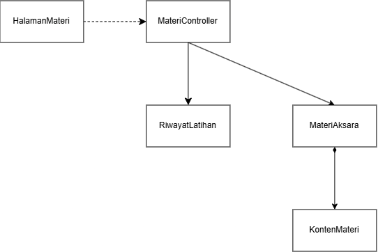
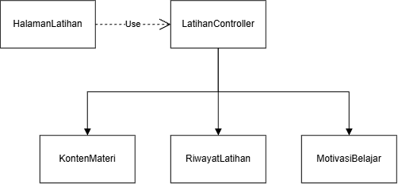
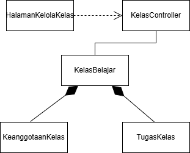
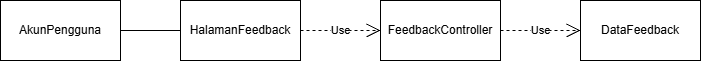
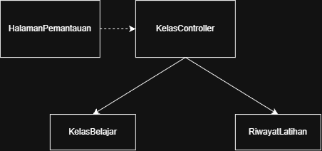

<h1>
IF2150 REKAYASA PERANGKAT LUNAK
 
TUGAS 4
 
CLASS DIAGRAM
</h1>
 

## Ngaksara

### Untuk: Amanda Aurellia Salsabilla

Dipersiapkan oleh:
| Informasi | Keterangan |
| --- | --- |
| Kelas | K2 |
| Kelompok | 4 |

| NIM      | Nama                           |
| -------- | ------------------------------ |
| 13525026 | Ryuza Nadif Aldebaran          |
| 13525029 | Muhammad Naufal Hilmi          |
| 13525077 | Muhammad Abduh                 |
| 13525107 | Nathaniel Marvelo              |
| 13525113 | Diandra Aria Yufana            |
| 13525143 | Natan Danuarta Ariel Wicaksana |

---

## Daftar Perubahan

| Revisi | Deskripsi                             |
| :----- | :------------------------------------ |
| _A_    | Memperjelas deskripsi perangkat lunak |
| _B_    |                                       |
| _C_    |                                       |
| ...    |                                       |

 
 

# BAB 1: Deskripsi Perangkat Lunak

Ngaksara merupakan solusi perangkat lunak berbasis web yang kami usulkan sebagai upaya pemenuhan SDGs 4 (Quality Education). Format web ini dipilih untuk meningkatkan aksesibilitas sehingga pengguna dapat langsung mengakses platform tanpa perlu mengunduh aplikasi terlebih dahulu. Ngaksara dirancang khusus untuk menunjang proses pembelajaran aksara yang kompleks, dengan fokus awal pada aksara Jawa dan Sunda. Melalui platform ini, kami berharap dapat berkontribusi dalam pelestarian dan pembelajaran berbagai bahasa daerah.

Platform ini dirancang untuk dua target pengguna utama yaitu pelajar dan pengajar. Pelajar memiliki fleksibilitas untuk belajar secara mandiri atau bergabung ke dalam kelas menggunakan kode yang dibagikan oleh pengajar. Di dalam kelas tersebut, pengajar dapat mendistribusikan latihan, menentukan tenggat waktu, memantau perkembangan siswa, mengidentifikasi bagian yang sering salah, serta memberikan umpan balik dan rekomendasi materi lanjutan.

Untuk metode pembelajarannya, salah satu mode latihan yang ditawarkan Ngaksara adalah menggambar aksara mengikuti garis panduan (outline), dengan opsi tanpa garis panduan bagi pengguna yang sudah mahir. Sistem akan menilai tingkat keakuratan hasil gambar pengguna dibandingkan dengan karakter aslinya. Evaluasi ini berfungsi sebagai tolak ukur sejauh mana goresan mereka sudah presisi sekaligus menjadi acuan untuk mengulang latihan pada karakter tertentu jika hasilnya belum maksimal.

Selain itu, Ngaksara juga menyediakan tiga mode latihan tambahan. Pertama, mode mencocokkan aksara dengan bunyi di mana pengguna memilih aksara atau rangkaian yang tepat berdasarkan audio yang diputar sistem. Kedua, mode merangkai aksara yang melatih pengguna menyusun aksara dan tanda baca menjadi suku kata atau kata sesuai aturan yang berlaku. Ketiga, mode transliterasi yaitu mengubah tulisan latin menjadi aksara Jawa/Sunda atau sebaliknya tanpa menerjemahkan makna kalimat. Ketiga metode latihan di atas merupakan solusi kami untuk meningkatkan penguasaan pelafalan dan pemahaman bahasa tersebut secara menyeluruh. Fitur-fitur ini dirancang agar pengguna tidak sekadar mampu menulis aksara dengan baik, tetapi juga tepat dalam melafalkannya, mengingat bentuk tulisan pada aksara yang kompleks sering kali tidak mencerminkan cara bacanya secara langsung.

Guna mendukung proses belajar yang berkelanjutan, Ngaksara menyediakan materi pembelajaran yang disusun secara bertahap. Materi dimulai dari pengenalan karakter dasar hingga penggabungan karakter menjadi kata dan kalimat sederhana. Melalui susunan yang terstruktur ini, kami berharap pengguna dapat mengikuti proses belajar sesuai dengan kecepatan dan kemampuan masing-masing, tanpa perlu merasa tertinggal atau terlalu terbebani oleh materi.

Untuk menjaga motivasi, Ngaksara menyimpan seluruh hasil latihan untuk membentuk rekam jejak progres belajar. Sistem ini menerapkan fitur streak harian, yang akan bertambah apabila pelajar menyelesaikan setidaknya satu aktivitas belajar yang sah (aktivitas yang hanya dibuka tanpa diselesaikan tidak akan menambah streak atau poin).

Sebagai pelengkap, terdapat fitur papan peringkat yang diterapkan secara eksklusif pada tingkat kelas (bukan global) dan dapat diaktifkan atau dinonaktifkan oleh pengajar. Poin pada papan peringkat diberikan berdasarkan penyelesaian dan ketepatan latihan. Sistem juga membatasi perolehan poin agar pengulangan soal yang sama tidak bisa digunakan untuk mengumpulkan poin tanpa batas. Privasi pelajar juga tetap terjaga karena identitas yang ditampilkan di papan peringkat menggunakan nama tampilan yang bebas mereka pilih.

---

# BAB 2: Kebutuhan Fungsional

## 2.1 Kebutuhan Fungsional

| ID KF | ID Kebutuhan | Penjelasan                                                                                                                                                   |
| ----- | ------------ | ------------------------------------------------------------------------------------------------------------------------------------------------------------ |
| KF01  | R01          | Sistem harus menampilkan pilihan antarmuka pendaftaran akun untuk setiap opsi pengguna (pelajar, pengajar, maupun tim materi)                                |
| KF02  | R01          | Sistem harus memberikan akses kontrol/privilege berbeda untuk setiap jenis pengguna                                                                          |
| KF03  | R02          | Sistem harus menampilkan pilihan antarmuka log-in untuk setiap opsi pengguna (pelajar, pengajar, maupun tim materi)                                          |
| KF04  | R02          | Ketika pengguna melakukan pendaftaran akun, log in, atau logout, sistem harus memproses permintaan tersebut melalui pengecekan validitas kredensial          |
| KF05  | R03          | Setelah pengguna membuat kata sandi, sistem harus mengenkripsi kata sandi tersebut sebelum disimpan di database                                              |
| KF06  | R04          | Sistem harus menampilkan dokumen Terms & Conditions kepada pengguna saat membuat akun                                                                        |
| KF07  | R04          | Bila pengguna belum mencapai akhir dokumen Terms & Conditions, maka sistem harus menolak melanjutkan pembuatan akun                                          |
| KF08  | R05          | Sistem harus menampilkan tampilan antarmuka untuk setiap fitur pengajaran yang ditawarkan                                                                    |
| KF09  | R06          | Ketika pengguna berada di halaman utama, sistem harus menampilkan daftar materi secara terurut berdasarkan jenis aksara atau tingkat kesulitan               |
| KF10  | R08          | Jika tersedia opsi menampilkan outline, sistem harus menampilkan tampilan antarmuka fitur menggambar aksara sesuai dengan opsi outline yang dipilih pengguna |
| KF11  | R08          | Ketika pengguna berinteraksi dengan sistem dalam penggambaran aksara, sistem harus memproses interaksi tersebut                                              |
| KF12  | R09          | Ketika pengguna menggoreskan aksara di layar, sistem harus menilai akurasi goresan tersebut terhadap template dengan algoritma yang sesuai                   |
| KF13  | R11          | Sistem harus menampilkan tampilan antarmuka riwayat pengerjaan latihan pelajar bagi pengajar                                                                 |
| KF14  | R12          | Setelah pelajar melakukan aktivitas pembelajaran, sistem harus mencatat dan menyimpan riwayat aktivitas tersebut agar dapat diakses pengajar                 |
| KF15  | R13          | Ketika diperlukan pembaharuan materi, sistem harus mensinkronisasi data-data konten dari tim materi ke dalam database terpusat                               |
| KF16  | R14          | Ketika diperlukan pembaharuan materi, sistem harus memodifikasi konten pembelajaran sesuai dengan pilihan dan tingkat akses tim materi                       |
| KF17  | R16          | Dalam interval waktu yang rutin, sistem harus mencatat dan menyimpan log aktivitas dan error yang terjadi                                                    |
| KF18  | R18          | Saat pelajar memiliki keluhan atau feedback, sistem harus menerima keluhan tersebut melalui form yang tersedia                                               |
| KF19  | R18          | Ketika sistem menerima keluhan atau feedback dari pelajar, sistem harus mengirimkannya ke server                                                             |
| KF20  | R18          | Ketika server menerima keluhan atau feedback dari pelajar, sistem harus menampilkan keluhan tersebut di tampilan antarmuka admin                             |

---

# BAB 3: Model Use Case

## 3.1 Identifikasi Aktor

| Aktor         | Deskripsi                                                                                                                                                                                                                                                        |
| :------------ | :--------------------------------------------------------------------------------------------------------------------------------------------------------------------------------------------------------------------------------------------------------------- |
| Pelajar       | Pengguna yang login ke aplikasi untuk belajar dan berlatih aksara Jawa dan Sunda. Pengguna ini dapat menggunakan fitur komunikasi untuk bertanya langsung kepada pengajar jika mengalami kesulitan dalam menjalankan aplikasi maupun kebingungan terkait materi. |
| Pengajar      | Pengguna yang login sebagai fasilitator pembelajaran. Pengguna ini memiliki akses untuk melihat rekam jejak latihan pelajar, menganalisis kelemahan yang mereka hadapi berdasarkan data latihan, serta membalas pertanyaan yang diajukan oleh pelajar.           |
| Tim Materi    | Pengguna yang bertindak sebagai pengelola konten materi. Tim materi membutuhkan akses untuk mengelola modul.                                                                                                                                                     |
| Administrator | Pengguna yang bertindak sebagai teknisi pemelihara sistem aplikasi. Pengguna ini memantau kelancaran fitur fitur agar aplikasi berjalan lancar.                                                                                                                  |

## 3.2 Identifikasi Use Case

| ID UC | Nama Use Case | Deskripsi Singkat | Aktor Terlibat | ID KF Terkait |
| :--- | :--- | :--- | :--- | :--- |
| UC01 | Melakukan pendaftaran akun | Pelajar, pengajar, atau tim materi melakukan pembuatan akun untuk dapat menggunakan perangkat lunak | Pelajar, pengajar, tim materi | KF01, KF02, KF03, KF04, KF05, KF06, KF07 |
| UC-02 | Mempelajari Materi | Pelajar memahami materi terbit untuk aksara dan tingkat yang dipilih. | Pelajar | |
| UC-03 | Mengerjakan Latihan Aksara | Pelajar menyelesaikan salah satu mode latihan dan memperoleh hasil serta umpan balik. | Pelajar | |
| UC-04 | Meninjau Progres dan Motivasi | Pelajar mengetahui perkembangan, materi yang perlu diulang, dan status motivasinya. | Pelajar | |
| UC-05 | Mengikuti Pembelajaran Kelas | Pelajar bergabung ke kelas dan menyelesaikan tugas yang diberikan Pengajar. | Pelajar | |
| UC06 | Memperbaharui materi | Tim materi melakukan pembaharuan atau perbaikan pada materi pembelajaran yang ada di perangkat lunak | Tim materi | KF15, KF16 |
| UC-07 | Menyiapkan Pembelajaran Kelas | Pengajar membentuk kelas, mengendalikan akses, mengelola anggota, dan menyediakan tugas. | Pengajar | |
| UC-08 | Memantau dan Menindaklanjuti Progres | Pengajar memahami perkembangan anggota dan memberikan tindak lanjut. | Pengajar | |
| UC09 | Menyampaikan feedback | Pelajar menyampaikan feedback yang dimiliki melalui form yang tersedia di perangkat lunak | Pelajar, pengajar, administrator | |

## 3.3 Use Case Diagram

 

<i>Gambar 1. Diagram Use Case Ngaksara</i>

 

## 3.4 Skenario Use Case

### 3.4.1 Skenario UC01

**Nama Use Case:** Melakukan Pendaftaran Akun

**Skenario Normal**

| No  | Aksi Aktor                                                      | Reaksi Perangkat Lunak                                                                    |
| :-- | :-------------------------------------------------------------- | :---------------------------------------------------------------------------------------- |
| 1   | Pengguna memilih opsi pendaftaran akun (pelajar, pengajar)      | Sistem menampilkan antarmuka opsi pemilihan jenis akun yang didaftarkan                   |
| 2   | Pengguna memasukkan kredensial akun (email, password, username) | Sistem menampilkan antarmuka pendaftaran akun dan memverifikasi kredensial yang digunakan |
| 3   | Pengguna membaca Terms & Conditions aplikasi                    | Sistem menerima afirmasi bahwa pengguna sudah membaca Terms & Conditions yang berlaku     |

 

**Skenario Alternatif 1: Otorisasi Pembayaran Gagal**

| No  | Aksi Aktor                                                      | Reaksi Perangkat Lunak                                                                    |
| :-- | :-------------------------------------------------------------- | :---------------------------------------------------------------------------------------- |
| 1   | Pengguna memilih opsi pendaftaran akun (pelajar, pengajar)      | Sistem menampilkan antarmuka opsi pemilihan jenis akun yang didaftarkan                   |
| 2   | Pengguna memasukkan kredensial akun (email, password, username) | Sistem menampilkan antarmuka pendaftaran akun dan memverifikasi kredensial yang digunakan |
| 3   | Pengguna memastikan kredensial yang digunakan sesuai.           | Kembali ke langkah 2 Skenario Normal                                                      |

### 3.4.2 Skenario UC02

**Nama Use Case:** Mempelajari Materi

**Skenario Normal**

| No. | Aksi Pelajar                               | Reaksi Perangkat Lunak                                                      |
| :-- | :----------------------------------------- | :-------------------------------------------------------------------------- |
| 1   | Memilih jenis aksara dan tingkat kesulitan | Sisitem menampilkan daftar materi yang sesuai beserta status progres        
| 2   | Memilih satu materi                        | Sistem memuat paket materi yang sesuai dengan versi perangkat lunak         |
| 3   | Membaca bentuk, aturan, dan contoh         | Sistem menampilkan isi materi secara utuh                                   |
| 4   | Meminta contoh bunyi pengucapan            | Sistem memutar audio yang terkait serta sesuai dengan versi perangkat lunak |

 

**Skenario Alternatif 1: Materi belum tersedia untuk kombinasi yang dipilih**

| No. | Aksi Pelajar                                              | Reaksi Perangkat Lunak                                                                                      |
| :-- | :-------------------------------------------------------- | :---------------------------------------------------------------------------------------------------------- |
| 1   | Memilih jenis aksara dan tingkat kesulitan                | Sistem tidak menemukan materi yang sesuai dan menampilkan pesan "materi belum tersedia untuk kombinasi ini" |
| 2   | Memilih kombinasi jenis aksara dan tingkat kesulitan lain | Sistem kembali ke langkah 1 Skenario Normal                                                                 |

 

**Skenario Alternatif 2: Audio pengucapan gagal diputar**

| No. | Aksi Pelajar                          | Reaksi Perangkat Lunak                                                                                             |
| :-- | :------------------------------------ | :----------------------------------------------------------------------------------------------------------------- |
| 1   | Membaca bentuk, aturan, dan contoh    | Sistem menampilkan isi materi secara utuh                                                                          |
| 2   | Meminta contoh bunyi pengucapan       | Sistem gagal memuat berkas audio (misal karena koneksi terputus) dan menampilkan pesan "audio tidak dapat diputar" |
| 3   | Meminta ulang contoh bunyi pengucapan | Sistem kembali ke langkah 4 Skenario Normal                                                                        |

### 3.4.3 Skenario UC03

**Nama Use Case:** Mengerjakan Latihan Aksara

**Skenario Normal**

| No. | Aksi Pelajar | Reaksi Perangkat Lunak |
| :--- | :--- | :--- |
| 1 | Memilih materi, lalu memilih salah satu mode latihan (menulis, mencocokkan bunyi, atau merangkai) | Sistem menyiapkan soal latihan sesuai mode dan target aksara yang dipilih |
| 2 | Mengerjakan latihan sesuai mode yang dipilih | Sistem menangkap dan menampilkan interaksi pelajar secara langsung |
| 3 | Mengirimkan jawaban/hasil latihan | Sistem mengevaluasi jawaban sesuai kriteria mode latihan dan menampilkan skor/status beserta feedback |
| 4 | Menyelesaikan latihan | Sistem menyimpan hasil ke riwayat latihan, serta memperbarui streak dan poin pelajar |

 

**Skenario Alternatif 1: Latihan mencocokkan bunyi**
 
| No. | Aksi Pelajar | Reaksi Perangkat Lunak |
| :--- | :--- | :--- |
| 1 | Memilih mode mencocokkan bunyi | Sistem memutar audio pengucapan dan menampilkan pilihan aksara |
| 2 | Memilih aksara yang sesuai dengan bunyi yang diputar | Sistem menampilkan status jawaban (benar/salah) beserta penjelasannya |
| 3 | Menyelesaikan latihan | Sistem menyimpan hasil ke riwayat latihan serta memperbarui streak dan poin |
 
 

**Skenario Alternatif 2: Latihan merangkai aksara**
 
| No. | Aksi Pelajar | Reaksi Perangkat Lunak |
| :--- | :--- | :--- |
| 1 | Memilih mode merangkai aksara | Sistem menampilkan komponen aksara dan tanda baca yang dapat disusun |
| 2 | Menyusun komponen menjadi suku kata/kata dan mengirimkannya | Sistem memvalidasi rangkaian berdasarkan aturan aksara yang berlaku dan menampilkan hasil |
| 3 | Menyelesaikan latihan | Sistem menyimpan hasil ke riwayat latihan serta memperbarui streak dan poin |
 
 

**Skenario Alternatif 3: Gambar aksara kurang akurat (mode menulis)**
 
| No. | Aksi Pelajar | Reaksi Perangkat Lunak |
| :--- | :--- | :--- |
| 1 | Memilih mode menulis dan target aksara | Sistem menampilkan outline aksara sesuai materi yang dipilih |
| 2 | Menggambarkan aksara sesuai outline yang tampil | Sistem menampilkan goresan sesuai interaksi pelajar |
| 3 | Mengirimkan hasil gambar | Sistem menilai keakuratan penulisan berada di bawah ambang batas |
| 4 | Mengulang latihan pada aksara yang sama | Sistem menampilkan kembali outline aksara yang sama untuk diulang, tanpa menambah streak/poin baru |

### 3.4.4 Skenario UC04

**Nama Use Case:** Meninjau Progres dan Motivasi
 
**Skenario Normal**
 
| No. | Aksi Pelajar | Reaksi Perangkat Lunak |
| :--- | :--- | :--- |
| 1 | Membuka halaman progres | Sistem menampilkan riwayat aktivitas dan tingkat penguasaan per materi |
| 2 | Memilih salah satu materi pada riwayat | Sistem menampilkan detail hasil latihan dan umpan balik untuk materi tersebut |
| 3 | Meminta rekomendasi materi lanjutan | Sistem menampilkan materi dengan tingkat penguasaan terendah yang masih relevan untuk dipelajari |
| 4 | Meninjau indikator motivasi (streak, poin, badge) | Sistem menampilkan streak harian, total poin, dan badge yang telah diperoleh pelajar |
 
 

**Skenario Alternatif 1: Belum ada riwayat pembelajaran**
 
| No. | Aksi Pelajar | Reaksi Perangkat Lunak |
| :--- | :--- | :--- |
| 1 | Membuka halaman progres | Sistem menampilkan keadaan kosong dan merekomendasikan materi awal untuk mulai dipelajari |
| 2 | Membuka rekomendasi materi awal | Sistem mengarahkan pelajar ke halaman mempelajari materi yang direkomendasikan |
 
 

**Skenario Alternatif 2: Melihat papan peringkat kelas**
 
| No. | Aksi Pelajar | Reaksi Perangkat Lunak |
| :--- | :--- | :--- |
| 1 | Membuka papan peringkat pada salah satu kelas yang diikuti | Sistem menampilkan urutan poin anggota kelas menggunakan nama tampilan masing-masing |

### 3.4.5 Skenario UC05

**Nama Use Case:** Mengikuti Pembelajaran Kelas
 
**Skenario Normal**
 
| No. | Aksi Pelajar | Reaksi Perangkat Lunak |
| :--- | :--- | :--- |
| 1 | Memasukkan kode kelas yang diberikan pengajar | Sistem memvalidasi kode dan mendaftarkan pelajar sebagai anggota kelas |
| 2 | Membuka kelas yang diikuti | Sistem menampilkan daftar tugas beserta tenggat waktu dan status pengerjaannya |
| 3 | Membuka salah satu tugas sebelum tenggat | Sistem menampilkan komponen materi atau latihan yang harus diselesaikan |
| 4 | Menyelesaikan seluruh komponen wajib pada tugas | Sistem mencatat waktu penyelesaian dan menetapkan status "tepat waktu" |
 
 

**Skenario Alternatif 1: Pelajar sudah menjadi anggota kelas**
 
| No. | Aksi Pelajar | Reaksi Perangkat Lunak |
| :--- | :--- | :--- |
| 1 | Membuka kelas tanpa memasukkan kode ulang | Sistem menampilkan daftar tugas kelas tanpa membuat keanggotaan baru |
 
 

**Skenario Alternatif 2: Tugas diselesaikan terlambat**
 
| No. | Aksi Pelajar | Reaksi Perangkat Lunak |
| :--- | :--- | :--- |
| 1 | Membuka tugas yang telah melewati tenggat | Sistem menampilkan status "terlambat" pada tugas tersebut |
| 2 | Menyelesaikan seluruh komponen wajib | Sistem mencatat waktu penyelesaian dan menetapkan status "terlambat" |
 
 

**Skenario Alternatif 3: Kode kelas tidak valid**
 
| No. | Aksi Pelajar | Reaksi Perangkat Lunak |
| :--- | :--- | :--- |
| 1 | Memasukkan kode kelas | Sistem tidak menemukan kode aktif yang cocok dan menampilkan pesan "kode tidak valid atau tidak aktif" |
| 2 | Memasukkan kode kelas yang benar | Sistem kembali ke langkah 1 Skenario Normal |

### 3.4.6 Skenario UC06

**Nama Use Case:** Memperbaharui Materi

**Skenario Normal**

| No  | Aksi Aktor                                                                               | Reaksi Perangkat Lunak                                            |
| :-- | :--------------------------------------------------------------------------------------- | :---------------------------------------------------------------- |
| 1   | Tim materi memilih menu pengelolaan materi                                               | Sistem menampilkan daftar materi yang dapat diedit.               |
| 2   | Tim materi memilih opsi menambahkan materi baru                                          | Sistem mengarahkan pelanggan ke halaman menambahkan materi        |
| 3   | Tim materi mengunggah file materi dan mengisi detail (nama, kategori, tingkat kesulitan) | Sistem memvalidasi dan menyimpan materi baru ke database terpusat |
| 4   | Tim materi menyimpan hasil perbaruan materi.                                             | Sistem menampilkan pesan "materi berhasil ditambahkan".           |

 

**Skenario Alternatif 1: Penambahan materi gagal**

| No  | Aksi Aktor                                 | Reaksi Perangkat Lunak                                                                                                                                                                                  |
| :-- | :----------------------------------------- | :------------------------------------------------------------------------------------------------------------------------------------------------------------------------------------------------------ |
| 1   | Tim materi memilih menu memperbarui materi | Sistem menampilkan ringkasan pesanan dan pilihan metode pembayaran                                                                                                                                      |
| 2   | Tim materi menambahkan materi baru         | Sistem menerima respons penambahan materi gagal (misal: jenis file tidak didukung website). Materi tidak berubah, sistem menampilkan pesan error dan meminta tim materi memilih ulang file materi baru. |
| 3   | Tim materi menambahkan materi ulang        | Sistem kembali ke langkah 2 skenario normal                                                                                                                                                             |

### 3.4.7 Skenario UC07
 
**Nama Use Case:** Menyiapkan Pembelajaran Kelas
 
**Skenario Normal**
 
| No. | Aksi Pengajar | Reaksi Perangkat Lunak |
| :--- | :--- | :--- |
| 1 | Membuat kelas baru dengan mengisi nama kelas | Sistem membuat kelas milik pengajar tersebut beserta satu kode kelas aktif yang unik |
| 2 | Membagikan kode kelas kepada pelajar | Sistem menampilkan daftar anggota yang bergabung |
| 3 | Memilih materi atau latihan dan menetapkan tenggat waktu | Sistem menyusun paket tugas sesuai materi/latihan dan tenggat yang dipilih |
| 4 | Menerbitkan tugas | Sistem menyediakan tugas tersebut hanya bagi anggota kelas yang bersangkutan |
 
 

**Skenario Alternatif 1: Mengganti kode kelas**
 
| No. | Aksi Pengajar | Reaksi Perangkat Lunak |
| :--- | :--- | :--- |
| 1 | Meminta pergantian kode kelas | Sistem menonaktifkan kode lama dan membuatkan satu kode aktif baru yang unik |
 
 

**Skenario Alternatif 2: Mengeluarkan anggota kelas**
 
| No. | Aksi Pengajar | Reaksi Perangkat Lunak |
| :--- | :--- | :--- |
| 1 | Memilih salah satu anggota untuk dikeluarkan | Sistem meminta konfirmasi pengeluaran anggota |
| 2 | Mengonfirmasi pengeluaran anggota | Sistem mengakhiri akses anggota tersebut ke kelas tanpa menghapus riwayat belajar pribadinya |
 
 

**Skenario Alternatif 3: Mengaktifkan papan peringkat kelas**
 
| No. | Aksi Pengajar | Reaksi Perangkat Lunak |
| :--- | :--- | :--- |
| 1 | Mengaktifkan papan peringkat pada pengaturan kelas | Sistem menyimpan status aktif dan menampilkan papan peringkat bagi anggota |
 
### 3.4.8 Skenario UC08

**Nama Use Case:** Memantau dan Menindaklanjuti Progres

**Skenario Normal**

| No. | Aksi Pengajar | Reaksi Perangkat Lunak |
| :--- | :--- | :--- |
| 1 | Membuka halaman pemantauan salah satu kelas yang diampu | Sistem menampilkan agregat tingkat penguasaan dan pola kesalahan umum anggota kelas |
| 2 | Memilih salah satu anggota kelas | Sistem menampilkan detail progres dan riwayat pengerjaan tugas anggota tersebut |
| 3 | Menuliskan umpan balik atau rekomendasi materi lanjutan | Sistem memeriksa isi pesan dan penerima yang dituju |
| 4 | Mengirimkan umpan balik | Sistem menyimpan pesan tersebut dan menyediakannya hanya bagi anggota yang dituju |

 

**Skenario Alternatif 1: Belum ada hasil belajar anggota**

| No. | Aksi Pengajar | Reaksi Perangkat Lunak |
| :--- | :--- | :--- |
| 1 | Membuka halaman pemantauan | Sistem menampilkan keadaan kosong beserta daftar anggota yang belum memiliki riwayat latihan |
| 2 | Mengirimkan rekomendasi materi awal kepada anggota tersebut | Sistem menyimpan rekomendasi dan menyediakannya bagi anggota yang dituju |

 

**Skenario Alternatif 2: Anggota yang dipilih bukan anggota aktif kelas**

| No. | Aksi Pengajar | Reaksi Perangkat Lunak |
| :--- | :--- | :--- |
| 1 | Mencoba membuka progres pengguna yang bukan anggota kelas | Sistem menolak permintaan dan tidak menampilkan data progres pengguna tersebut |
### 3.4.9 Skenario UC09

**Nama Use Case:** Menyampaikan Feedback

**Skenario Normal**

| No  | Aksi Aktor                                                                          | Reaksi Perangkat Lunak                                                           |
| :-- | :---------------------------------------------------------------------------------- | :------------------------------------------------------------------------------- |
| 1   | User (pelajar dan pengajar) memilih menu feedback di bagian samping pada menu utama | Sistem menampilkan form feedback dengan beberapa pertanyaan terbuka dan tertutup |
| 2   | User memilih pilihan feedback (performa/tampilan/fitur/materi)                      | Sistem menampilkan pilihan-pilihan feedback yang dapat diisi oleh user           |
| 3   | User mengirim/submit feedback setelah mengisi                                       | Sistem menampilkan pesan bahwa feedback berhasil terkirim                        |

 

**Skenario Alternatif 1: Feedback gagal terkirim (karena server down/kendala jaringan)**

| No  | Aksi Aktor                                                                          | Reaksi Perangkat Lunak                                                           |
| :-- | :---------------------------------------------------------------------------------- | :------------------------------------------------------------------------------- |
| 1   | User (pelajar dan pengajar) memilih menu feedback di bagian samping pada menu utama | Sistem menampilkan form feedback dengan beberapa pertanyaan terbuka dan tertutup |
| 2   | User memilih pilihan feedback (performa/tampilan/fitur/materi)                      | Sistem menampilkan pilihan-pilihan feedback yang dapat diisi oleh user           |
| 3   | User mengirim/submit feedback setelah mengisi                                       | Sistem menampilkan pesan bahwa feedback gagal terkirim                           |

---

# BAB 4: Diagram Kelas

Bagian ini berisi identifikasi kelas dan pemodelan struktur kelas yang diperlukan untuk merealisasikan use case pada BAB 3. Gunakan skenario use case (3.4) sebagai dasar untuk menentukan kelas, atribut, metode, dan hubungan antarkelas.

## 4.1 Identifikasi Kelas

Identifikasi seluruh kelas yang diperlukan berdasarkan use case dan skenarionya. Satu kelas boleh terkait dengan lebih dari satu use case. Pada perancangan ini, kelas dibagi menjadi tiga jenis sesuai dengan arsitektur aplikasi berbasis web: _Entity_ (representasi data), _Boundary_ (antarmuka pengguna), dan _Controller_ (pengelola logika bisnis).

| ID Kelas | Nama Kelas | Deskripsi Kelas | ID Use Case |
| :--- | :--- | :--- | :--- |
| C01 | `AkunPengguna` | *(Entity)* Menyimpan data kredensial, profil, dan peran pengguna (Pelajar, Pengajar, Tim Materi) | UC01–UC09 |
| C02 | `MateriAksara` | *(Entity)* Menyimpan data modul, jenis aksara, dan tingkat kesulitan materi | UC02, UC03, UC04, UC06 |
| C03 | `RiwayatLatihan` | *(Entity)* Menyimpan rekam hasil pengerjaan latihan dan status progres pelajar | UC02, UC03, UC04, UC08 |
| C04 | `DataFeedback` | *(Entity)* Menyimpan laporan kendala atau masukan yang dikirimkan oleh pengguna beserta status penyelesaiannya | UC09 |
| C05 | `HalamanPendaftaran`| *(Boundary)* Antarmuka untuk memasukkan data diri dan persetujuan pembuatan akun baru | UC01 |
| C06 | `HalamanLogin` | *(Boundary)* Antarmuka untuk memasukkan kredensial akses masuk pengguna | UC01 |
| C07 | `HalamanUtama` | *(Boundary)* Papan navigasi awal setelah log in yang menjadi pintu masuk ke fitur-fitur lain | UC01–UC09 (navigasi) |
| C08 | `HalamanLatihan` | *(Boundary)* Antarmuka keempat mode latihan (menulis, mencocokkan bunyi, merangkai) | UC03 |
| C09 | `HalamanKelolaMateri`| *(Boundary)* Antarmuka bagi Tim Materi untuk melihat daftar, mengunggah, atau menyunting modul aksara | UC06 |
| C10 | `HalamanFeedback` | *(Boundary)* Antarmuka formulir pengaduan kendala untuk diisi oleh pelajar atau pengajar | UC09 |
| C11 | `HalamanKelasPelajar` | *(Boundary)* Antarmuka bergabung kelas, daftar tugas, dan pengerjaan tugas bagi pelajar | UC05 |
| C12 | `HalamanKelolaKelas` | *(Boundary)* Antarmuka bagi pengajar untuk mengelola kelas, kode, anggota, dan tugas | UC07 |
| C13 | `HalamanMateri` | *(Boundary)* Antarmuka bagi pelajar untuk memilih materi, membaca isi materi, dan memutar audio contoh pengucapan | UC02 |
| C14 | `HalamanProgres` | *(Boundary)* Antarmuka riwayat, penguasaan materi, rekomendasi, dan indikator motivasi bagi pelajar | UC04 |
| C15 | `OtentikasiController`| *(Controller)* Menangani logika backend enkripsi kata sandi, validasi sesi login, dan verifikasi pendaftaran akun | UC01 |
| C16 | `LatihanController` | *(Controller)* Menyiapkan soal, mengevaluasi jawaban untuk keempat mode latihan, serta memperbarui riwayat dan motivasi belajar | UC03 |
| C17 | `MateriController` | *(Controller)* Mengelola pengambilan, pengurutan, dan pembaruan data materi aksara, termasuk pemuatan paket konten dan audio | UC02, UC06 |
| C18 | `FeedbackController` | *(Controller)* Menerima, memvalidasi format, dan menyimpan kiriman form feedback ke dalam database | UC09 |
| C19 | `ProgresController` | *(Controller)* Menampilkan riwayat latihan, mengirim rekomendasi materi, dan menyiapkan data papan peringkat | UC04 |
| C20 | `KelasController` | *(Controller)* Mengoordinasikan alur bergabung kelas, pengelolaan kelas/tugas, pemantauan, dan pengiriman umpan balik | UC05, UC07, UC08 |
| C21 | `KontenMateri` | *(Entity)* Menyimpan isi paket materi (bentuk aksara, aturan, contoh, dan file audio pengucapan) beserta versi kompatibilitasnya | UC02, UC03 |
| C22 | `MotivasiBelajar` | *(Entity)* Menyimpan streak harian, poin, dan badge yang dimiliki seorang pelajar | UC03, UC04, UC07 |
| C23 | `KelasBelajar` | *(Entity)* Menyimpan data kelas dan kode aktif | UC05, UC07, UC08 |
| C24 | `KeanggotaanKelas` | *(Entity)* Menyimpan status keanggotaan seorang pelajar pada satu kelas | UC05, UC07, UC08 |
| C25 | `TugasKelas` | *(Entity)* Menyimpan tugas kelas beserta tenggat waktu dan komponen materi/latihan yang ditetapkan | UC05, UC07 |
| C26 | `PenyelesaianTugas` | *(Entity)* Menyimpan status pengerjaan tugas oleh seorang anggota (tepat waktu/terlambat) | UC05 |

## 4.2 Diagram Kelas per Use Case

Buat diagram kelas untuk setiap use case pada 3.2.

### 4.2.1 Use Case UC01

**Nama Use Case:** Melakukan pendaftaran akun

#### Identifikasi Kelas

| ID Kelas | Nama Kelas             | Deskripsi Kelas                                                                                                                              |
| :------- | :--------------------- | :------------------------------------------------------------------------------------------------------------------------------------------- |
| C01      | `AkunPengguna`         | _(Entity)_ Menyimpan data kredensial, profil, dan peran pengguna (Pelajar, Pengajar, Tim Materi) yang mendaftar.                             |
| C05      | `HalamanPendaftaran`   | _(Boundary)_ Antarmuka (_frontend_) bagi pengguna untuk memilih peran, menginput data diri, dan memberikan persetujuan _Terms & Conditions_. |
| C11      | `OtentikasiController` | _(Controller)_ Menangani logika validasi masukan data, enkripsi kata sandi, dan memicu penyimpanan akun baru ke _database_.                  |

#### Diagram Kelas

<i>Gambar 2. Diagram Kelas Use Case UC01</i>

HalamanPendaftaran bergantung (dependensi) pada OtentikasiController karena antarmuka memanggil logika validasi dari _controller_ tanpa menyimpannya secara permanen. OtentikasiController memiliki relasi asosiasi dengan AkunPengguna untuk mengenkripsi kata sandi dan menciptakan instansiasi data pengguna baru di pangkalan data (sesuai KF04 dan KF05).

| ID Kelas | Nama Kelas             | Atribut                                                        | Metode/Operasi                                                                                     |
| :------- | :--------------------- | :------------------------------------------------------------- | :------------------------------------------------------------------------------------------------- |
| C05      | `HalamanPendaftaran`   | `formInputData` `statusPersetujuan`                         | `tampilkanOpsiPeran()` `terimaInputKredensial()` `tampilkanTnC()` `tampilkanNotifikasi()` |
| C11      | `OtentikasiController` |                                                                | `verifikasiFormatData()` `cekEmailTersedia()` `enkripsiPassword()` `simpanAkun()`         |
| C01      | `AkunPengguna`         | `idAkun` `email` `username` `passwordHash` `peran` | `buatAkunBaru()` `getDetailAkun()`                                                              |

### 4.2.2 Use Case UC02

**Nama Use Case:** Mempelajari Materi

#### Identifikasi Kelas

| ID Kelas | Nama Kelas         | Deskripsi Kelas                                                                                                                      |
| :------- | :----------------- | :----------------------------------------------------------------------------------------------------------------------------------- |
| C15      | `HalamanMateri`    | _(Boundary)_ Antarmuka bagi pelajar untuk memilih materi, membaca isi materi, dan memutar audio contoh pengucapan.                   |
| C13      | `MateriController` | _(Controller)_ Mengelola logika pengambilan daftar materi, pemuatan paket konten, dan audio pengucapan sesuai versi perangkat lunak. |
| C02      | `MateriAksara`     | _(Entity)_ Menyimpan data modul, jenis aksara, dan tingkat kesulitan materi yang dipilih pelajar.                                    |
| C16      | `KontenMateri`     | _(Entity)_ Menyimpan konten materi (bentuk, aturan, contoh, dan berkas audio pengucapan) beserta versi kompatibilitasnya.            |
| C03      | `RiwayatLatihan`   | _(Entity)_ Menyimpan riwayat progres pelajar yang ditampilkan sebagai status pada daftar materi.                                     |

#### Diagram Kelas

<i>Gambar X. Diagram Kelas Use Case UC02</i>

 

`HalamanMateri` memiliki dependensi pada `MateriController` karena pemilihan materi maupun audio diteruskan ke controller untuk diproses. `MateriController` berasosiasi dengan `MateriKAsara` untuk mengambil daftar materi sesuai jenis aksara dan tingkat kesulitan yang dipilih (KF09), serta berasosiasi dengan `RiwayatLatihan` untuk mengambil status progres pelajar yang ditampilkan bersama daftar materi tersehut. `MateriAksara` dan `KontenMateri` memiliki relasi komposisi disebabkan keduanya memiliki fungsi yang saling melengkapi.

| ID Kelas | Nama Kelas         | Atribut                                               | Metode/Operasi                                                   |
| :------- | :----------------- | :---------------------------------------------------- | :--------------------------------------------------------------- |
| C15      | `HalamanMateri`    | _-_                                                   | _pilihMateri(), tampilkanIsiMateri(), putarAudioPengucapan()_    |
| C13      | `MateriController` | _-_                                                   | _ambilDaftarMateri(), muatPaketMateri(), ambilAudioPengucapan()_ |
| C02      | `MateriAksara`     | _idMateri, namaAksara, jenisAksara, tingkatKesulitan_ | _-_                                                              |
| C16      | `KontenMateri`     | _bentukAksara, aturan, contoh, urlAudio, versiKonten_ | _-_                                                              |
| C03      | `RiwayatLatihan`   | _idRiwayat, statusProgres, nilaiAkurasi_              | _-_                                                              |

### 4.2.3 Use Case UC03

**Nama Use Case:** Masuk ke halaman utama perangkat lunak

#### Identifikasi Kelas

| ID Kelas | Nama Kelas         | Deskripsi Kelas                                                                                                              |
| :------- | :----------------- | :--------------------------------------------------------------------------------------------------------------------------- |
| C01      | `AkunPengguna`     | _(Entity)_ Menyimpan peran pengguna (Pelajar, Pengajar, Tim Materi) yang menentukan tampilan halaman utama yang disesuaikan. |
| C02      | `MateriAksara`     | _(Entity)_ Menyimpan data modul dan tingkat kesulitan materi yang ditampilkan serta diurutkan di halaman utama.              |
| C03      | `RiwayatLatihan`   | _(Entity)_ Menyimpan rekam jejak progres pelajar yang ditampilkan kepada pengajar saat memilih murid di kelasnya.            |
| C07      | `HalamanUtama`     | _(Boundary)_ Dasbor utama yang menyesuaikan tampilan dan menu dengan peran pengguna setelah berhasil log in.                 |
| C13      | `MateriController` | _(Controller)_ Mengelola logika penarikan dan pengurutan data materi, serta pengambilan data progres pelajar.                |

#### Diagram Kelas

<i>Gambar X. Diagram Kelas Use Case UC03</i>

 

HalamanUtama bergantung (dependensi) pada MateriController untuk meminta daftar materi maupun data progres yang akan ditampilkan, sementara asosiasinya dengan AkunPengguna digunakan untuk membaca peran pengguna agar dasbor yang tampil sesuai (pelajar, pengajar, atau tim materi), sesuai KF08. MateriController berasosiasi dengan MateriAksara untuk mengambil dan mengurutkan materi berdasarkan tingkat kesulitan (KF09), serta dengan RiwayatLatihan untuk menyediakan data progres belajar pelajar kepada pengajar.

| ID Kelas | Nama Kelas         | Atribut                                      | Metode/Operasi                                  |
| :------- | :----------------- | :------------------------------------------- | :---------------------------------------------- |
| C07      | `HalamanUtama`     | _-_                                          | _tampilkanDashboard(), urutkanTampilanMateri()_ |
| C13      | `MateriController` | _-_                                          | _ambilDaftarMateri(), ambilProgresPelajar()_    |
| C02      | `MateriAksara`     | _idMateri, namaAksara, tingkatKesulitan_     | _-_                                             |
| C03      | `RiwayatLatihan`   | _idRiwayat, nilaiAkurasi, tanggalPengerjaan_ | _-_                                             |
| C01      | `AkunPengguna`     | _idAkun, peran_                              | _-_                                             |

### 4.2.4 Use Case UC04

**Nama Use Case:** Menulis aksara saat melakukan pembelajaran

### 4.2.5 Use Case UC05

**Nama Use Case:** Menyelesaikan pembelajaran

### 4.2.6 Use Case UC06

**Nama Use Case:** Memperbaharui materi pembelajaran pada perangkat lunak

#### Identifikasi Kelas

| ID Kelas | Nama Kelas            | Deskripsi Kelas                                                                                                    |
| :------- | :-------------------- | :----------------------------------------------------------------------------------------------------------------- |
| C02      | `MateriAksara`        | _(Entity)_ Menyimpan data modul, outline aksara, dan tingkat kesulitan materi.                                     |
| C09      | `HalamanKelolaMateri` | _(Boundary)_ Antarmuka bagi Tim Materi untuk melihat daftar, mengunggah, atau menyunting modul aksara.             |
| C13      | `MateriController`    | _(Controller)_ Mengelola logika pengurutan, penarikan, penambahan, dan pembaruan data materi aksara di _database_. |

#### Diagram Kelas

<i>Gambar X. Diagram Kelas Use Case UC06</i>

 

Pada diagram kelas, cukup tampilkan nama kelas saja. Atribut dan metode/operasi milik setiap kelas dapat dituliskan pada tabel di bawah ini. Pastikan hubungan antarkelas menggunakan jenis relasi yang sesuai (asosiasi, agregasi, komposisi, generalisasi, atau dependensi).

| ID Kelas | Nama Kelas          | Atribut                                                         | Metode/Operasi                                                                                                        |
| :------- | :------------------ | :-------------------------------------------------------------- | :-------------------------------------------------------------------------------------------------------------------- |
| C09      | HalamanKelolaMateri | _daftarMateri, fileMateriInput, detailInput, pesanStatus_       | _tampilkanDaftarMateri(), pilihTambahMateriBaru(), unggahFileMateri(), tampilkanPesanSukses(), tampilkanPesanError()_ |
| C13      | MateriController    | _materiSedangDiproses, statusValidasi_                          | _ambilDaftarMateri(), tambahMateri(), validasiFormatFile(), perbaruiMateri()_                                         |
| C02      | MateriAksara        | _idMateri, namaMateri, kategori, tingkatKesulitan, fileOutline_ | _simpanMateri(), perbaruiData()_                                                                                      |

### 4.2.7 Use Case UC07

**Nama Use Case:** Menyampaikan feedback

#### Identifikasi Kelas

| ID Kelas | Nama Kelas         | Deskripsi Kelas                                                                                               |
| :------- | :----------------- | :------------------------------------------------------------------------------------------------------------ |
| C01      | AkunPengguna       | (Entity) Menyimpan data kredensial, profil, dan peran pengguna (Pelajar, Pengajar, Tim Materi).               |
| C04      | DataFeedback       | (Entity) Menyimpan laporan kendala atau masukan yang dikirimkan oleh pengguna beserta status penyelesaiannya. |
| C10      | HalamanFeedback    | (Boundary) Antarmuka formulir pengaduan kendala untuk diisi oleh pelajar atau pengajar.                       |
| C14      | FeedbackController | (Controller) Menerima, memvalidasi format, dan menyimpan kiriman form feedback ke dalam database.             |

#### Diagram Kelas

<i>Gambar X. Diagram Kelas Use Case UC07</i>

 

`AkunPengguna` memiliki hubungan asosiasi dengan `HalamanFeedback` karena `AkunPengguna` dapat berinteraksi dengan `HalamanFeedback` untuk menyampaikan feedback. `HalamanFeedback` ke `FeedbackController` dan `FeedbackController` ke `DataFeedback` sama-sama memiliki hubungan dependensi, menunjukkan hubungan ketergantungan untuk memproses aksi yang dilakukan oleh pengguna.

| ID Kelas | Nama Kelas         | Atribut                                       | Metode/Operasi                                                          |
| :------- | :----------------- | :-------------------------------------------- | :---------------------------------------------------------------------- |
| C01      | AkunPengguna       | idAku, peran                                  | -                                                                       |
| C04      | DataFeedback       | idFeedback, idAkun, pesan, waktuKirim, status | simpan() perbaruiStatus()                                               |
| C10      | HalamanFeedback    | pesanFeedback                                 | tampilkanFormFeedback(), kirimFeedback, tampilkanStatus()               |
| C14      | FeedbackController | -                                             | kirimFeedback(), validasiFeedback(), simpanFeedback(), perbaruiStatus() |

### 4.2.8 Use Case UC08

**Nama Use Case:** Memantau dan menindaklanjuti progres

#### Identifikasi Kelas

| ID Kelas | Nama Kelas | Deskripsi Kelas |
| :--- | :--- | :--- |
| C27 | `HalamanPemantauan` | *(Boundary)* Antarmuka bagi pengajar untuk memantau progres kelas dan mengirim umpan balik. |
| C28 | `KelasController` | *(Controller)* Mengoordinasikan pemuatan data pemantauan dan pengiriman umpan balik. |
| C20 | `KelasBelajar` | *(Entity)* Menyimpan data kelas yang menjadi sumber daftar anggota yang diampu. |
| C03 | `RiwayatLatihan` | *(Entity)* Sumber data agregat penguasaan dan pola kesalahan anggota kelas. |

#### Diagram Kelas

<i>Gambar 9. Diagram Kelas Use Case UC08</i>

 

`HalamanPemantauan` bergantung (dependency) pada `KelasController` untuk memuat data pemantauan dan mengirim umpan balik. `KelasController` berasosiasi dengan `KelasBelajar` untuk mengambil daftar anggota kelas yang diampu, dengan `RiwayatLatihan` untuk mengagregasi penguasaan dan pola kesalahan anggota (KF36), dan dengan `UmpanBalikPengajar` untuk menyimpan pesan yang dikirim pengajar (KF37).

| ID Kelas | Nama Kelas | Atribut | Metode/Operasi |
| :--- | :--- | :--- | :--- |
| C27 | `HalamanPemantauan` | *-* | *bukaDasbor(), pilihAnggota(), kirimUmpanBalik()* |
| C28 | `KelasController` | *-* | *pantauKelas(idKelas), kirimUmpanBalik(data)* |
| C20 | `KelasBelajar` | *idKelas, nama, pemilikId* | *daftarAnggota()* |
| C03 | `RiwayatLatihan` | *idRiwayat, mode, skor, status* | *-* |
| C24 | `UmpanBalikPengajar` | *idUmpanBalik, isi, pengirimId, penerimaId* | *terlihatOleh(akun)* |

## 4.3 Diagram Kelas Keseluruhan

Gabungkan seluruh kelas dan hubungan antarkelas dari diagram kelas setiap use case menjadi satu diagram kelas keseluruhan. Pastikan tidak ada kelas yang terduplikasi.

<i>Gambar X. Diagram Kelas Keseluruhan</i>

 

| ID Kelas | Nama Kelas         | Atribut                      | Metode/Operasi                             |
| :------- | :----------------- | :--------------------------- | :----------------------------------------- |
| _C01_    | _Pelanggan_        | _idPelanggan, nama, email_   | _lihatRiwayatPesanan()_                    |
| _C02_    | _Pesanan_          | _idPesanan, total, status_   | _hitungTotal(), perbaruiStatus()_          |
| _C03_    | _Keranjang_        | _daftarItem_                 | _tambahItem(), checkout()_                 |
| _C04_    | _MetodePembayaran_ | _-_                          | _kirimKePaymentGatewayDummy()_             |
| _C05_    | _Kartu_            | _nomorKartu, masaBerlaku_    | _kirimKePaymentGatewayDummy()_             |
| _C06_    | _EWallet_          | _saldo, idAkun_              | _cekSaldo(), kirimKePaymentGatewayDummy()_ |
| _C07_    | _RiwayatTransaksi_ | _idTransaksi, waktu, status_ | _catatTransaksi(), tampilkanNotifikasi()_  |
| _..._    | _..._              | _..._                        | _..._                                      |

---

# BAB 5: Traceability

Cocokkan setiap kebutuhan fungsional, use case, dengan diagram kelas yang mendukung atau mengimplementasikan kebutuhan tersebut.

| ID Kelas | ID Use Case        | ID KF                    |
| :------- | :----------------- | :----------------------- |
| _C01_    | _UC01, UC05_       | _KF01, KF06_             |
| _C02_    | _UC01, UC03, UC05_ | _KF01, KF02, KF05, KF06_ |
| _C03_    | _UC01, UC02_       | _KF01, KF02_             |
| _C04_    | _UC03, UC04_       | _KF03_                   |
| _C05_    | _UC03, UC04_       | _KF03_                   |
| _C06_    | _UC03, UC04_       | _KF03, KF04_             |
| _C07_    | _UC03, UC05_       | _KF04, KF05_             |
| _..._    | _..._              | _..._                    |

---

# Referensi

- Diagram UML: [https://www.drawio.com/](https://www.drawio.com/), [https://staruml.io/](https://staruml.io/)
