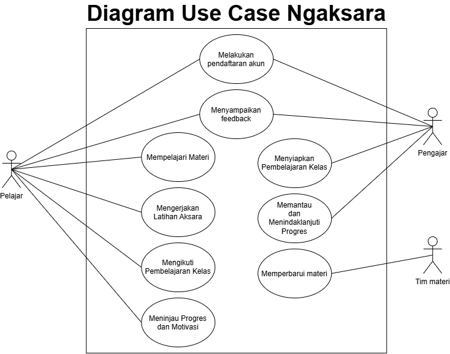

<h1>
IF2150 REKAYASA PERANGKAT LUNAK
 
TUGAS 4
 
CLASS DIAGRAM
</h1>
 

## Ngaksara

### Untuk: Amanda Aurellia Salsabilla

Dipersiapkan oleh:
| Informasi | Keterangan |
| --- | --- |
| Kelas | K2 |
| Kelompok | 4 |

| NIM      | Nama                           |
| -------- | ------------------------------ |
| 13525026 | Ryuza Nadif Aldebaran          |
| 13525029 | Muhammad Naufal Hilmi          |
| 13525077 | Muhammad Abduh                 |
| 13525107 | Nathaniel Marvelo              |
| 13525113 | Diandra Aria Yufana            |
| 13525143 | Natan Danuarta Ariel Wicaksana |

---

## Daftar Perubahan

| Revisi | Deskripsi                             |
| :----- | :------------------------------------ |
| _A_    | Memperjelas deskripsi perangkat lunak |
| _B_    | Menambahkan kebutuhan pengguna R19–R28 yang mencakup pencocokan bunyi, merangkai aksara, transliterasi, progres/streak/poin/lencana/scoreboard, kelas dan kode bergabung, tugas kelas, serta feedback Pengajar kepada siste. |
| _C_    | Menambahkan KF21–KF29 sebagai kebutuhan fungsional turunan R19–R27 |
| _D_    | Mengubah beberapa usecase yang tidak sesuai beserta skenario dan diagramnya |

 
 

# BAB 1: Deskripsi Perangkat Lunak

Ngaksara merupakan solusi perangkat lunak berbasis web yang kami usulkan sebagai upaya pemenuhan SDGs 4 (Quality Education). Format web ini dipilih untuk meningkatkan aksesibilitas sehingga pengguna dapat langsung mengakses platform tanpa perlu mengunduh aplikasi terlebih dahulu. Ngaksara dirancang khusus untuk menunjang proses pembelajaran aksara yang kompleks, dengan fokus awal pada aksara Jawa dan Sunda. Melalui platform ini, kami berharap dapat berkontribusi dalam pelestarian dan pembelajaran berbagai bahasa daerah.

Platform ini dirancang untuk dua target pengguna utama yaitu pelajar dan pengajar. Pelajar memiliki fleksibilitas untuk belajar secara mandiri atau bergabung ke dalam kelas menggunakan kode yang dibagikan oleh pengajar. Di dalam kelas tersebut, pengajar dapat mendistribusikan latihan, menentukan tenggat waktu, memantau perkembangan siswa, mengidentifikasi bagian yang sering salah, serta memberikan umpan balik dan rekomendasi materi lanjutan.

Untuk metode pembelajarannya, salah satu mode latihan yang ditawarkan Ngaksara adalah menggambar aksara mengikuti garis panduan (outline), dengan opsi tanpa garis panduan bagi pengguna yang sudah mahir. Sistem akan menilai tingkat keakuratan hasil gambar pengguna dibandingkan dengan karakter aslinya. Evaluasi ini berfungsi sebagai tolak ukur sejauh mana goresan mereka sudah presisi sekaligus menjadi acuan untuk mengulang latihan pada karakter tertentu jika hasilnya belum maksimal.

Selain itu, Ngaksara juga menyediakan tiga mode latihan tambahan. Pertama, mode mencocokkan aksara dengan bunyi di mana pengguna memilih aksara atau rangkaian yang tepat berdasarkan audio yang diputar sistem. Kedua, mode merangkai aksara yang melatih pengguna menyusun aksara dan tanda baca menjadi suku kata atau kata sesuai aturan yang berlaku. Ketiga, mode transliterasi yaitu mengubah tulisan latin menjadi aksara Jawa/Sunda atau sebaliknya tanpa menerjemahkan makna kalimat. Ketiga metode latihan di atas merupakan solusi kami untuk meningkatkan penguasaan pelafalan dan pemahaman bahasa tersebut secara menyeluruh. Fitur-fitur ini dirancang agar pengguna tidak sekadar mampu menulis aksara dengan baik, tetapi juga tepat dalam melafalkannya, mengingat bentuk tulisan pada aksara yang kompleks sering kali tidak mencerminkan cara bacanya secara langsung.

Guna mendukung proses belajar yang berkelanjutan, Ngaksara menyediakan materi pembelajaran yang disusun secara bertahap. Materi dimulai dari pengenalan karakter dasar hingga penggabungan karakter menjadi kata dan kalimat sederhana. Melalui susunan yang terstruktur ini, kami berharap pengguna dapat mengikuti proses belajar sesuai dengan kecepatan dan kemampuan masing-masing, tanpa perlu merasa tertinggal atau terlalu terbebani oleh materi.

Untuk menjaga motivasi, Ngaksara menyimpan seluruh hasil latihan untuk membentuk rekam jejak progres belajar. Sistem ini menerapkan fitur streak harian, yang akan bertambah apabila pelajar menyelesaikan setidaknya satu aktivitas belajar yang sah (aktivitas yang hanya dibuka tanpa diselesaikan tidak akan menambah streak atau poin).

Sebagai pelengkap, terdapat fitur papan peringkat yang diterapkan secara eksklusif pada tingkat kelas (bukan global) dan dapat diaktifkan atau dinonaktifkan oleh pengajar. Poin pada papan peringkat diberikan berdasarkan penyelesaian dan ketepatan latihan. Sistem juga membatasi perolehan poin agar pengulangan soal yang sama tidak bisa digunakan untuk mengumpulkan poin tanpa batas. Privasi pelajar juga tetap terjaga karena identitas yang ditampilkan di papan peringkat menggunakan nama tampilan yang bebas mereka pilih.

---

# BAB 2: Kebutuhan Fungsional

## 2.1 Kebutuhan Fungsional

| ID KF | ID Kebutuhan | Penjelasan |
| --- | --- | --- |
| KF01 | R01 | Sistem harus menampilkan pilihan antarmuka pendaftaran akun untuk setiap opsi pengguna (pelajar dan pengajar) |
| KF02 | R01 | Sistem harus memberikan akses kontrol/privilege berbeda untuk setiap jenis pengguna |
| KF03 | R02 | Sistem harus menampilkan pilihan antarmuka log-in untuk setiap opsi pengguna (pelajar dan pengajar) |
| KF04 | R02 | Ketika pengguna melakukan pendaftaran akun, log in, atau logout, sistem harus memproses permintaan tersebut melalui pengecekan validitas kredensial |
| KF05 | R03 | Setelah pengguna membuat kata sandi, sistem harus menyimpan password dalam bentuk hash adaptif bersalt sebelum disimpan di database |
| KF06 | R04 | Sistem harus menampilkan dokumen Terms & Conditions kepada pengguna saat membuat akun |
| KF07 | R04 | Bila pengguna belum memberikan persetujuan eksplisit terhadap Terms & Conditions, sistem harus menolak menyelesaikan pembuatan akun |
| KF08 | R05 | Sistem harus menampilkan antarmuka materi dan latihan sesuai fitur pembelajaran yang dipilih pengguna |
| KF09 | R06 | Ketika pengguna berada di halaman utama, sistem harus menampilkan daftar materi secara terurut berdasarkan jenis aksara atau tingkat kesulitan |
| KF10 | R08 | Jika tersedia opsi menampilkan outline, sistem harus menampilkan tampilan antarmuka fitur menggambar aksara sesuai dengan opsi outline yang dipilih pengguna |
| KF11 | R08 | Ketika pengguna menggambar aksara, sistem harus merekam dan memproses urutan goresan secara berkelanjutan |
| KF12 | R09 | Ketika pengguna menggoreskan aksara di layar, sistem harus menilai akurasi goresan tersebut terhadap template dengan algoritma yang sesuai |
| KF13 | R11 | Sistem harus menampilkan tampilan antarmuka riwayat pengerjaan latihan pelajar bagi pengajar |
| KF14 | R12 | Setelah pelajar melakukan aktivitas pembelajaran, sistem harus mencatat dan menyimpan riwayat aktivitas tersebut agar dapat diakses pengajar |
| KF15 | R13 | Ketika Tim Materi mengunggah modul atau latihan, sistem harus menyimpan konten tersebut pada penyimpanan terpusat sebagai draf |
| KF16 | R14 | Ketika Tim Materi memilih tindakan yang diizinkan, sistem harus mengubah atau menghapus konten sesuai hak aksesnya |
| KF17 | R16 | Dalam interval waktu yang rutin, sistem harus mencatat dan menyimpan log aktivitas dan error yang terjadi |
| KF18 | R18, R28 | Saat Pelajar atau Pengajar memiliki keluhan atau feedback, sistem harus menerima feedback tersebut melalui form yang tersedia |
| KF19 | R18, R28 | Ketika sistem menerima feedback yang valid dari Pelajar atau Pengajar, sistem harus memvalidasi dan menyimpannya pada server |
| KF20 | R18, R28 | Setelah server menyimpan feedback, sistem harus memberikan konfirmasi kepada pengirim dan menyediakan data feedback untuk pengelolaan sistem |
| KF21 | R19 | Ketika Pelajar memulai latihan bunyi, sistem harus memutar atau merekam pelafalan dan mencocokkannya dengan aksara target |
| KF22 | R20 | Ketika Pelajar mengirim susunan aksara, sistem harus mengevaluasi urutan tersebut terhadap urutan yang benar |
| KF23 | R21 | Ketika Pelajar mengirim hasil transliterasi, sistem harus mengevaluasi kesesuaian aksara dan teks latin |
| KF24 | R22 | Ketika Pelajar membuka halaman progres, sistem harus menampilkan progres, streak, poin, lencana, dan scoreboard |
| KF25 | R23 | Ketika Pengajar mengirim data kelas yang valid, sistem harus membuat kelas dan menghasilkan kode bergabung unik |
| KF26 | R24 | Ketika Pelajar mengirim kode bergabung yang aktif, sistem harus menambahkan Pelajar sebagai anggota kelas |
| KF27 | R25 | Ketika Pengajar menerbitkan tugas, sistem harus menyimpan komponen tugas, instruksi, dan tenggat |
| KF28 | R26 | Ketika Pelajar membuka atau mengirim tugas, sistem harus menampilkan tugas aktif dan menyimpan status pengumpulan termasuk keterlambatan |

---

# BAB 3: Model Use Case

## 3.1 Identifikasi Aktor

| Aktor | Deskripsi |
| :--- | :--- |
| Pelajar | Pengguna yang login ke aplikasi untuk belajar dan berlatih aksara Jawa dan Sunda. Pengguna ini dapat mengirim feedback kepada sistem jika mengalami kendala atau memiliki saran.|
| Pengajar | Pengguna yang login sebagai fasilitator pembelajaran. Pengguna ini memiliki akses untuk melihat rekam jejak latihan Pelajar, menganalisis kelemahan mereka, serta mengirim feedback kepada sistem.|
| Tim Materi | Pengguna yang bertindak sebagai pengelola konten materi. Tim materi membutuhkan akses untuk mengelola modul. |                                                                 

## 3.2 Identifikasi Use Case

| ID | Nama | Aktor | Tujuan | KF |
|---|---|---|---|---|
| UC-01 | Melakukan Pendaftaran Akun | Pelajar; Pengajar | Membuat akun sesuai peran untuk dapat menggunakan perangkat lunak. | KF01–KF07, KF17 |
| UC-02 | Mempelajari Materi | Pelajar | Memahami materi terbit untuk aksara dan tingkat yang dipilih. | KF02–KF04, KF08–KF09, KF17 |
| UC-03 | Mengerjakan Latihan Aksara | Pelajar | Menyelesaikan mode latihan dan memperoleh hasil serta umpan balik. | KF02–KF03, KF10–KF12, KF14, KF17, KF21–KF23 |
| UC-04 | Meninjau Progres dan Motivasi | Pelajar | Mengetahui perkembangan, materi yang perlu diulang, dan status motivasi. | KF02–KF03, KF14, KF17, KF24 |
| UC-05 | Mengikuti Pembelajaran Kelas | Pelajar | Bergabung ke kelas dan menyelesaikan tugas yang diberikan Pengajar. | KF02–KF03, KF14, KF17, KF26, KF28 |
| UC-06 | Memperbaharui Materi | Tim Materi | Memperbarui atau memperbaiki materi pembelajaran yang tersedia. | KF02–KF03, KF15–KF17, KF29 |
| UC-07 | Menyiapkan Pembelajaran Kelas | Pengajar | Membentuk kelas, mengendalikan akses, mengelola anggota, dan menyediakan tugas. | KF02–KF03, KF17, KF25, KF27 |
| UC-08 | Memantau dan Menindaklanjuti Progres | Pengajar | Memahami perkembangan anggota dan memberikan tindak lanjut. | KF02–KF04, KF13–KF14, KF17 |
| UC-09 | Menyampaikan Feedback | Pelajar; Pengajar | Menyampaikan feedback aplikasi, materi, atau pengalaman penggunaan melalui form. | KF02–KF03, KF17–KF20 |

## 3.3 Use Case Diagram

 

<i>Gambar 1. Diagram Use Case Ngaksara</i>

 

## 3.4 Skenario Use Case

### 3.4.1 Skenario UC01

**Nama Use Case:** Melakukan Pendaftaran Akun

**Skenario Normal**

| No. | Aksi Aktor | Reaksi Perangkat Lunak |
| :--- | :--- | :--- |
| 1 | Pengguna memilih opsi pendaftaran akun (pelajar, pengajar) | Sistem menampilkan antarmuka opsi pemilihan jenis akun yang didaftarkan |
| 2 | Pengguna memasukkan kredensial akun (email, password, username) | Sistem menampilkan antarmuka pendaftaran akun dan memverifikasi kredensial yang digunakan |
| 3 | Pengguna membaca Terms & Conditions aplikasi | Sistem menerima afirmasi bahwa pengguna sudah membaca Terms & Conditions yang berlaku |

**Skenario Alternatif 1: Otorisasi Pembayaran Gagal**

| No. | Aksi Aktor | Reaksi Perangkat Lunak |
| :--- | :--- | :--- |
| 1 | Pengguna memilih opsi pendaftaran akun (pelajar, pengajar) | Sistem menampilkan antarmuka opsi pemilihan jenis akun yang didaftarkan |
| 2 | Pengguna memasukkan kredensial akun (email, password, username) | Sistem menampilkan antarmuka pendaftaran akun dan memverifikasi kredensial yang digunakan |
| 3 | Pengguna memastikan kredensial yang digunakan sesuai | Kembali ke langkah 2 Skenario Normal |

### 3.4.2 Skenario UC02

**Nama Use Case:** Mempelajari Materi

**Skenario Normal**

| No. | Aksi Pelajar | Reaksi Perangkat Lunak |
| :--- | :--- | :--- |
| 1 | Memilih jenis aksara dan tingkat kesulitan | Sistem menampilkan daftar materi yang sesuai beserta status progres |
| 2 | Memilih satu materi | Sistem memuat paket materi yang sesuai dengan versi perangkat lunak |
| 3 | Membaca bentuk, aturan, dan contoh | Sistem menampilkan isi materi secara utuh |
| 4 | Meminta contoh bunyi pengucapan | Sistem memutar audio yang terkait serta sesuai dengan versi perangkat lunak |

**Skenario Alternatif 1: Materi belum tersedia untuk kombinasi yang dipilih**

| No. | Aksi Pelajar | Reaksi Perangkat Lunak |
| :--- | :--- | :--- |
| 1 | Memilih jenis aksara dan tingkat kesulitan | Sistem tidak menemukan materi yang sesuai dan menampilkan pesan "materi belum tersedia untuk kombinasi ini" |
| 2 | Memilih kombinasi jenis aksara dan tingkat kesulitan lain | Sistem kembali ke langkah 1 Skenario Normal |

**Skenario Alternatif 2: Audio pengucapan gagal diputar**

| No. | Aksi Pelajar | Reaksi Perangkat Lunak |
| :--- | :--- | :--- |
| 1 | Membaca bentuk, aturan, dan contoh | Sistem menampilkan isi materi secara utuh |
| 2 | Meminta contoh bunyi pengucapan | Sistem gagal memuat berkas audio (misal karena koneksi terputus) dan menampilkan pesan "audio tidak dapat diputar" |
| 3 | Meminta ulang contoh bunyi pengucapan | Sistem kembali ke langkah 4 Skenario Normal |

### 3.4.3 Skenario UC03

**Nama Use Case:** Mengerjakan Latihan Aksara

**Skenario Normal**

| No. | Aksi Pelajar | Reaksi Perangkat Lunak |
| :--- | :--- | :--- |
| 1 | Memilih materi, lalu memilih salah satu mode latihan (menulis, mencocokkan bunyi, atau merangkai) | Sistem menyiapkan soal latihan sesuai mode dan target aksara yang dipilih |
| 2 | Mengerjakan latihan sesuai mode yang dipilih | Sistem menangkap dan menampilkan interaksi pelajar secara langsung |
| 3 | Mengirimkan jawaban/hasil latihan | Sistem mengevaluasi jawaban sesuai kriteria mode latihan dan menampilkan skor/status beserta feedback |
| 4 | Menyelesaikan latihan | Sistem menyimpan hasil ke riwayat latihan, serta memperbarui streak dan poin pelajar |

**Skenario Alternatif 1: Latihan mencocokkan bunyi**
 
| No. | Aksi Pelajar | Reaksi Perangkat Lunak |
| :--- | :--- | :--- |
| 1 | Memilih mode mencocokkan bunyi | Sistem memutar audio pengucapan dan menampilkan pilihan aksara |
| 2 | Memilih aksara yang sesuai dengan bunyi yang diputar | Sistem menampilkan status jawaban (benar/salah) beserta penjelasannya |
| 3 | Menyelesaikan latihan | Sistem menyimpan hasil ke riwayat latihan serta memperbarui streak dan poin |
 
**Skenario Alternatif 2: Latihan merangkai aksara**
 
| No. | Aksi Pelajar | Reaksi Perangkat Lunak |
| :--- | :--- | :--- |
| 1 | Memilih mode merangkai aksara | Sistem menampilkan komponen aksara dan tanda baca yang dapat disusun |
| 2 | Menyusun komponen menjadi suku kata/kata dan mengirimkannya | Sistem memvalidasi rangkaian berdasarkan aturan aksara yang berlaku dan menampilkan hasil |
| 3 | Menyelesaikan latihan | Sistem menyimpan hasil ke riwayat latihan serta memperbarui streak dan poin |
 
**Skenario Alternatif 3: Gambar aksara kurang akurat (mode menulis)**
 
| No. | Aksi Pelajar | Reaksi Perangkat Lunak |
| :--- | :--- | :--- |
| 1 | Memilih mode menulis dan target aksara | Sistem menampilkan outline aksara sesuai materi yang dipilih |
| 2 | Menggambarkan aksara sesuai outline yang tampil | Sistem menampilkan goresan sesuai interaksi pelajar |
| 3 | Mengirimkan hasil gambar | Sistem menilai keakuratan penulisan berada di bawah ambang batas |
| 4 | Mengulang latihan pada aksara yang sama | Sistem menampilkan kembali outline aksara yang sama untuk diulang, tanpa menambah streak/poin baru |

### 3.4.4 Skenario UC04

**Nama Use Case:** Meninjau Progres dan Motivasi
 
**Skenario Normal**
 
| No. | Aksi Pelajar | Reaksi Perangkat Lunak |
| :--- | :--- | :--- |
| 1 | Membuka halaman progres | Sistem menampilkan riwayat aktivitas dan tingkat penguasaan per materi |
| 2 | Memilih salah satu materi pada riwayat | Sistem menampilkan detail hasil latihan dan umpan balik untuk materi tersebut |
| 3 | Meminta rekomendasi materi lanjutan | Sistem menampilkan materi dengan tingkat penguasaan terendah yang masih relevan untuk dipelajari |
| 4 | Meninjau indikator motivasi (streak, poin, badge) | Sistem menampilkan streak harian, total poin, dan badge yang telah diperoleh pelajar |
 
**Skenario Alternatif 1: Belum ada riwayat pembelajaran**
 
| No. | Aksi Pelajar | Reaksi Perangkat Lunak |
| :--- | :--- | :--- |
| 1 | Membuka halaman progres | Sistem menampilkan keadaan kosong dan merekomendasikan materi awal untuk mulai dipelajari |
| 2 | Membuka rekomendasi materi awal | Sistem mengarahkan pelajar ke halaman mempelajari materi yang direkomendasikan |
 
**Skenario Alternatif 2: Melihat papan peringkat kelas**
 
| No. | Aksi Pelajar | Reaksi Perangkat Lunak |
| :--- | :--- | :--- |
| 1 | Membuka papan peringkat pada salah satu kelas yang diikuti | Sistem menampilkan urutan poin anggota kelas menggunakan nama tampilan masing-masing |

### 3.4.5 Skenario UC05

**Nama Use Case:** Mengikuti Pembelajaran Kelas
 
**Skenario Normal**
 
| No. | Aksi Pelajar | Reaksi Perangkat Lunak |
| :--- | :--- | :--- |
| 1 | Memasukkan kode kelas yang diberikan pengajar | Sistem memvalidasi kode dan mendaftarkan pelajar sebagai anggota kelas |
| 2 | Membuka kelas yang diikuti | Sistem menampilkan daftar tugas beserta tenggat waktu dan status pengerjaannya |
| 3 | Membuka salah satu tugas sebelum tenggat | Sistem menampilkan komponen materi atau latihan yang harus diselesaikan |
| 4 | Menyelesaikan seluruh komponen wajib pada tugas | Sistem mencatat waktu penyelesaian dan menetapkan status "tepat waktu" |
 
**Skenario Alternatif 1: Pelajar sudah menjadi anggota kelas**
 
| No. | Aksi Pelajar | Reaksi Perangkat Lunak |
| :--- | :--- | :--- |
| 1 | Membuka kelas tanpa memasukkan kode ulang | Sistem menampilkan daftar tugas kelas tanpa membuat keanggotaan baru |
 
**Skenario Alternatif 2: Tugas diselesaikan terlambat**
 
| No. | Aksi Pelajar | Reaksi Perangkat Lunak |
| :--- | :--- | :--- |
| 1 | Membuka tugas yang telah melewati tenggat | Sistem menampilkan status "terlambat" pada tugas tersebut |
| 2 | Menyelesaikan seluruh komponen wajib | Sistem mencatat waktu penyelesaian dan menetapkan status "terlambat" |
 
**Skenario Alternatif 3: Kode kelas tidak valid**
 
| No. | Aksi Pelajar | Reaksi Perangkat Lunak |
| :--- | :--- | :--- |
| 1 | Memasukkan kode kelas | Sistem tidak menemukan kode aktif yang cocok dan menampilkan pesan "kode tidak valid atau tidak aktif" |
| 2 | Memasukkan kode kelas yang benar | Sistem kembali ke langkah 1 Skenario Normal |

### 3.4.6 Skenario UC06

**Nama Use Case:** Memperbaharui Materi

**Skenario Normal**

| No. | Aksi Aktor | Reaksi Perangkat Lunak |
| :--- | :--- | :--- |
| 1 | Tim materi memilih menu pengelolaan materi | Sistem menampilkan daftar materi yang dapat diedit |
| 2 | Tim materi memilih opsi menambahkan materi baru | Sistem mengarahkan pelanggan ke halaman menambahkan materi |
| 3 | Tim materi mengunggah file materi dan mengisi detail (nama, kategori, tingkat kesulitan) | Sistem memvalidasi dan menyimpan materi baru ke database terpusat |
| 4 | Tim materi menyimpan hasil perbaruan materi | Sistem menampilkan pesan "materi berhasil ditambahkan" |

**Skenario Alternatif 1: Penambahan materi gagal**

| No. | Aksi Aktor | Reaksi Perangkat Lunak |
| :--- | :--- | :--- |
| 1 | Tim materi memilih menu memperbarui materi | Sistem menampilkan ringkasan pesanan dan pilihan metode pembayaran |
| 2 | Tim materi menambahkan materi baru | Sistem menerima respons penambahan materi gagal (misal: jenis file tidak didukung website). Materi tidak berubah, sistem menampilkan pesan error dan meminta tim materi memilih ulang file materi baru |
| 3 | Tim materi menambahkan materi ulang | Sistem kembali ke langkah 2 Skenario Normal |

### 3.4.7 Skenario UC07
 
**Nama Use Case:** Menyiapkan Pembelajaran Kelas
 
**Skenario Normal**
 
| No. | Aksi Pengajar | Reaksi Perangkat Lunak |
| :--- | :--- | :--- |
| 1 | Membuat kelas baru dengan mengisi nama kelas | Sistem membuat kelas milik pengajar tersebut beserta satu kode kelas aktif yang unik |
| 2 | Membagikan kode kelas kepada pelajar | Sistem menampilkan daftar anggota yang bergabung |
| 3 | Memilih materi atau latihan dan menetapkan tenggat waktu | Sistem menyusun paket tugas sesuai materi/latihan dan tenggat yang dipilih |
| 4 | Menerbitkan tugas | Sistem menyediakan tugas tersebut hanya bagi anggota kelas yang bersangkutan |
 
**Skenario Alternatif 1: Mengganti kode kelas**
 
| No. | Aksi Pengajar | Reaksi Perangkat Lunak |
| :--- | :--- | :--- |
| 1 | Meminta pergantian kode kelas | Sistem menonaktifkan kode lama dan membuatkan satu kode aktif baru yang unik |
 
**Skenario Alternatif 2: Mengeluarkan anggota kelas**
 
| No. | Aksi Pengajar | Reaksi Perangkat Lunak |
| :--- | :--- | :--- |
| 1 | Memilih salah satu anggota untuk dikeluarkan | Sistem meminta konfirmasi pengeluaran anggota |
| 2 | Mengonfirmasi pengeluaran anggota | Sistem mengakhiri akses anggota tersebut ke kelas tanpa menghapus riwayat belajar pribadinya |
 
**Skenario Alternatif 3: Mengaktifkan papan peringkat kelas**
 
| No. | Aksi Pengajar | Reaksi Perangkat Lunak |
| :--- | :--- | :--- |
| 1 | Mengaktifkan papan peringkat pada pengaturan kelas | Sistem menyimpan status aktif dan menampilkan papan peringkat bagi anggota |

### 3.4.8 Skenario UC08

**Nama Use Case:** Memantau dan Menindaklanjuti Progres

**Skenario Normal**

| No. | Aksi Pengajar | Reaksi Perangkat Lunak |
| :--- | :--- | :--- |
| 1 | Membuka halaman pemantauan salah satu kelas yang diampu | Sistem menampilkan agregat tingkat penguasaan dan pola kesalahan umum anggota kelas |
| 2 | Memilih salah satu anggota kelas | Sistem menampilkan detail progres dan riwayat pengerjaan tugas anggota tersebut |
| 3 | Menuliskan umpan balik atau rekomendasi materi lanjutan | Sistem memeriksa isi pesan dan penerima yang dituju |
| 4 | Mengirimkan umpan balik | Sistem menyimpan pesan tersebut dan menyediakannya hanya bagi anggota yang dituju |

**Skenario Alternatif 1: Belum ada hasil belajar anggota**

| No. | Aksi Pengajar | Reaksi Perangkat Lunak |
| :--- | :--- | :--- |
| 1 | Membuka halaman pemantauan | Sistem menampilkan keadaan kosong beserta daftar anggota yang belum memiliki riwayat latihan |
| 2 | Mengirimkan rekomendasi materi awal kepada anggota tersebut | Sistem menyimpan rekomendasi dan menyediakannya bagi anggota yang dituju |

**Skenario Alternatif 2: Anggota yang dipilih bukan anggota aktif kelas**

| No. | Aksi Pengajar | Reaksi Perangkat Lunak |
| :--- | :--- | :--- |
| 1 | Mencoba membuka progres pengguna yang bukan anggota kelas | Sistem menolak permintaan dan tidak menampilkan data progres pengguna tersebut |

### 3.4.9 Skenario UC09

**Nama Use Case:** Menyampaikan Feedback

**Skenario Normal**

| No. | Aksi Aktor | Reaksi Perangkat Lunak |
| :--- | :--- | :--- |
| 1 | User (pelajar dan pengajar) memilih menu feedback di bagian samping pada menu utama | Sistem menampilkan form feedback dengan beberapa pertanyaan terbuka dan tertutup |
| 2 | User memilih pilihan feedback (performa/tampilan/fitur/materi) | Sistem menampilkan pilihan-pilihan feedback yang dapat diisi oleh user |
| 3 | User mengirim/submit feedback setelah mengisi | Sistem menampilkan pesan bahwa feedback berhasil terkirim |

**Skenario Alternatif 1: Feedback gagal terkirim (karena server down/kendala jaringan)**

| No. | Aksi Aktor | Reaksi Perangkat Lunak |
| :--- | :--- | :--- |
| 1 | User (pelajar dan pengajar) memilih menu feedback di bagian samping pada menu utama | Sistem menampilkan form feedback dengan beberapa pertanyaan terbuka dan tertutup |
| 2 | User memilih pilihan feedback (performa/tampilan/fitur/materi) | Sistem menampilkan pilihan-pilihan feedback yang dapat diisi oleh user |
| 3 | User mengirim/submit feedback setelah mengisi | Sistem menampilkan pesan bahwa feedback gagal terkirim |

---

# BAB 4: Diagram Kelas

## 4.1 Identifikasi Kelas

| ID Kelas | Nama Kelas | Jenis dan Deskripsi | ID Use Case |
| :--- | :--- | :--- | :--- |
| C01 | `AkunPengguna` | *(Entity)* Menyimpan kredensial, profil, dan peran Pelajar, Pengajar, atau Tim Materi. | UC-01–UC-09 |
| C02 | `MateriAksara` | *(Entity)* Menyimpan metadata materi, jenis aksara, dan tingkat kesulitan. | UC-02, UC-03, UC-04, UC-06 |
| C03 | `RiwayatLatihan` | *(Entity)* Menyimpan hasil latihan, status, dan waktu pengerjaan Pelajar. | UC-02, UC-03, UC-04, UC-08 |
| C04 | `DataFeedback` | *(Entity)* Menyimpan feedback, pengirim, waktu kirim, dan status tindak lanjut. | UC-09 |
| C05 | `HalamanPendaftaran` | *(Boundary)* Form pendaftaran, pemilihan peran, dan persetujuan Terms & Conditions. | UC-01 |
| C06 | `HalamanLogin` | *(Boundary)* Form untuk memasukkan kredensial login. Login dipetakan ke UC-01 karena Bab 3 belum mendefinisikan use case login terpisah dan kebutuhan autentikasi dibahas bersama akses akun. | UC-01 |
| C07 | `HalamanUtama` | *(Boundary)* Navigasi utama setelah pengguna masuk ke sistem. | UC-02–UC-09 |
| C08 | `HalamanLatihan` | *(Boundary)* Antarmuka latihan menulis, mencocokkan bunyi, merangkai aksara, dan transliterasi. | UC-03 |
| C09 | `HalamanKelolaMateri` | *(Boundary)* Antarmuka Tim Materi untuk mengunggah dan menyunting modul. | UC-06 |
| C10 | `HalamanFeedback` | *(Boundary)* Form untuk mengirim feedback aplikasi, materi, atau pengalaman penggunaan. | UC-09 |
| C11 | `HalamanKelasPelajar` | *(Boundary)* Antarmuka Pelajar untuk bergabung kelas, melihat tugas, dan mengumpulkan tugas. | UC-05 |
| C12 | `HalamanKelolaKelas` | *(Boundary)* Antarmuka Pengajar untuk mengelola kelas dan memantau anggotanya. | UC-07, UC-08 |
| C13 | `HalamanMateri` | *(Boundary)* Antarmuka Pelajar untuk memilih dan mempelajari materi serta memutar audio. | UC-02 |
| C14 | `HalamanProgres` | *(Boundary)* Antarmuka Pelajar untuk melihat riwayat, progres, rekomendasi, dan motivasi. | UC-04 |
| C15 | `OtentikasiController` | *(Controller)* Memvalidasi pendaftaran dan login serta memproses autentikasi pengguna. | UC-01 |
| C16 | `LatihanController` | *(Controller)* Menyiapkan latihan, menilai jawaban, dan memperbarui riwayat serta motivasi. | UC-03 |
| C17 | `MateriController` | *(Controller)* Mengambil, mengurutkan, memuat, dan memperbarui materi. | UC-02, UC-03, UC-06 |
| C18 | `FeedbackController` | *(Controller)* Memvalidasi dan menyimpan feedback serta menyiapkan konfirmasi. | UC-09 |
| C19 | `ProgresController` | *(Controller)* Mengolah riwayat dan progres, menyiapkan rekomendasi serta scoreboard. | UC-04, UC-08 |
| C20 | `KelasController` | *(Controller)* Memproses keanggotaan, kelas, tugas, dan pengambilan data kelas. | UC-05, UC-07, UC-08 |
| C21 | `KontenMateri` | *(Entity)* Menyimpan isi materi, contoh, aturan, audio, dan versi konten. | UC-02, UC-03, UC-06 |
| C22 | `MotivasiBelajar` | *(Entity)* Menyimpan streak, poin, dan badge Pelajar untuk motivasi dan scoreboard. | UC-03, UC-04, UC-07 |
| C23 | `KelasBelajar` | *(Entity)* Menyimpan data kelas, pemilik, kode bergabung, dan pengaturan kelas. | UC-05, UC-07, UC-08 |
| C24 | `KeanggotaanKelas` | *(Entity)* Menyimpan hubungan Pelajar dengan kelas dan status keanggotaannya. | UC-05, UC-07, UC-08 |
| C25 | `TugasKelas` | *(Entity)* Menyimpan instruksi, komponen, dan tenggat tugas. | UC-05, UC-07 |
| C26 | `PenyelesaianTugas` | *(Entity)* Menyimpan status dan waktu pengumpulan tugas oleh Pelajar. | UC-05 |

## 4.2 Diagram Kelas per Use Case

Tempat gambar disediakan untuk setiap use case. Gunakan ID kelas pada Tabel 4.1 dan uraian kelas pada subbagian masing-masing sebagai acuan saat menggambar diagram.

### 4.2.1 Use Case UC-01

**Nama Use Case:** Melakukan Pendaftaran Akun

#### Diagram Kelas

 

<i>Gambar 2. Diagram Kelas Use Case UC-01</i>

 

`HalamanPendaftaran` dan `HalamanLogin` mengirim masukan ke `OtentikasiController`. Controller memvalidasi masukan dan berinteraksi dengan `AkunPengguna` untuk membuat akun atau memeriksa kredensial. C06 ditempatkan pada UC-01 karena belum ada use case login tersendiri di Bab 3.

| ID Kelas | Nama Kelas | Atribut Utama | Metode Utama |
| :--- | :--- | :--- | :--- |
| C05 | `HalamanPendaftaran` | `formInputData`, `statusPersetujuan` | `tampilkanOpsiPeran()`, `tampilkanTnC()`, `kirimPendaftaran()` |
| C06 | `HalamanLogin` | `emailInput`, `passwordInput` | `kirimKredensial()`, `tampilkanStatusLogin()` |
| C15 | `OtentikasiController` | `statusValidasi`, `statusSesi` | `verifikasiFormatData()`, `enkripsiPassword()`, `simpanAkun()`, `validasiLogin()` |
| C01 | `AkunPengguna` | `idAkun`, `email`, `username`, `passwordHash`, `peran` | `buatAkunBaru()`, `getDetailAkun()` |

### 4.2.2 Use Case UC-02

**Nama Use Case:** Mempelajari Materi

#### Diagram Kelas

 

<i>Gambar 3. Diagram Kelas Use Case UC-02</i>

 

`HalamanMateri` meminta daftar dan isi materi melalui `MateriController`. Controller mengambil metadata dari `MateriAksara`, isi dan audio dari `KontenMateri`, serta status belajar dari `RiwayatLatihan` untuk Pelajar yang sedang masuk.

| ID Kelas | Nama Kelas | Atribut Utama | Metode Utama |
| :--- | :--- | :--- | :--- |
| C13 | `HalamanMateri` | `materiTerpilih`, `statusTampilan` | `pilihMateri()`, `tampilkanIsiMateri()`, `putarAudioPengucapan()` |
| C17 | `MateriController` | `jenisAksaraTerpilih`, `versiAplikasi` | `ambilDaftarMateri()`, `muatPaketMateri()`, `ambilAudioPengucapan()` |
| C02 | `MateriAksara` | `idMateri`, `namaMateri`, `jenisAksara`, `tingkatKesulitan` | `simpan()`, `ambilMetadata()` |
| C21 | `KontenMateri` | `bentukAksara`, `aturan`, `contoh`, `urlAudio`, `versiKonten` | `ambilKonten()`, `ambilAudio()` |
| C03 | `RiwayatLatihan` | `idRiwayat`, `idPelajar`, `statusProgres`, `nilaiAkurasi` | `ambilStatusProgres()` |
| C01 | `AkunPengguna` | `idAkun`, `peran` | `getDetailAkun()` |

### 4.2.3 Use Case UC-03

**Nama Use Case:** Mengerjakan Latihan Aksara

#### Diagram Kelas

 

<i>Gambar 4. Diagram Kelas Use Case UC-03</i>

 

`HalamanLatihan` menyampaikan jawaban ke `LatihanController`. Controller meminta materi atau soal yang diperlukan, menilai jawaban, lalu menyimpan hasil ke `RiwayatLatihan` dan memperbarui `MotivasiBelajar`.

| ID Kelas | Nama Kelas | Atribut Utama | Metode Utama |
| :--- | :--- | :--- | :--- |
| C08 | `HalamanLatihan` | `modeLatihan`, `jawabanInput`, `hasilTampilan` | `pilihModeLatihan()`, `kirimJawaban()`, `tampilkanHasil()` |
| C16 | `LatihanController` | `soalAktif`, `jawabanPengguna`, `skor` | `siapkanSoal()`, `nilaiJawaban()`, `simpanHasil()` |
| C17 | `MateriController` | `idMateri`, `versiKonten` | `ambilKontenLatihan()`, `ambilAudioPengucapan()` |
| C02 | `MateriAksara` | `idMateri`, `jenisAksara`, `tingkatKesulitan` | `ambilTargetLatihan()` |
| C21 | `KontenMateri` | `bentukAksara`, `aturan`, `contoh`, `urlAudio` | `ambilKonten()` |
| C03 | `RiwayatLatihan` | `idRiwayat`, `idPelajar`, `mode`, `skor`, `tanggalPengerjaan` | `simpanHasil()` |
| C22 | `MotivasiBelajar` | `idPelajar`, `streak`, `poin`, `daftarBadge` | `perbaruiStreak()`, `tambahPoin()`, `berikanBadge()` |
| C01 | `AkunPengguna` | `idAkun`, `peran` | `getDetailAkun()` |

### 4.2.4 Use Case UC-04

**Nama Use Case:** Meninjau Progres dan Motivasi

#### Diagram Kelas

 

<i>Gambar 5. Diagram Kelas Use Case UC-04</i>

 

`ProgresController` menyusun riwayat, penguasaan materi, rekomendasi, streak, poin, badge, dan scoreboard untuk ditampilkan pada `HalamanProgres`.

| ID Kelas | Nama Kelas | Atribut Utama | Metode Utama |
| :--- | :--- | :--- | :--- |
| C14 | `HalamanProgres` | `filterPeriode`, `dataTampilan` | `tampilkanProgres()`, `pilihPeriode()`, `tampilkanScoreboard()` |
| C19 | `ProgresController` | `idPelajar`, `periode` | `ambilRiwayat()`, `hitungProgres()`, `siapkanRekomendasi()`, `ambilScoreboard()` |
| C02 | `MateriAksara` | `idMateri`, `namaMateri`, `tingkatKesulitan` | `ambilMateriRekomendasi()` |
| C03 | `RiwayatLatihan` | `idRiwayat`, `idPelajar`, `mode`, `skor`, `tanggalPengerjaan` | `ambilRiwayat()`, `hitungPenguasaan()` |
| C22 | `MotivasiBelajar` | `idPelajar`, `streak`, `poin`, `daftarBadge` | `ambilMotivasi()`, `susunScoreboard()` |
| C01 | `AkunPengguna` | `idAkun`, `namaTampilan`, `peran` | `getProfil()` |

### 4.2.5 Use Case UC-05

**Nama Use Case:** Mengikuti Pembelajaran Kelas

#### Diagram Kelas

 

<i>Gambar 6. Diagram Kelas Use Case UC-05</i>

 

`KelasController` memvalidasi kode melalui `KelasBelajar`, mencatat keanggotaan pada `KeanggotaanKelas`, menampilkan `TugasKelas`, dan menyimpan pengumpulan pada `PenyelesaianTugas`.

| ID Kelas | Nama Kelas | Atribut Utama | Metode Utama |
| :--- | :--- | :--- | :--- |
| C11 | `HalamanKelasPelajar` | `kodeKelasInput`, `tugasAktif`, `jawabanInput` | `kirimKodeBergabung()`, `tampilkanTugas()`, `kirimTugas()` |
| C20 | `KelasController` | `idPelajar`, `idKelas` | `validasiKodeBergabung()`, `gabungkanPelajar()`, `ambilTugasAktif()`, `simpanPengumpulan()` |
| C23 | `KelasBelajar` | `idKelas`, `nama`, `kodeBergabung`, `status` | `validasiKode()` |
| C24 | `KeanggotaanKelas` | `idKeanggotaan`, `idKelas`, `idPelajar`, `status` | `simpanKeanggotaan()`, `ubahStatus()` |
| C25 | `TugasKelas` | `idTugas`, `idKelas`, `instruksi`, `tenggat`, `komponenTugas` | `ambilTugasAktif()` |
| C26 | `PenyelesaianTugas` | `idPenyelesaian`, `idTugas`, `idPelajar`, `waktuKumpul`, `status` | `simpanPengumpulan()`, `tentukanStatusKetepatan()` |
| C01 | `AkunPengguna` | `idAkun`, `namaTampilan`, `peran` | `getProfil()` |

### 4.2.6 Use Case UC-06

**Nama Use Case:** Memperbaharui Materi

#### Diagram Kelas

 

<i>Gambar 7. Diagram Kelas Use Case UC-06</i>

 

`MateriController` memvalidasi perubahan dari `HalamanKelolaMateri`, memeriksa hak akses pengguna, lalu memperbarui metadata `MateriAksara` dan konten pada `KontenMateri`.

| ID Kelas | Nama Kelas | Atribut Utama | Metode Utama |
| :--- | :--- | :--- | :--- |
| C09 | `HalamanKelolaMateri` | `daftarMateri`, `fileMateriInput`, `detailInput`, `pesanStatus` | `tampilkanDaftarMateri()`, `unggahFileMateri()`, `suntingMateri()`, `tampilkanStatus()` |
| C17 | `MateriController` | `materiSedangDiproses`, `statusValidasi` | `ambilDaftarMateri()`, `validasiFormatFile()`, `tambahMateri()`, `perbaruiMateri()` |
| C02 | `MateriAksara` | `idMateri`, `namaMateri`, `jenisAksara`, `tingkatKesulitan` | `simpan()`, `perbaruiData()` |
| C21 | `KontenMateri` | `bentukAksara`, `aturan`, `contoh`, `urlAudio`, `versiKonten` | `simpanKonten()`, `perbaruiKonten()`, `arsipkanVersi()` |
| C01 | `AkunPengguna` | `idAkun`, `peran` | `verifikasiHakAkses()` |

### 4.2.7 Use Case UC-07

**Nama Use Case:** Menyiapkan Pembelajaran Kelas

#### Diagram Kelas

 

<i>Gambar 8. Diagram Kelas Use Case UC-07</i>

 

`KelasController` membuat kelas dan kode bergabung, mengelola anggota, serta menerbitkan tugas. `MotivasiBelajar` mendukung scoreboard kelas ketika fitur tersebut diaktifkan Pengajar.

| ID Kelas | Nama Kelas | Atribut Utama | Metode Utama |
| :--- | :--- | :--- | :--- |
| C12 | `HalamanKelolaKelas` | `dataKelasInput`, `instruksiTugas`, `tenggat`, `statusScoreboard` | `buatKelas()`, `kelolaAnggota()`, `buatTugas()`, `aturScoreboard()` |
| C20 | `KelasController` | `idPengajar`, `idKelas` | `buatKelas()`, `hasilkanKodeUnik()`, `kelolaAnggota()`, `terbitkanTugas()` |
| C22 | `MotivasiBelajar` | `idPelajar`, `streak`, `poin`, `daftarBadge` | `ambilPoinKelas()`, `susunScoreboard()` |
| C23 | `KelasBelajar` | `idKelas`, `nama`, `pemilikId`, `kodeBergabung`, `statusScoreboard` | `simpan()`, `buatKodeBergabung()` |
| C24 | `KeanggotaanKelas` | `idKeanggotaan`, `idKelas`, `idPelajar`, `status` | `daftarAnggota()`, `ubahStatus()` |
| C25 | `TugasKelas` | `idTugas`, `idKelas`, `instruksi`, `komponenTugas`, `tenggat` | `simpan()`, `terbitkan()` |
| C01 | `AkunPengguna` | `idAkun`, `peran` | `verifikasiHakAkses()` |

### 4.2.8 Use Case UC-08

**Nama Use Case:** Memantau dan Menindaklanjuti Progres

#### Diagram Kelas

 

<i>Gambar 9. Diagram Kelas Use Case UC-08</i>

 

`KelasController` mengambil kelas dan anggota yang diampu Pengajar, lalu meminta `ProgresController` mengolah `RiwayatLatihan`. Hasilnya ditampilkan melalui `HalamanKelolaKelas` untuk membantu Pengajar menentukan tindak lanjut.

| ID Kelas | Nama Kelas | Atribut Utama | Metode Utama |
| :--- | :--- | :--- | :--- |
| C12 | `HalamanKelolaKelas` | `idKelasTerpilih`, `daftarAnggota`, `ringkasanProgres` | `tampilkanAnggota()`, `tampilkanProgres()`, `pilihAnggota()` |
| C20 | `KelasController` | `idPengajar`, `idKelas` | `ambilKelasPengajar()`, `ambilDaftarAnggota()` |
| C19 | `ProgresController` | `idPelajar`, `periode` | `agregasiProgres()`, `hitungPolaKesalahan()` |
| C23 | `KelasBelajar` | `idKelas`, `nama`, `pemilikId` | `daftarKelasPengajar()` |
| C24 | `KeanggotaanKelas` | `idKeanggotaan`, `idKelas`, `idPelajar`, `status` | `daftarAnggotaAktif()` |
| C03 | `RiwayatLatihan` | `idRiwayat`, `idPelajar`, `mode`, `skor`, `tanggalPengerjaan`, `status` | `ambilRiwayatPelajar()`, `hitungPolaKesalahan()` |
| C01 | `AkunPengguna` | `idAkun`, `namaTampilan`, `peran` | `getProfil()` |

### 4.2.9 Use Case UC-09

**Nama Use Case:** Menyampaikan Feedback

#### Diagram Kelas

 

<i>Gambar 10. Diagram Kelas Use Case UC-09</i>

 

`FeedbackController` memvalidasi masukan, menghubungkannya dengan akun pengirim, menyimpan data feedback, dan menyiapkan konfirmasi. Alur ini sesuai dengan KF18–KF20.

| ID Kelas | Nama Kelas | Atribut Utama | Metode Utama |
| :--- | :--- | :--- | :--- |
| C10 | `HalamanFeedback` | `kategoriFeedback`, `pesanFeedback`, `statusKirim` | `tampilkanFormFeedback()`, `kirimFeedback()`, `tampilkanKonfirmasi()` |
| C18 | `FeedbackController` | `dataMasukan`, `statusValidasi` | `validasiFeedback()`, `simpanFeedback()`, `kirimKonfirmasi()` |
| C04 | `DataFeedback` | `idFeedback`, `idAkun`, `kategori`, `pesan`, `waktuKirim`, `status` | `simpan()`, `perbaruiStatus()` |
| C01 | `AkunPengguna` | `idAkun`, `peran` | `getProfil()` |

## 4.3 Diagram Kelas Keseluruhan

 

<i>Gambar 11. Diagram Kelas Keseluruhan</i>

 

| ID Kelas | Nama Kelas | Atribut | Metode/Operasi |
| :------- | :--------- | :------ | :-------------- |
| C01 | `AkunPengguna` | idAkun, email, username, passwordHash, peran | buatAkunBaru(), getDetailAkun() |
| C02 | `MateriAksara` | idMateri, namaMateri, jenisAksara, tingkatKesulitan, fileOutline | simpanMateri(), perbaruiData() |
| C03 | `RiwayatLatihan` | idRiwayat, mode, statusProgres, nilaiAkurasi, tanggalPengerjaan | catatHasil(), perbaruiStatus() |
| C04 | `DataFeedback` | idFeedback, idAkun, pesan, waktuKirim, status | simpan(), perbaruiStatus() |
| C05 | `HalamanPendaftaran` | formInputData, statusPersetujuan | tampilkanOpsiPeran(), terimaInputKredensial(), tampilkanTnC(), tampilkanNotifikasi() |
| C06 | `HalamanLogin` | formKredensial, pesanError | tampilkanFormLogin(), terimaInputKredensial(), tampilkanNotifikasi() |
| C07 | `HalamanUtama` | - | tampilkanDashboard(), urutkanTampilanMateri() |
| C08 | `HalamanLatihan` | modeLatihan, interaksiPengguna | tampilkanSoalLatihan(), terimaInteraksiPengguna(), tampilkanHasilLatihan() |
| C09 | `HalamanKelolaMateri` | daftarMateri, fileMateriInput, detailInput, pesanStatus | tampilkanDaftarMateri(), pilihTambahMateriBaru(), unggahFileMateri(), tampilkanPesanSukses(), tampilkanPesanError() |
| C10 | `HalamanFeedback` | pesanFeedback | tampilkanFormFeedback(), kirimFeedback(), tampilkanStatus() |
| C11 | `HalamanKelasPelajar` | kodeKelasInput, daftarTugas | masukkanKodeKelas(), tampilkanDaftarTugas(), bukaTugas() |
| C12 | `HalamanKelolaKelas` | namaKelasInput, daftarAnggota | buatKelasBaru(), tampilkanDaftarAnggota(), tetapkanTugas(), tampilkanProgresAnggota() |
| C13 | `HalamanMateri` | - | pilihMateri(), tampilkanIsiMateri(), putarAudioPengucapan() |
| C14 | `HalamanProgres` | - | tampilkanRiwayat(), tampilkanRekomendasi(), tampilkanIndikatorMotivasi() |
| C15 | `OtentikasiController` | - | verifikasiFormatData(), cekEmailTersedia(), enkripsiPassword(), simpanAkun() |
| C16 | `LatihanController` | soalAktif, statusPenilaian | siapkanSoalLatihan(), evaluasiJawaban(), perbaruiRiwayatDanMotivasi() |
| C17 | `MateriController` | materiSedangDiproses, statusValidasi | ambilDaftarMateri(), muatPaketMateri(), tambahMateri(), validasiFormatFile(), perbaruiMateri() |
| C18 | `FeedbackController` | - | kirimFeedback(), validasiFeedback(), simpanFeedback(), perbaruiStatus() |
| C19 | `ProgresController` | - | ambilRiwayatLatihan(), hitungRekomendasiMateri(), siapkanDataPapanPeringkat() |
| C20 | `KelasController` | - | prosesGabungKelas(), kelolaKelasDanTugas(), pantauProgresAnggota(), kirimUmpanBalik() |
| C21 | `KontenMateri` | bentukAksara, aturan, contoh, urlAudio, versiKonten | - |
| C22 | `MotivasiBelajar` | idMotivasi, streakHarian, totalPoin, daftarBadge | tambahStreak(), tambahPoin() |
| C23 | `KelasBelajar` | idKelas, namaKelas, kodeAktif, statusPapanPeringkat | buatKodeBaru() |
| C24 | `KeanggotaanKelas` | idKeanggotaan, idAkun, idKelas, namaTampilan | aktifkanKeanggotaan(), nonaktifkanKeanggotaan() |
| C25 | `TugasKelas` | idTugas, namaTugas, tenggatWaktu, komponenLatihan | - |
| C26 | `PenyelesaianTugas` | idPenyelesaian, idTugas, idAkun, waktuSelesai, status | tetapkanStatus() |

---

# BAB 5: Traceability

Cocokkan setiap kebutuhan fungsional, use case, dengan diagram kelas yang mendukung atau mengimplementasikan kebutuhan tersebut.

| ID Kelas | ID Use Case        | ID KF                    |
| :------- | :----------------- | :----------------------- |
| _C01_    | _UC01, UC05_       | _KF01, KF06_             |
| _C02_    | _UC01, UC03, UC05_ | _KF01, KF02, KF05, KF06_ |
| _C03_    | _UC01, UC02_       | _KF01, KF02_             |
| _C04_    | _UC03, UC04_       | _KF03_                   |
| _C05_    | _UC03, UC04_       | _KF03_                   |
| _C06_    | _UC03, UC04_       | _KF03, KF04_             |
| _C07_    | _UC03, UC05_       | _KF04, KF05_             |
| _..._    | _..._              | _..._                    |

---

# Referensi

- Diagram UML: [https://www.drawio.com/](https://www.drawio.com/), [https://staruml.io/](https://staruml.io/)
