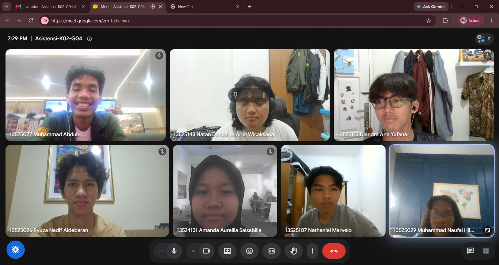

# Form Asistensi

## Tugas Besar IF2150 - Rekayasa Perangkat Lunak

| Informasi | Keterangan |
| --- | --- |
| **Hari** | Selasa |
| **Tanggal** | 29/09/2026 |
| **Kelas** | K2 |
| **Nomor Kelompok** | 4  |
| **Nama Kelompok** | 0sks  |
| **Nama Perangkat Lunak** | Ngaksara  |
| **Dokumen** | CD  |

### Anggota Kelompok

| NIM | Nama |
| --- | --- |
| 13525026 | Ryuza Nadif Aldebaran |
| 13525029 | Muhammad Naufal Hilmi |
| 13525077 | Muhammad Abduh |
| 13525107 | Nathaniel Marvelo |
| 13525113 | Diandra Aria Yufana |
| 13525143 | Natan Danuarta Ariel Wicaksana |

### Catatan

| Catatan |
| --- |
| 1. Banyak faktor yang dapat memengaruhi kecepatan menulis aksara. Belum pasti apakah website/device yang digunakan akan berpengaruh |
| 2. Masih diperbolehkan untuk melakukan perubahan pada bab 2, terutama akan operasi perangkat lunak dikarenakan belum pasti akan menggunakan bahasa apa saja |
| 3. Tidak perlu menambahkan KNF untuk setiap fitur, kelima KNF yang dibuat sudah cukup |

**Notes for this section:**  
*Catatan dapat dituliskan dalam bentuk paragraf atau poin-poin, disesuaikan saja.* 

## Dokumentasi

<!--  -->

  

  <i>Gambar 1. Dokumentasi kegiatan asistensi.</i>

