<h1>
IF2150 REKAYASA PERANGKAT LUNAK
 
TUGAS 5
 
SPESIFIKASI KEBUTUHAN PERANGKAT LUNAK (SKPL)
</h1>
 

## Ngaksara

### Untuk: Amanda Aurellia Salsabilla

Dipersiapkan oleh:
| Informasi | Keterangan |
| --- | --- |
| Kelas | K2 |
| Kelompok | 4  |

| NIM | Nama |
|---|---|
| 13525026 | Ryuza Nadif Aldebaran |
| 13525029 | Muhammad Naufal Hilmi |
| 13525077 | Muhammad Abduh |
| 13525107 | Nathaniel Marvelo |
| 13525113 | Diandra Aria Yufana |
| 13525143 | Natan Danuarta Ariel Wicaksana |
---

## Daftar Perubahan

| Revisi | Deskripsi |
| :--- | :--- |
| *A* | *Deskripsikan perubahan yang dilakukan dari dokumen sebelumnya pada dokumen ini. Jika tidak terdapat perubahan, harap kosongkan tabel.* |
| *B* |  |
| *C* |  |
| ... |  |

 

# BAB 1: Pendahuluan

## 1.1 Tujuan Penulisan Dokumen
Dokumen Spesifikasi Kebutuhan Perangkat Lunak (SKPL) ini disusun sebagai kesepakatan antara tim pengembang dan pemangku kepentingan mengenai apa yang akan dilakukan oleh perangkat lunak Ngaksara. Dokumen ini berfokus untuk mendefinisikan dan merinci seluruh spesifikasi kebutuhan (fungsional dan non-fungsional), batasan, serta aturan domain perangkat lunak.

Pengguna utama dari dokumen ini meliputi:
1. Kelompok Pengembang (Kelompok 4 Kelas K2): Sebagai landasan dalam menentukan keputusan struktur desain, implementasi kode, dan pengujian, guna memastikan sistem dibangun sesuai dengan spesifikasi.
2. Pemelihara Sistem di Masa Depan: Sebagai sarana komunikasi untuk menangkap maksud awal dari sistem, sehingga pemelihara yang tidak ikut menulis dokumen ini tetap dapat memahami aturan sistem saat melakukan perbaikan.
3. Asisten Penilai (Amanda Aurellia Salsabilla) selaku Pemangku Kepentingan: Sebagai dokumen evaluasi dan validasi kelayakan aplikasi.

## 1.2 Lingkup Masalah
Tuliskan dengan ringkas nama aplikasi dan deskripsi singkatnya. Bagian ini maksimal berisi satu paragraf, dapat diringkas dari BAB 1 *Analisis Permasalahan* pada dokumen *Topic Brainstorming*.

Indonesia merupakan negara dengan keberagaman tinggi yang disebabkan oleh berbagai faktor, salah satunya yaitu adalah keberagaman bahasa. Beberapa bahasa daerah di Indonesia memiliki aksara sebagai sarana komunikasi tertulis untuk melestarikan budaya. Di era sekarang, aksara dari bahasa daerah di Indonesia sudah sangat jauh tertinggal dan mulai ditinggalkan. Ngaksara merupakan sebuah perangkat lunak yang dapat membantu mengenalkan kembali aksara daerah dengan menyediakan fitur-fitur untuk mempelajari aksara daerah, seperti cara tulis, cara baca, sampai menyusun aksara menjadi kata maupun kalimat sederhana.

## 1.3 Definisi, Istilah, dan Singkatan
Semua definisi dan singkatan yang digunakan dalam dokumen ini beserta penjelasannya.

Tabel 1.3. Definisi Istilah dan Singkatan
 
| Singkatan, Akronim, atau Istilah | Penjelasan |
| :--- | :--- |
| P/L | Perangkat Lunak, yaitu aplikasi yang memberikan perintah kepada komputer untuk menjalankan tugas tertentu. |
| SKPL | Spesifikasi Kebutuhan Perangkat Lunak, yaitu dokumen yang merangkum kebutuhan yang harus dipenuhi P/L. Padanan dari SRS (Software Requirements Specification). |
| KF | Kebutuhan Fungsional, yaitu perilaku sistem yang dapat diamati oleh pengguna. |
| KNF | Kebutuhan Non-Fungsional, yaitu batasan terhadap perilaku sistem atau cara sistem memberikannya, seperti waktu tanggap dan keamanan. |
| R | Kebutuhan hasil tahap Requirement Gathering yang menjadi sumber KF dan KNF. |
| UC | Use Case, yaitu rangkaian interaksi antara aktor dan sistem untuk mencapai suatu tujuan. |
| EARS | Easy Approach to Requirements Syntax, yaitu pola penulisan kebutuhan agar konsisten dan mudah diuji. |
| SDGs | Sustainable Development Goals, yaitu tujuan pembangunan berkelanjutan PBB. Ngaksara menyasar Tujuan 4, *Quality Education*. |
| Aksara | Sistem tulisan dengan bentuk karakter tersendiri. Dalam dokumen ini, istilah ini merujuk pada aksara Jawa dan aksara Sunda. |
| Pelajar | Aktor yang menggunakan Ngaksara untuk mempelajari materi dan mengerjakan latihan aksara. |
| Pengajar | Aktor yang berperan sebagai fasilitator, yaitu membuat kelas, memberikan tugas, dan memantau progres Pelajar. |
| Tim Materi | Aktor yang mengelola konten materi dan latihan. |
| Materi | Satuan konten pembelajaran yang berisi bentuk aksara, aturan, contoh, dan audio pengucapan untuk jenis aksara dan tingkat kesulitan tertentu. |
| Outline | Garis bantu bentuk aksara yang ditampilkan pada area menggambar sebagai panduan menggambar. |
| Goresan | Jejak yang dibuat Pelajar saat menggambar aksara di layar, beserta urutannya. |
| Template aksara | Bentuk acuan aksara yang benar untuk membandingkan dan menilai akurasi goresan. |
| Ambang batas akurasi | Nilai minimum akurasi goresan agar latihan meanggambar dinyatakan berhasil. |
| Mencocokkan bunyi | Mode latihan ketika Pelajar memilih aksara yang sesuai dengan audio pengucapan. |
| Merangkai aksara | Mode latihan ketika Pelajar menyusun komponen aksara dan tanda baca menjadi suku kata atau kata. |
| Transliterasi | Pengalihan tulisan dari aksara ke huruf Latin atau sebaliknya. |
| Streak | Jumlah hari berturut-turut Pelajar menyelesaikan aktivitas belajar. |
| Poin | Nilai yang diperoleh Pelajar setelah menyelesaikan latihan atau tugas. |
| Badge | Penanda pencapaian yang diberikan kepada Pelajar ketika memenuhi syarat tertentu. |
| Papan peringkat | Urutan poin anggota dalam satu kelas yang ditampilkan per kelas. |
| Kelas | Kelompok belajar milik seorang Pengajar yang beranggotakan sejumlah Pelajar. |
| Kode bergabung | Kode unik dan aktif yang digunakan Pelajar untuk bergabung ke suatu kelas. |
| Tugas | Paket materi atau latihan yang ditentukan Pengajar bagi anggota kelas, lengkap dengan instruksi dan tenggat. |
| Tenggat | Batas waktu penyelesaian tugas. Tugas yang diselesaikan setelah tenggat berstatus "terlambat". |
| Feedback | Masukan dari Pelajar atau Pengajar mengenai performa, tampilan, fitur, atau materi aplikasi. |
| T&C | Terms & Conditions, yaitu syarat dan ketentuan yang harus disetujui pengguna saat membuat akun. |
| Hash| Hasil fungsi satu arah yang digunakan untuk menyimpan kata sandi tanpa menyimpan teks aslinya. |
| Boundary, Controller, Entity | Tiga jenis kelas analisis, yaitu kelas antarmuka dengan aktor, kelas pengatur alur logika, dan kelas penyimpan data. |

## 1.4 Aturan Penomoran
Tuliskan aturan penomoran (ID) yang digunakan dalam dokumen ini. Gunakan pola ID yang **sama** dengan yang sudah dipakai pada dokumen-dokumen sebelumnya, jangan membuat pola baru di dokumen ini.

Tabel 1.4. Aturan Penomoran
 
| Hal/Bagian | Penomoran | Keterangan |
| :--- | :--- | :--- |
| Kebutuhan (hasil *Requirement Gathering*) | RXX | Contoh: R01. Menjadi sumber penelusuran KF dan KNF. |
| Kebutuhan Fungsional | KFXX | Contoh: KF01. Menggunakan nomor dua digit yang berurutan mulai dari 01. |
| Kebutuhan Non-Fungsional | KNFXX | Contoh: KNF01. Menggunakan nomor dua digit yang berurutan mulai dari 01. |
| Aktor | Nama aktor | Dirujuk dengan nama (Pelajar, Pengajar, Tim Materi), mengikuti dokumen *Use Case* sebelumnya. |
| Use Case | UC-XX | Contoh: UC-01. Menggunakan tanda hubung, mengikuti dokumen *Use Case & Skenario Use Case*. |
| Kelas | CXX | Contoh: C01. Menggunakan nomor dua digit, sesuai dokumen *Class Diagram*. |
| Tabel | Tabel X.Y | X adalah nomor bab dan Y adalah nomor urut tabel dalam bab tersebut. |
| Gambar | Gambar N | Nomor urut gambar di seluruh dokumen. |

## 1.5 Referensi
1. Kelompok 4 K2, *Topic Brainstorming – Ngaksara*, Tugas 1 IF2150 Rekayasa Perangkat Lunak.
2. Kelompok 4 K2, *Requirement Gathering – Ngaksara*, Tugas 2 IF2150 Rekayasa Perangkat Lunak.
3. Kelompok 4 K2, *Use Case & Skenario Use Case – Ngaksara*, Tugas 3 IF2150 Rekayasa Perangkat Lunak.
4. Kelompok 4 K2, *Class Diagram – Ngaksara*, Tugas 4 IF2150 Rekayasa Perangkat Lunak.
5. Slide Kuliah IF2150 Rekayasa Perangkat Lunak, Sesi 4 – Perumusan Kebutuhan.
6. A. Mavin, P. Wilkinson, A. Harwood, M. Novak, "EARS (Easy Approach to Requirements Syntax)," *Proceedings of the 17th IEEE International Requirements Engineering Conference (RE'09)*, IEEE, 2009.

## 1.6 Deskripsi Umum Dokumen (Ikhtisar)
| Bagian | Pembahasan | Keterangan |
| :--- | :--- | :--- |
| Bab 1 | Pendahuluan | Tujuan, Lingkup Masalah, Definisi, istilah, dan singkatan, Aturan penomoran, Referensi, Ikhtisar |
| Bab 2 | Deskripsi Umum P/L | Deskripsi umum sistem, Deskripsi umum P/L, Pengguna dan kebutuhan pengguna P/L, Batasan P/L, Lingkup operasi P/L |
| Bab 3 | Deskripsi Kebutuhan P/L | KF, KNF |
| Bab 4 | Pemodelan UC | Identifikasi aktor, Identifikasi UC, UC diagram, Skenario UC |
| Bab 5 | Pemodelan Kelas | Identifikasi kelas, Diagram kelas per UC, Diagram kelas keseluruhan |
| Bab 6 | Traceability | Traceability antara kelas, UC, dan KF |
---

# BAB 2: Deskripsi Perangkat Lunak

## 2.1 Deskripsi Umum Sistem
Ngaksara merupakan perangkat lunak berbasis web untuk mendukung pembelajaran aksara Jawa dan Sunda sebagai kontribusi terhadap SDGs 4, yaitu pendidikan berkualitas. Sistem melibatkan Pelajar, Pengajar, dan Tim Materi. Pelajar dapat belajar secara mandiri atau mengikuti pembelajaran kelas. Pengajar mengelola kelas, menerbitkan tugas, dan memantau perkembangan belajar anggota. Tim Materi mengelola konten pembelajaran sesuai hak aksesnya.

Pembelajaran dimulai ketika Pelajar memilih materi berdasarkan jenis aksara dan tingkat kesulitan. Materi mencakup bentuk aksara, aturan penulisan, contoh, dan audio pengucapan. Pelajar kemudian dapat mengerjakan latihan menggambar aksara, mencocokkan bunyi, merangkai aksara, atau transliterasi. Sistem mengevaluasi hasil latihan dan menyajikan umpan balik sebagai dasar untuk meninjau penguasaan materi.

### 2.1.1 Pembelajaran Mandiri

Pelajar memilih aksara dan tingkat kesulitan, mempelajari materi, menyelesaikan latihan, serta meninjau progres dan motivasi belajar. Proses ini mencakup UC-02, UC-03, dan UC-04.

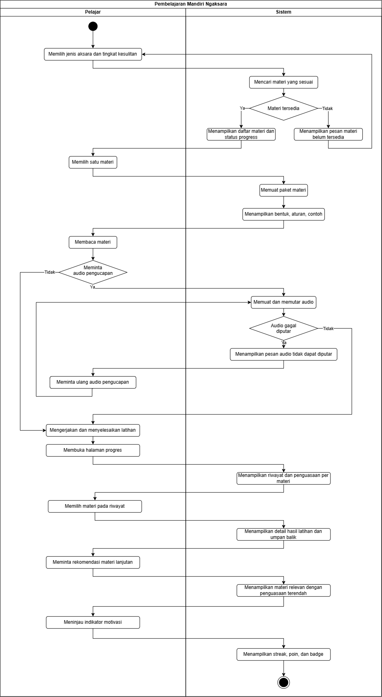

<i>Gambar 1. Activity Diagram Pembelajaran Mandiri</i>

### 2.1.2 Latihan Menggambar Aksara

Pelajar menggambar aksara dengan outline, mengirim hasil, dan menerima penilaian. Setelah latihan diselesaikan, sistem menyimpan hasil dan memperbarui motivasi. Aktivitas yang belum selesai tidak menambah streak atau poin, sedangkan pengulangan soal yang sama tidak memberikan poin baru. Diagram merinci UC-03.

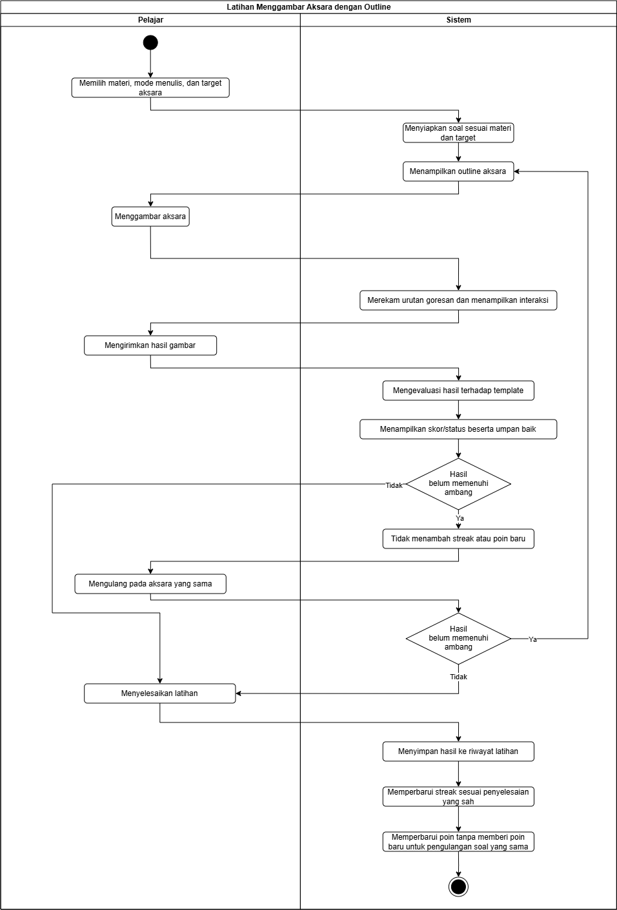

<i>Gambar 2. Activity Diagram Latihan Menggambar Aksara</i>

### 2.1.3 Pembelajaran Kelas

Pengajar membuat kelas dan menerbitkan tugas. Pelajar bergabung melalui kode kelas dan menyelesaikan tugas. Sistem mencatat status tepat waktu atau terlambat, kemudian Pengajar memantau progres anggota. Proses ini mencakup UC-07, UC-05, dan bagian pemantauan UC-08.

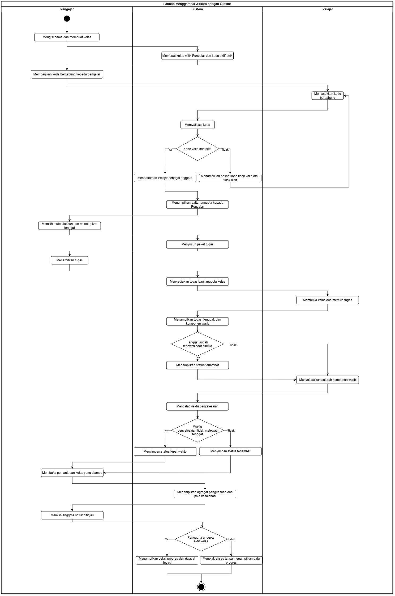

<i>Gambar 3. Activity Diagram Pembelajaran Kelas</i>

## 2.2 Deskripsi Umum Perangkat Lunak
Ngaksara menyediakan pengelolaan akun, materi, latihan, progres, motivasi belajar, pembelajaran kelas, dan penerimaan feedback. Pengguna mengakses layanan melalui browser dengan hak akses sesuai peran. Data yang dikelola mencakup profil pengguna, materi, hasil latihan, indikator motivasi, kelas, keanggotaan, tugas, penyelesaian tugas, dan feedback sistem.

Latihan mencakup menggambar dengan atau tanpa outline, mencocokkan bunyi, merangkai aksara, dan transliterasi Latin ke aksara Jawa/Sunda atau sebaliknya. Transliterasi tidak menerjemahkan makna. Sistem mengevaluasi latihan dan menyediakan hasil untuk peninjauan progres serta rekomendasi materi. Papan peringkat hanya berlaku per kelas, menggunakan nama tampilan, dan dapat diaktifkan atau dinonaktifkan Pengajar.

Pelajar dan Pengajar menyampaikan feedback aplikasi melalui UC-09. Ngaksara tidak menyediakan pengiriman pesan antar pengguna. Pengajar memantau progres anggota kelas melalui UC-08 tanpa mengirim pesan melalui sistem.

Untuk implementasi awal, Ngaksara tidak menggunakan API atau layanan eksternal. Materi, audio, gambar, font, dan komponen antarmuka disediakan sebagai aset aplikasi pada server. Basis data dan penyimpanan berkas merupakan komponen internal. Distribusi audio dan gambar dari server kepada browser merupakan bagian operasi Ngaksara.

## 2.3 Pengguna dan Kebutuhan Pengguna Perangkat Lunak

Tabel 2.1. Pengguna dan Kebutuhan Pengguna

| Pengguna | Kebutuhan |
| :--- | :--- |
| Pelajar | Membuat akun dan mengakses aplikasi. Mempelajari materi, mengerjakan latihan, memperoleh hasil, serta meninjau progres dan motivasi. Bergabung ke kelas dan menyelesaikan tugas. Melihat papan peringkat apabila diaktifkan. Menyampaikan feedback sistem. |
| Pengajar | Membuat akun dan mengakses aplikasi. Membuat kelas, mengelola kode dan anggota, serta menerbitkan tugas dengan instruksi dan tenggat. Memantau progres dan pola kesalahan anggota aktif. Mengatur papan peringkat kelas dan menyampaikan feedback sistem. |
| Tim Materi | Mengakses pengelolaan konten sesuai hak aksesnya. Mengunggah, memperbarui, atau menghapus konten sesuai tindakan yang diizinkan. Menjaga kesesuaian materi serta template penulisan dengan aksara dan tingkat kesulitan. |

## 2.4 Batasan Perangkat Lunak
Batasan yang harus dituliskan, di antaranya:
1. Ngaksara berbasis web dan berfokus pada aksara Jawa serta Sunda.
2. Hak akses mengikuti peran Pelajar, Pengajar, dan Tim Materi.
3. Pengajar hanya dapat melihat progres anggota aktif kelas yang diampunya.
4. Keanggotaan baru menggunakan kode valid dan aktif. Pengeluaran anggota mengakhiri akses kelas tanpa menghapus riwayat pribadi.
5. Papan peringkat hanya per kelas, bersifat opsional, dan menggunakan nama tampilan.
6. Aktivitas yang belum diselesaikan tidak menambah streak atau poin. Pengulangan soal yang sama tidak memberikan poin baru.
7. Status pengumpulan ditetapkan berdasarkan waktu penyelesaian seluruh komponen wajib. Penyelesaian pada atau sebelum tenggat berstatus tepat waktu, sedangkan penyelesaian setelah tenggat berstatus terlambat.
8. Feedback ditujukan kepada sistem. Tidak ada fitur pesan antar pengguna.
9. KNF03 menargetkan pemuatan daftar materi beserta gambar kurang dari tiga detik pada koneksi stabil. KNF04 menargetkan keterlambatan tampilan goresan tidak lebih dari 50 milidetik.
10. Implementasi awal didemonstrasikan melalui localhost atau jaringan lokal. Hosting publik belum menjadi bagian dari lingkungan demonstrasi.

## 2.5 Lingkungan Operasi Perangkat Lunak

Tabel 2.2. Lingkungan Operasi yang Direncanakan

| Komponen | Spesifikasi |
| :--- | :--- |
| Server aplikasi | Laravel 13 dengan PHP 8.4. |
| OS lingkungan demonstrasi | Windows 11 64-bit dan Linux|
| Cara menjalankan demonstrasi | Server pengembangan Laravel pada localhost atau jaringan lokal. |
| Rencana OS jika dipublikasikan | Ubuntu Server 24.04 LTS dengan Nginx dan PHP-FPM 8.4.|
| Basis data | MySQL 8.4 dengan `utf8mb4`. |
| Antarmuka | Blade, HTML, CSS, Bootstrap 5.3, dan JavaScript. Aset disimpan bersama aplikasi. |
| Interaksi menggambar | Canvas API dan Pointer Events. |
| Penyimpanan | Laravel Filesystem pada disk lokal untuk materi, audio, gambar, dan data template. |
| Alokasi awal server | Dua inti CPU, RAM 4 GB untuk proses server dan ruang kosong 10 GB untuk aplikasi serta data awal.|
| Client | Chrome, Edge, atau Firefox versi stabil yang tersedia.|
| Perangkat pengguna | Mouse atau layar sentuh, browser dengan JavaScript aktif, serta speaker/headphone untuk latihan audio. |
| Jaringan demonstrasi | Localhost atau LAN. Koneksi internet tidak menjadi ketergantungan runtime apabila seluruh aset dan server tersedia secara lokal. |
| Integrasi eksternal | Tidak digunakan pada implementasi awal. |
| Pemeliharaan | Pengembang memeriksa log aplikasi dan kondisi server menggunakan sarana operasional. Tidak ditambahkan aktor Administrator maupun antarmuka pemeliharaan baru. |

---

# BAB 3: Deskripsi Kebutuhan Perangkat Lunak

## 3.1 Kebutuhan Fungsional (KF)

Tabel 3.1. Kebutuhan Fungsional

| ID KF | ID Kebutuhan | Penjelasan |
| --- | --- | --- |
| KF01 | R01 | Sistem harus menampilkan pilihan antarmuka pendaftaran akun untuk setiap opsi pengguna (pelajar dan pengajar) |
| KF02 | R01 | Sistem harus memberikan akses kontrol/privilege berbeda untuk setiap jenis pengguna |
| KF03 | R02 | Sistem harus menampilkan pilihan antarmuka log-in untuk setiap opsi pengguna (pelajar dan pengajar) |
| KF04 | R02 | Ketika pengguna melakukan pendaftaran akun, log in, atau logout, sistem harus memproses permintaan tersebut melalui pengecekan validitas kredensial |
| KF05 | R03 | Setelah pengguna membuat kata sandi, sistem harus menyimpan password dalam bentuk hash adaptif bersalt sebelum disimpan di database |
| KF06 | R04 | Sistem harus menampilkan dokumen Terms & Conditions kepada pengguna saat membuat akun |
| KF07 | R04 | Bila pengguna belum memberikan persetujuan eksplisit terhadap Terms & Conditions, sistem harus menolak menyelesaikan pembuatan akun |
| KF08 | R05 | Sistem harus menampilkan antarmuka materi dan latihan sesuai fitur pembelajaran yang dipilih pengguna |
| KF09 | R06 | Ketika pengguna berada di halaman utama, sistem harus menampilkan daftar materi secara terurut berdasarkan jenis aksara atau tingkat kesulitan |
| KF10 | R08 | Jika tersedia opsi menampilkan outline, sistem harus menampilkan tampilan antarmuka fitur menggambar aksara sesuai dengan opsi outline yang dipilih pengguna |
| KF11 | R08 | Ketika pengguna menggambar aksara, sistem harus merekam dan memproses urutan goresan secara berkelanjutan |
| KF12 | R09 | Ketika pengguna menggoreskan aksara di layar, sistem harus menilai akurasi goresan tersebut terhadap template dengan algoritma yang sesuai |
| KF13 | R11 | Sistem harus menampilkan tampilan antarmuka riwayat pengerjaan latihan pelajar bagi pengajar |
| KF14 | R12 | Setelah pelajar melakukan aktivitas pembelajaran, sistem harus mencatat dan menyimpan riwayat aktivitas tersebut agar dapat diakses pengajar |
| KF15 | R13 | Ketika Tim Materi mengunggah modul atau latihan, sistem harus menyimpan konten tersebut pada penyimpanan terpusat sebagai draf |
| KF16 | R14 | Ketika Tim Materi memilih tindakan yang diizinkan, sistem harus mengubah atau menghapus konten sesuai hak aksesnya |
| KF17 | R16 | Dalam interval waktu yang rutin, sistem harus mencatat dan menyimpan log aktivitas dan error yang terjadi |
| KF18 | R18, R28 | Saat Pelajar atau Pengajar memiliki keluhan atau feedback, sistem harus menerima feedback tersebut melalui form yang tersedia |
| KF19 | R18, R28 | Ketika sistem menerima feedback yang valid dari Pelajar atau Pengajar, sistem harus memvalidasi dan menyimpannya pada server |
| KF20 | R18, R28 | Setelah server menyimpan feedback, sistem harus memberikan konfirmasi kepada pengirim dan menyediakan data feedback untuk pengelolaan sistem |
| KF21 | R19 | Ketika Pelajar memulai latihan bunyi, sistem harus memutar atau merekam pelafalan dan mencocokkannya dengan aksara target |
| KF22 | R20 | Ketika Pelajar mengirim susunan aksara, sistem harus mengevaluasi urutan tersebut terhadap urutan yang benar |
| KF23 | R21 | Ketika Pelajar mengirim hasil transliterasi, sistem harus mengevaluasi kesesuaian aksara dan teks latin |
| KF24 | R22 | Ketika Pelajar membuka halaman progres, sistem harus menampilkan progres, streak, poin, lencana, dan scoreboard |
| KF25 | R23 | Ketika Pengajar mengirim data kelas yang valid, sistem harus membuat kelas dan menghasilkan kode bergabung unik |
| KF26 | R24 | Ketika Pelajar mengirim kode bergabung yang aktif, sistem harus menambahkan Pelajar sebagai anggota kelas |
| KF27 | R25 | Ketika Pengajar menerbitkan tugas, sistem harus menyimpan komponen tugas, instruksi, dan tenggat |
| KF28 | R26 | Ketika Pelajar membuka atau mengirim tugas, sistem harus menampilkan tugas aktif dan menyimpan status pengumpulan termasuk keterlambatan |

## 3.2 Kebutuhan Non-Fungsional (KNF)

Tabel 3.2. Kebutuhan Non-Fungsional

| ID KNF | ID Kebutuhan | Parameter | Deskripsi Kebutuhan |
| :--- | :--- | :--- | :--- |
| KNF01 | R16 | Maintainabiliy | Aplikasi harus otomatis mencatat seluruh masalah ke dalam log agar administrator mudah mencari letak masalahnya. |
| KNF02 | R03 | Security | Sistem harus mengamankan kata sandi pengguna dengan cara dienkripsi sebelum disimpan ke database. |
| KNF03 | R07 | Response time | Sistem harus bisa memuat dan menampilkan halaman daftar materi beserta gambarnya degan waktu kurang dari 3 detik saat koneksi internet stabil. |
| KNF04 | R10 | Response time | Saat pelajar berlatih menggambar aksara di layar, coretan tidak boleh delay lebih dari 50 milidetik agar terasa lancar dan nyaman. |
| KNF05 | R18 | Reliability | Fitur penerimaan feedback kendala harus berhasil terkirim dan tersimpan. Jika tidak, harus memberikan pesan error (jika internet terputus). |

---

# BAB 4: Pemodelan Use Case

## 4.1 Identifikasi Aktor

| Aktor | Deskripsi |
| :--- | :--- |
| Pelajar | Pengguna yang login ke aplikasi untuk belajar dan berlatih aksara Jawa dan Sunda. Pengguna ini dapat mengirim feedback kepada sistem jika mengalami kendala atau memiliki saran.|
| Pengajar | Pengguna yang login sebagai fasilitator pembelajaran. Pengguna ini memiliki akses untuk melihat rekam jejak latihan Pelajar, menganalisis kelemahan mereka, serta mengirim feedback kepada sistem.|
| Tim Materi | Pengguna yang bertindak sebagai pengelola konten materi. Tim materi membutuhkan akses untuk mengelola modul. |   

## 4.2 Identifikasi Use Case

| ID | Nama | Aktor | Tujuan | KF |
|---|---|---|---|---|
| UC-01 | Melakukan Pendaftaran Akun | Pelajar; Pengajar | Membuat akun sesuai peran untuk dapat menggunakan perangkat lunak. | KF01–KF07, KF17 |
| UC-02 | Mempelajari Materi | Pelajar | Memahami materi terbit untuk aksara dan tingkat yang dipilih. | KF02–KF04, KF08–KF09, KF17 |
| UC-03 | Mengerjakan Latihan Aksara | Pelajar | Menyelesaikan mode latihan dan memperoleh hasil serta umpan balik. | KF02–KF03, KF10–KF12, KF14, KF17, KF21–KF23 |
| UC-04 | Meninjau Progres dan Motivasi | Pelajar | Mengetahui perkembangan, materi yang perlu diulang, dan status motivasi. | KF02–KF03, KF14, KF17, KF24 |
| UC-05 | Mengikuti Pembelajaran Kelas | Pelajar | Bergabung ke kelas dan menyelesaikan tugas yang diberikan Pengajar. | KF02–KF03, KF14, KF17, KF26, KF28 |
| UC-06 | Memperbaharui Materi | Tim Materi | Memperbarui atau memperbaiki materi pembelajaran yang tersedia. | KF02–KF03, KF15–KF17, KF29 |
| UC-07 | Menyiapkan Pembelajaran Kelas | Pengajar | Membentuk kelas, mengendalikan akses, mengelola anggota, dan menyediakan tugas. | KF02–KF03, KF17, KF25, KF27 |
| UC-08 | Memantau dan Menindaklanjuti Progres | Pengajar | Memahami perkembangan anggota dan memberikan tindak lanjut. | KF02–KF04, KF13–KF14, KF17 |
| UC-09 | Menyampaikan Feedback | Pelajar; Pengajar | Menyampaikan feedback aplikasi, materi, atau pengalaman penggunaan melalui form. | KF02–KF03, KF17–KF20 |

## 4.3 Use Case Diagram
Salin ulang Use Case Diagram dari BAB 3.3 dokumen *Use Case & Scenario Use Case* atau *Class Diagram* (gunakan versi paling akhir/terbaru apabila terdapat perubahan).

<i>Gambar 2. Contoh Use Case Diagram</i>

## 4.4 Skenario Use Case

### 4.4.1 Skenario UC01

**Nama Use Case:** Melakukan Pendaftaran Akun

**Skenario Normal**

| No. | Aksi Aktor | Reaksi Perangkat Lunak |
| :--- | :--- | :--- |
| 1 | Pengguna memilih opsi pendaftaran akun (pelajar, pengajar) | Sistem menampilkan antarmuka opsi pemilihan jenis akun yang didaftarkan |
| 2 | Pengguna memasukkan kredensial akun (email, password, username) | Sistem menampilkan antarmuka pendaftaran akun dan memverifikasi kredensial yang digunakan |
| 3 | Pengguna membaca Terms & Conditions aplikasi | Sistem menerima afirmasi bahwa pengguna sudah membaca Terms & Conditions yang berlaku |

**Skenario Alternatif 1: Otorisasi Pembayaran Gagal**

| No. | Aksi Aktor | Reaksi Perangkat Lunak |
| :--- | :--- | :--- |
| 1 | Pengguna memilih opsi pendaftaran akun (pelajar, pengajar) | Sistem menampilkan antarmuka opsi pemilihan jenis akun yang didaftarkan |
| 2 | Pengguna memasukkan kredensial akun (email, password, username) | Sistem menampilkan antarmuka pendaftaran akun dan memverifikasi kredensial yang digunakan |
| 3 | Pengguna memastikan kredensial yang digunakan sesuai | Kembali ke langkah 2 Skenario Normal |

### 4.4.2 Skenario UC02

**Nama Use Case:** Mempelajari Materi

**Skenario Normal**

| No. | Aksi Pelajar | Reaksi Perangkat Lunak |
| :--- | :--- | :--- |
| 1 | Memilih jenis aksara dan tingkat kesulitan | Sistem menampilkan daftar materi yang sesuai beserta status progres |
| 2 | Memilih satu materi | Sistem memuat paket materi yang sesuai dengan versi perangkat lunak |
| 3 | Membaca bentuk, aturan, dan contoh | Sistem menampilkan isi materi secara utuh |
| 4 | Meminta contoh bunyi pengucapan | Sistem memutar audio yang terkait serta sesuai dengan versi perangkat lunak |

**Skenario Alternatif 1: Materi belum tersedia untuk kombinasi yang dipilih**

| No. | Aksi Pelajar | Reaksi Perangkat Lunak |
| :--- | :--- | :--- |
| 1 | Memilih jenis aksara dan tingkat kesulitan | Sistem tidak menemukan materi yang sesuai dan menampilkan pesan "materi belum tersedia untuk kombinasi ini" |
| 2 | Memilih kombinasi jenis aksara dan tingkat kesulitan lain | Sistem kembali ke langkah 1 Skenario Normal |

**Skenario Alternatif 2: Audio pengucapan gagal diputar**

| No. | Aksi Pelajar | Reaksi Perangkat Lunak |
| :--- | :--- | :--- |
| 1 | Membaca bentuk, aturan, dan contoh | Sistem menampilkan isi materi secara utuh |
| 2 | Meminta contoh bunyi pengucapan | Sistem gagal memuat berkas audio (misal karena koneksi terputus) dan menampilkan pesan "audio tidak dapat diputar" |
| 3 | Meminta ulang contoh bunyi pengucapan | Sistem kembali ke langkah 4 Skenario Normal |

### 4.4.3 Skenario UC03

**Nama Use Case:** Mengerjakan Latihan Aksara

**Skenario Normal**

| No. | Aksi Pelajar | Reaksi Perangkat Lunak |
| :--- | :--- | :--- |
| 1 | Memilih materi, lalu memilih salah satu mode latihan (menulis, mencocokkan bunyi, atau merangkai) | Sistem menyiapkan soal latihan sesuai mode dan target aksara yang dipilih |
| 2 | Mengerjakan latihan sesuai mode yang dipilih | Sistem menangkap dan menampilkan interaksi pelajar secara langsung |
| 3 | Mengirimkan jawaban/hasil latihan | Sistem mengevaluasi jawaban sesuai kriteria mode latihan dan menampilkan skor/status beserta feedback |
| 4 | Menyelesaikan latihan | Sistem menyimpan hasil ke riwayat latihan, serta memperbarui streak dan poin pelajar |

**Skenario Alternatif 1: Latihan mencocokkan bunyi**
 
| No. | Aksi Pelajar | Reaksi Perangkat Lunak |
| :--- | :--- | :--- |
| 1 | Memilih mode mencocokkan bunyi | Sistem memutar audio pengucapan dan menampilkan pilihan aksara |
| 2 | Memilih aksara yang sesuai dengan bunyi yang diputar | Sistem menampilkan status jawaban (benar/salah) beserta penjelasannya |
| 3 | Menyelesaikan latihan | Sistem menyimpan hasil ke riwayat latihan serta memperbarui streak dan poin |
 
**Skenario Alternatif 2: Latihan merangkai aksara**
 
| No. | Aksi Pelajar | Reaksi Perangkat Lunak |
| :--- | :--- | :--- |
| 1 | Memilih mode merangkai aksara | Sistem menampilkan komponen aksara dan tanda baca yang dapat disusun |
| 2 | Menyusun komponen menjadi suku kata/kata dan mengirimkannya | Sistem memvalidasi rangkaian berdasarkan aturan aksara yang berlaku dan menampilkan hasil |
| 3 | Menyelesaikan latihan | Sistem menyimpan hasil ke riwayat latihan serta memperbarui streak dan poin |
 
**Skenario Alternatif 3: Gambar aksara kurang akurat (mode menulis)**
 
| No. | Aksi Pelajar | Reaksi Perangkat Lunak |
| :--- | :--- | :--- |
| 1 | Memilih mode menulis dan target aksara | Sistem menampilkan outline aksara sesuai materi yang dipilih |
| 2 | Menggambarkan aksara sesuai outline yang tampil | Sistem menampilkan goresan sesuai interaksi pelajar |
| 3 | Mengirimkan hasil gambar | Sistem menilai keakuratan penulisan berada di bawah ambang batas |
| 4 | Mengulang latihan pada aksara yang sama | Sistem menampilkan kembali outline aksara yang sama untuk diulang, tanpa menambah streak/poin baru |

### 4.4.4 Skenario UC04

**Nama Use Case:** Meninjau Progres dan Motivasi
 
**Skenario Normal**
 
| No. | Aksi Pelajar | Reaksi Perangkat Lunak |
| :--- | :--- | :--- |
| 1 | Membuka halaman progres | Sistem menampilkan riwayat aktivitas dan tingkat penguasaan per materi |
| 2 | Memilih salah satu materi pada riwayat | Sistem menampilkan detail hasil latihan dan umpan balik untuk materi tersebut |
| 3 | Meminta rekomendasi materi lanjutan | Sistem menampilkan materi dengan tingkat penguasaan terendah yang masih relevan untuk dipelajari |
| 4 | Meninjau indikator motivasi (streak, poin, badge) | Sistem menampilkan streak harian, total poin, dan badge yang telah diperoleh pelajar |
 
**Skenario Alternatif 1: Belum ada riwayat pembelajaran**
 
| No. | Aksi Pelajar | Reaksi Perangkat Lunak |
| :--- | :--- | :--- |
| 1 | Membuka halaman progres | Sistem menampilkan keadaan kosong dan merekomendasikan materi awal untuk mulai dipelajari |
| 2 | Membuka rekomendasi materi awal | Sistem mengarahkan pelajar ke halaman mempelajari materi yang direkomendasikan |
 
**Skenario Alternatif 2: Melihat papan peringkat kelas**
 
| No. | Aksi Pelajar | Reaksi Perangkat Lunak |
| :--- | :--- | :--- |
| 1 | Membuka papan peringkat pada salah satu kelas yang diikuti | Sistem menampilkan urutan poin anggota kelas menggunakan nama tampilan masing-masing |

### 4.4.5 Skenario UC05

**Nama Use Case:** Mengikuti Pembelajaran Kelas
 
**Skenario Normal**
 
| No. | Aksi Pelajar | Reaksi Perangkat Lunak |
| :--- | :--- | :--- |
| 1 | Memasukkan kode kelas yang diberikan pengajar | Sistem memvalidasi kode dan mendaftarkan pelajar sebagai anggota kelas |
| 2 | Membuka kelas yang diikuti | Sistem menampilkan daftar tugas beserta tenggat waktu dan status pengerjaannya |
| 3 | Membuka salah satu tugas sebelum tenggat | Sistem menampilkan komponen materi atau latihan yang harus diselesaikan |
| 4 | Menyelesaikan seluruh komponen wajib pada tugas | Sistem mencatat waktu penyelesaian dan menetapkan status "tepat waktu" |
 
**Skenario Alternatif 1: Pelajar sudah menjadi anggota kelas**
 
| No. | Aksi Pelajar | Reaksi Perangkat Lunak |
| :--- | :--- | :--- |
| 1 | Membuka kelas tanpa memasukkan kode ulang | Sistem menampilkan daftar tugas kelas tanpa membuat keanggotaan baru |
 
**Skenario Alternatif 2: Tugas diselesaikan terlambat**
 
| No. | Aksi Pelajar | Reaksi Perangkat Lunak |
| :--- | :--- | :--- |
| 1 | Membuka tugas yang telah melewati tenggat | Sistem menampilkan status "terlambat" pada tugas tersebut |
| 2 | Menyelesaikan seluruh komponen wajib | Sistem mencatat waktu penyelesaian dan menetapkan status "terlambat" |
 
**Skenario Alternatif 3: Kode kelas tidak valid**
 
| No. | Aksi Pelajar | Reaksi Perangkat Lunak |
| :--- | :--- | :--- |
| 1 | Memasukkan kode kelas | Sistem tidak menemukan kode aktif yang cocok dan menampilkan pesan "kode tidak valid atau tidak aktif" |
| 2 | Memasukkan kode kelas yang benar | Sistem kembali ke langkah 1 Skenario Normal |

### 4.4.6 Skenario UC06

**Nama Use Case:** Memperbaharui Materi

**Skenario Normal**

| No. | Aksi Aktor | Reaksi Perangkat Lunak |
| :--- | :--- | :--- |
| 1 | Tim materi memilih menu pengelolaan materi | Sistem menampilkan daftar materi yang dapat diedit |
| 2 | Tim materi memilih opsi menambahkan materi baru | Sistem mengarahkan pelanggan ke halaman menambahkan materi |
| 3 | Tim materi mengunggah file materi dan mengisi detail (nama, kategori, tingkat kesulitan) | Sistem memvalidasi dan menyimpan materi baru ke database terpusat |
| 4 | Tim materi menyimpan hasil perbaruan materi | Sistem menampilkan pesan "materi berhasil ditambahkan" |

**Skenario Alternatif 1: Penambahan materi gagal**

| No. | Aksi Aktor | Reaksi Perangkat Lunak |
| :--- | :--- | :--- |
| 1 | Tim materi memilih menu memperbarui materi | Sistem menampilkan ringkasan pesanan dan pilihan metode pembayaran |
| 2 | Tim materi menambahkan materi baru | Sistem menerima respons penambahan materi gagal (misal: jenis file tidak didukung website). Materi tidak berubah, sistem menampilkan pesan error dan meminta tim materi memilih ulang file materi baru |
| 3 | Tim materi menambahkan materi ulang | Sistem kembali ke langkah 2 Skenario Normal |

### 4.4.7 Skenario UC07
 
**Nama Use Case:** Menyiapkan Pembelajaran Kelas
 
**Skenario Normal**
 
| No. | Aksi Pengajar | Reaksi Perangkat Lunak |
| :--- | :--- | :--- |
| 1 | Membuat kelas baru dengan mengisi nama kelas | Sistem membuat kelas milik pengajar tersebut beserta satu kode kelas aktif yang unik |
| 2 | Membagikan kode kelas kepada pelajar | Sistem menampilkan daftar anggota yang bergabung |
| 3 | Memilih materi atau latihan dan menetapkan tenggat waktu | Sistem menyusun paket tugas sesuai materi/latihan dan tenggat yang dipilih |
| 4 | Menerbitkan tugas | Sistem menyediakan tugas tersebut hanya bagi anggota kelas yang bersangkutan |
 
**Skenario Alternatif 1: Mengganti kode kelas**
 
| No. | Aksi Pengajar | Reaksi Perangkat Lunak |
| :--- | :--- | :--- |
| 1 | Meminta pergantian kode kelas | Sistem menonaktifkan kode lama dan membuatkan satu kode aktif baru yang unik |
 
**Skenario Alternatif 2: Mengeluarkan anggota kelas**
 
| No. | Aksi Pengajar | Reaksi Perangkat Lunak |
| :--- | :--- | :--- |
| 1 | Memilih salah satu anggota untuk dikeluarkan | Sistem meminta konfirmasi pengeluaran anggota |
| 2 | Mengonfirmasi pengeluaran anggota | Sistem mengakhiri akses anggota tersebut ke kelas tanpa menghapus riwayat belajar pribadinya |
 
**Skenario Alternatif 3: Mengaktifkan papan peringkat kelas**
 
| No. | Aksi Pengajar | Reaksi Perangkat Lunak |
| :--- | :--- | :--- |
| 1 | Mengaktifkan papan peringkat pada pengaturan kelas | Sistem menyimpan status aktif dan menampilkan papan peringkat bagi anggota |

### 4.4.8 Skenario UC08

**Nama Use Case:** Memantau dan Menindaklanjuti Progres

**Skenario Normal**

| No. | Aksi Pengajar | Reaksi Perangkat Lunak |
| :--- | :--- | :--- |
| 1 | Membuka halaman pemantauan salah satu kelas yang diampu | Sistem menampilkan agregat tingkat penguasaan dan pola kesalahan umum anggota kelas |
| 2 | Memilih salah satu anggota kelas | Sistem menampilkan detail progres dan riwayat pengerjaan tugas anggota tersebut |
| 3 | Menuliskan umpan balik atau rekomendasi materi lanjutan | Sistem memeriksa isi pesan dan penerima yang dituju |
| 4 | Mengirimkan umpan balik | Sistem menyimpan pesan tersebut dan menyediakannya hanya bagi anggota yang dituju |

**Skenario Alternatif 1: Belum ada hasil belajar anggota**

| No. | Aksi Pengajar | Reaksi Perangkat Lunak |
| :--- | :--- | :--- |
| 1 | Membuka halaman pemantauan | Sistem menampilkan keadaan kosong beserta daftar anggota yang belum memiliki riwayat latihan |
| 2 | Mengirimkan rekomendasi materi awal kepada anggota tersebut | Sistem menyimpan rekomendasi dan menyediakannya bagi anggota yang dituju |

**Skenario Alternatif 2: Anggota yang dipilih bukan anggota aktif kelas**

| No. | Aksi Pengajar | Reaksi Perangkat Lunak |
| :--- | :--- | :--- |
| 1 | Mencoba membuka progres pengguna yang bukan anggota kelas | Sistem menolak permintaan dan tidak menampilkan data progres pengguna tersebut |

### 4.4.9 Skenario UC09

**Nama Use Case:** Menyampaikan Feedback

**Skenario Normal**

| No. | Aksi Aktor | Reaksi Perangkat Lunak |
| :--- | :--- | :--- |
| 1 | User (pelajar dan pengajar) memilih menu feedback di bagian samping pada menu utama | Sistem menampilkan form feedback dengan beberapa pertanyaan terbuka dan tertutup |
| 2 | User memilih pilihan feedback (performa/tampilan/fitur/materi) | Sistem menampilkan pilihan-pilihan feedback yang dapat diisi oleh user |
| 3 | User mengirim/submit feedback setelah mengisi | Sistem menampilkan pesan bahwa feedback berhasil terkirim |

**Skenario Alternatif 1: Feedback gagal terkirim (karena server down/kendala jaringan)**

| No. | Aksi Aktor | Reaksi Perangkat Lunak |
| :--- | :--- | :--- |
| 1 | User (pelajar dan pengajar) memilih menu feedback di bagian samping pada menu utama | Sistem menampilkan form feedback dengan beberapa pertanyaan terbuka dan tertutup |
| 2 | User memilih pilihan feedback (performa/tampilan/fitur/materi) | Sistem menampilkan pilihan-pilihan feedback yang dapat diisi oleh user |
| 3 | User mengirim/submit feedback setelah mengisi | Sistem menampilkan pesan bahwa feedback gagal terkirim |

---

# BAB 5: Pemodelan Kelas

## 5.1 Identifikasi Kelas
| ID Kelas | Nama Kelas | Jenis dan Deskripsi | ID Use Case |
| :--- | :--- | :--- | :--- |
| C01 | `AkunPengguna` | *(Entity)* Menyimpan kredensial, profil, dan peran Pelajar, Pengajar, atau Tim Materi. | UC-01–UC-09 |
| C02 | `MateriAksara` | *(Entity)* Menyimpan metadata materi, jenis aksara, dan tingkat kesulitan. | UC-02, UC-03, UC-04, UC-06 |
| C03 | `RiwayatLatihan` | *(Entity)* Menyimpan hasil latihan, status, dan waktu pengerjaan Pelajar. | UC-02, UC-03, UC-04, UC-05, UC-08 |
| C04 | `DataFeedback` | *(Entity)* Menyimpan feedback, pengirim, waktu kirim, dan status tindak lanjut. | UC-09 |
| C05 | `HalamanPendaftaran` | *(Boundary)* Form pendaftaran, pemilihan peran, dan persetujuan Terms & Conditions. | UC-01 |
| C06 | `HalamanLogin` | *(Boundary)* Form untuk memasukkan kredensial login. Login dipetakan ke UC-01 karena Bab 3 belum mendefinisikan use case login terpisah dan kebutuhan autentikasi dibahas bersama akses akun. | UC-01 |
| C07 | `HalamanUtama` | *(Boundary)* Navigasi utama setelah pengguna masuk ke sistem. | UC-02–UC-09 |
| C08 | `HalamanLatihan` | *(Boundary)* Antarmuka latihan menulis, mencocokkan bunyi, merangkai aksara, dan transliterasi. | UC-03 |
| C09 | `HalamanKelolaMateri` | *(Boundary)* Antarmuka Tim Materi untuk mengunggah dan menyunting modul. | UC-06 |
| C10 | `HalamanFeedback` | *(Boundary)* Form untuk mengirim feedback aplikasi, materi, atau pengalaman penggunaan. | UC-09 |
| C11 | `HalamanKelasPelajar` | *(Boundary)* Antarmuka Pelajar untuk bergabung kelas, melihat tugas, dan mengumpulkan tugas. | UC-05 |
| C12 | `HalamanKelolaKelas` | *(Boundary)* Antarmuka Pengajar untuk mengelola kelas dan memantau anggotanya. | UC-07, UC-08 |
| C13 | `HalamanMateri` | *(Boundary)* Antarmuka Pelajar untuk memilih dan mempelajari materi serta memutar audio. | UC-02 |
| C14 | `HalamanProgres` | *(Boundary)* Antarmuka Pelajar untuk melihat riwayat, progres, rekomendasi, dan motivasi. | UC-04 |
| C15 | `OtentikasiController` | *(Controller)* Memvalidasi pendaftaran dan login serta memproses autentikasi pengguna. | UC-01 |
| C16 | `LatihanController` | *(Controller)* Menyiapkan latihan, menilai jawaban, dan memperbarui riwayat serta motivasi. | UC-03 |
| C17 | `MateriController` | *(Controller)* Mengambil, mengurutkan, memuat, dan memperbarui materi. | UC-02, UC-03, UC-06 |
| C18 | `FeedbackController` | *(Controller)* Memvalidasi dan menyimpan feedback serta menyiapkan konfirmasi. | UC-09 |
| C19 | `ProgresController` | *(Controller)* Mengolah riwayat dan progres, menyiapkan rekomendasi serta scoreboard. | UC-04, UC-08 |
| C20 | `KelasController` | *(Controller)* Memproses keanggotaan, kelas, tugas, dan pengambilan data kelas. | UC-05, UC-07, UC-08 |
| C21 | `KontenMateri` | *(Entity)* Menyimpan isi materi, contoh, aturan, audio, dan versi konten. | UC-02, UC-03, UC-06 |
| C22 | `MotivasiBelajar` | *(Entity)* Menyimpan streak, poin, dan badge Pelajar untuk motivasi dan scoreboard. | UC-03, UC-04, UC-07 |
| C23 | `KelasBelajar` | *(Entity)* Menyimpan data kelas, pemilik, kode bergabung, dan pengaturan kelas. | UC-05, UC-07, UC-08 |
| C24 | `KeanggotaanKelas` | *(Entity)* Menyimpan hubungan Pelajar dengan kelas dan status keanggotaannya. | UC-05, UC-07, UC-08 |
| C25 | `TugasKelas` | *(Entity)* Menyimpan instruksi, komponen, dan tenggat tugas. | UC-05, UC-07 |
| C26 | `PenyelesaianTugas` | *(Entity)* Menyimpan status dan waktu pengumpulan tugas oleh Pelajar. | UC-05 |

## 5.2 Diagram Kelas per Use Case
### 4.2.1 Use Case UC-01

**Nama Use Case:** Melakukan Pendaftaran Akun

#### Identifikasi Kelas

| ID Kelas | Nama Kelas | Deskripsi Kelas |
| :--- | :--- | :--- |
| C05 | `HalamanPendaftaran` | Form pendaftaran, pemilihan peran, dan persetujuan Terms & Conditions. |
| C06 | `HalamanLogin` | Form untuk memasukkan kredensial login. Login dipetakan ke UC-01 karena Bab 3 belum mendefinisikan use case login terpisah dan kebutuhan autentikasi dibahas bersama akses akun. |
| C15 | `OtentikasiController` | Memvalidasi pendaftaran dan login serta memproses autentikasi pengguna. |
| C01 | `AkunPengguna` | Menyimpan kredensial, profil, dan peran Pelajar, Pengajar, atau Tim Materi. |

#### Diagram Kelas

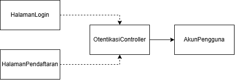

<i>Gambar 2. Diagram Kelas Use Case UC-01</i>

`HalamanPendaftaran` dan `HalamanLogin` mengirim masukan ke `OtentikasiController`. Controller memvalidasi masukan dan berinteraksi dengan `AkunPengguna` untuk membuat akun atau memeriksa kredensial.

| ID Kelas | Nama Kelas | Atribut Utama | Metode Utama |
| :--- | :--- | :--- | :--- |
| C05 | `HalamanPendaftaran` | `formInputData`, `statusPersetujuan` | `tampilkanOpsiPeran()`, `tampilkanTnC()`, `kirimPendaftaran()` |
| C06 | `HalamanLogin` | `emailInput`, `passwordInput` | `kirimKredensial()`, `tampilkanStatusLogin()` |
| C15 | `OtentikasiController` | `statusValidasi`, `statusSesi` | `verifikasiFormatData()`, `enkripsiPassword()`, `simpanAkun()`, `validasiLogin()` |
| C01 | `AkunPengguna` | `idAkun`, `email`, `username`, `passwordHash`, `peran` | `buatAkunBaru()`, `getDetailAkun()` |

### 4.2.2 Use Case UC-02

**Nama Use Case:** Mempelajari Materi

#### Identifikasi Kelas

| ID Kelas | Nama Kelas | Deskripsi Kelas |
| :--- | :--- | :--- |
| C13 | `HalamanMateri` | Antarmuka Pelajar untuk memilih dan mempelajari materi serta memutar audio. |
| C17 | `MateriController` | Mengambil, mengurutkan, memuat, dan memperbarui materi. |
| C02 | `MateriAksara` | Menyimpan metadata materi, jenis aksara, dan tingkat kesulitan. |
| C21 | `KontenMateri` | Menyimpan isi materi, contoh, aturan, audio, dan versi konten. |
| C03 | `RiwayatLatihan` | Menyimpan hasil latihan, status, dan waktu pengerjaan Pelajar. |
| C01 | `AkunPengguna` | Menyimpan kredensial, profil, dan peran Pelajar, Pengajar, atau Tim Materi. |

#### Diagram Kelas

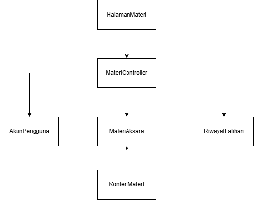

<i>Gambar 3. Diagram Kelas Use Case UC-02</i>

`HalamanMateri` meminta daftar dan isi materi melalui `MateriController`. Controller mengambil metadata dari `MateriAksara`, isi dan audio dari `KontenMateri`, serta status belajar dari `RiwayatLatihan` untuk Pelajar yang sedang masuk.

| ID Kelas | Nama Kelas | Atribut Utama | Metode Utama |
| :--- | :--- | :--- | :--- |
| C13 | `HalamanMateri` | `materiTerpilih`, `statusTampilan` | `pilihMateri()`, `tampilkanIsiMateri()`, `putarAudioPengucapan()` |
| C17 | `MateriController` | `jenisAksaraTerpilih`, `versiAplikasi` | `ambilDaftarMateri()`, `muatPaketMateri()`, `ambilAudioPengucapan()` |
| C02 | `MateriAksara` | `idMateri`, `namaMateri`, `jenisAksara`, `tingkatKesulitan` | `simpan()`, `ambilMetadata()` |
| C21 | `KontenMateri` | `bentukAksara`, `aturan`, `contoh`, `urlAudio`, `versiKonten` | `ambilKonten()`, `ambilAudio()` |
| C03 | `RiwayatLatihan` | `idRiwayat`, `idPelajar`, `statusProgres`, `nilaiAkurasi` | `ambilStatusProgres()` |
| C01 | `AkunPengguna` | `idAkun`, `peran` | `getDetailAkun()` |

### 4.2.3 Use Case UC-03

**Nama Use Case:** Mengerjakan Latihan Aksara

#### Identifikasi Kelas

| ID Kelas | Nama Kelas | Deskripsi Kelas |
| :--- | :--- | :--- |
| C08 | `HalamanLatihan` | Antarmuka latihan menulis, mencocokkan bunyi, merangkai aksara, dan transliterasi. |
| C16 | `LatihanController` | Menyiapkan latihan, menilai jawaban, dan memperbarui riwayat serta motivasi. |
| C17 | `MateriController` | Mengambil, mengurutkan, memuat, dan memperbarui materi. |
| C02 | `MateriAksara` | Menyimpan metadata materi, jenis aksara, dan tingkat kesulitan. |
| C21 | `KontenMateri` | Menyimpan isi materi, contoh, aturan, audio, dan versi konten. |
| C03 | `RiwayatLatihan` | Menyimpan hasil latihan, status, dan waktu pengerjaan Pelajar. |
| C22 | `MotivasiBelajar` | Menyimpan streak, poin, dan badge Pelajar untuk motivasi dan scoreboard. |
| C01 | `AkunPengguna` | Menyimpan kredensial, profil, dan peran Pelajar, Pengajar, atau Tim Materi. |

#### Diagram Kelas

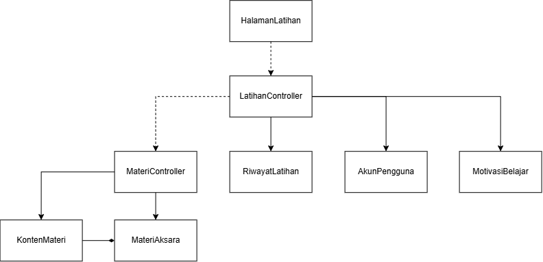

<i>Gambar 4. Diagram Kelas Use Case UC-03</i>

`HalamanLatihan` menyampaikan jawaban ke `LatihanController`. Controller meminta materi atau soal yang diperlukan, menilai jawaban, lalu menyimpan hasil ke `RiwayatLatihan` dan memperbarui `MotivasiBelajar`.

| ID Kelas | Nama Kelas | Atribut Utama | Metode Utama |
| :--- | :--- | :--- | :--- |
| C08 | `HalamanLatihan` | `modeLatihan`, `jawabanInput`, `hasilTampilan` | `pilihModeLatihan()`, `kirimJawaban()`, `tampilkanHasil()` |
| C16 | `LatihanController` | `soalAktif`, `jawabanPengguna`, `skor` | `siapkanSoal()`, `nilaiJawaban()`, `simpanHasil()` |
| C17 | `MateriController` | `idMateri`, `versiKonten` | `ambilKontenLatihan()`, `ambilAudioPengucapan()` |
| C02 | `MateriAksara` | `idMateri`, `jenisAksara`, `tingkatKesulitan` | `ambilTargetLatihan()` |
| C21 | `KontenMateri` | `bentukAksara`, `aturan`, `contoh`, `urlAudio` | `ambilKonten()` |
| C03 | `RiwayatLatihan` | `idRiwayat`, `idPelajar`, `mode`, `skor`, `tanggalPengerjaan` | `simpanHasil()` |
| C22 | `MotivasiBelajar` | `idPelajar`, `streak`, `poin`, `daftarBadge` | `perbaruiStreak()`, `tambahPoin()`, `berikanBadge()` |
| C01 | `AkunPengguna` | `idAkun`, `peran` | `getDetailAkun()` |

### 4.2.4 Use Case UC-04

**Nama Use Case:** Meninjau Progres dan Motivasi

#### Identifikasi Kelas

| ID Kelas | Nama Kelas | Deskripsi Kelas |
| :--- | :--- | :--- |
| C14 | `HalamanProgres` | Antarmuka Pelajar untuk melihat riwayat, progres, rekomendasi, dan motivasi. |
| C19 | `ProgresController` | Mengolah riwayat dan progres, menyiapkan rekomendasi serta scoreboard. |
| C02 | `MateriAksara` | Menyimpan metadata materi, jenis aksara, dan tingkat kesulitan. |
| C03 | `RiwayatLatihan` | Menyimpan hasil latihan, status, dan waktu pengerjaan Pelajar. |
| C22 | `MotivasiBelajar` | Menyimpan streak, poin, dan badge Pelajar untuk motivasi dan scoreboard. |
| C01 | `AkunPengguna` | Menyimpan kredensial, profil, dan peran Pelajar, Pengajar, atau Tim Materi. |

#### Diagram Kelas

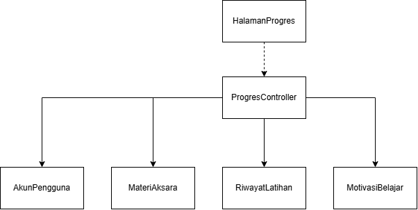

<i>Gambar 5. Diagram Kelas Use Case UC-04</i>

`ProgresController` menyusun riwayat, penguasaan materi, rekomendasi, streak, poin, badge, dan scoreboard untuk ditampilkan pada `HalamanProgres`.

| ID Kelas | Nama Kelas | Atribut Utama | Metode Utama |
| :--- | :--- | :--- | :--- |
| C14 | `HalamanProgres` | `filterPeriode`, `dataTampilan` | `tampilkanProgres()`, `pilihPeriode()`, `tampilkanScoreboard()` |
| C19 | `ProgresController` | `idPelajar`, `periode` | `ambilRiwayat()`, `hitungProgres()`, `siapkanRekomendasi()`, `ambilScoreboard()` |
| C02 | `MateriAksara` | `idMateri`, `namaMateri`, `tingkatKesulitan` | `ambilMateriRekomendasi()` |
| C03 | `RiwayatLatihan` | `idRiwayat`, `idPelajar`, `mode`, `skor`, `tanggalPengerjaan` | `ambilRiwayat()`, `hitungPenguasaan()` |
| C22 | `MotivasiBelajar` | `idPelajar`, `streak`, `poin`, `daftarBadge` | `ambilMotivasi()`, `susunScoreboard()` |
| C01 | `AkunPengguna` | `idAkun`, `namaTampilan`, `peran` | `getProfil()` |

### 4.2.5 Use Case UC-05

**Nama Use Case:** Mengikuti Pembelajaran Kelas

#### Identifikasi Kelas

| ID Kelas | Nama Kelas | Deskripsi Kelas |
| :--- | :--- | :--- |
| C11 | `HalamanKelasPelajar` | Antarmuka Pelajar untuk bergabung kelas, melihat tugas, dan mengumpulkan tugas. |
| C20 | `KelasController` | Memproses keanggotaan, kelas, tugas, dan pengambilan data kelas. |
| C23 | `KelasBelajar` | Menyimpan data kelas, pemilik, kode bergabung, dan pengaturan kelas. |
| C24 | `KeanggotaanKelas` | Menyimpan hubungan Pelajar dengan kelas dan status keanggotaannya. |
| C25 | `TugasKelas` | Menyimpan instruksi, komponen, dan tenggat tugas. |
| C26 | `PenyelesaianTugas` | Menyimpan status dan waktu pengumpulan tugas oleh Pelajar. |
| C03 | `RiwayatLatihan` | Menyimpan hasil latihan, status, dan waktu pengerjaan Pelajar. |
| C01 | `AkunPengguna` | Menyimpan kredensial, profil, dan peran Pelajar, Pengajar, atau Tim Materi. |

#### Diagram Kelas

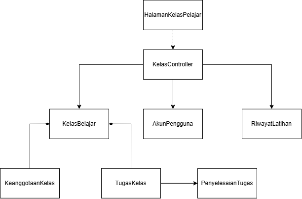

<i>Gambar 6. Diagram Kelas Use Case UC-05</i>

`KelasController` memvalidasi kode melalui `KelasBelajar`, mencatat keanggotaan pada `KeanggotaanKelas`, menampilkan `TugasKelas`, menyimpan pengumpulan pada `PenyelesaianTugas`, serta mencatat aktivitas pembelajaran pada `RiwayatLatihan`.

| ID Kelas | Nama Kelas | Atribut Utama | Metode Utama |
| :--- | :--- | :--- | :--- |
| C11 | `HalamanKelasPelajar` | `kodeKelasInput`, `tugasAktif`, `jawabanInput` | `kirimKodeBergabung()`, `tampilkanTugas()`, `kirimTugas()` |
| C20 | `KelasController` | `idPelajar`, `idKelas` | `validasiKodeBergabung()`, `gabungkanPelajar()`, `ambilTugasAktif()`, `simpanPengumpulan()` |
| C23 | `KelasBelajar` | `idKelas`, `nama`, `kodeBergabung`, `status` | `validasiKode()` |
| C24 | `KeanggotaanKelas` | `idKeanggotaan`, `idKelas`, `idPelajar`, `status` | `simpanKeanggotaan()`, `ubahStatus()` |
| C25 | `TugasKelas` | `idTugas`, `idKelas`, `instruksi`, `tenggat`, `komponenTugas` | `ambilTugasAktif()` |
| C26 | `PenyelesaianTugas` | `idPenyelesaian`, `idTugas`, `idPelajar`, `waktuKumpul`, `status` | `simpanPengumpulan()`, `tentukanStatusKetepatan()` |
| C03 | `RiwayatLatihan` | `idRiwayat`, `idPelajar`, `modeAktivitas`, `tanggalPengerjaan`, `status` | `catatAktivitas()` |
| C01 | `AkunPengguna` | `idAkun`, `namaTampilan`, `peran` | `getProfil()` |

### 4.2.6 Use Case UC-06

**Nama Use Case:** Memperbaharui Materi

#### Identifikasi Kelas

| ID Kelas | Nama Kelas | Deskripsi Kelas |
| :--- | :--- | :--- |
| C09 | `HalamanKelolaMateri` | Antarmuka Tim Materi untuk mengunggah dan menyunting modul. |
| C17 | `MateriController` | Mengambil, mengurutkan, memuat, dan memperbarui materi. |
| C02 | `MateriAksara` | Menyimpan metadata materi, jenis aksara, dan tingkat kesulitan. |
| C21 | `KontenMateri` | Menyimpan isi materi, contoh, aturan, audio, dan versi konten. |
| C01 | `AkunPengguna` | Menyimpan kredensial, profil, dan peran Pelajar, Pengajar, atau Tim Materi. |

#### Diagram Kelas

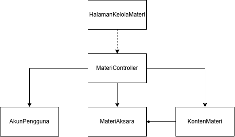

<i>Gambar 7. Diagram Kelas Use Case UC-06</i>

`MateriController` memvalidasi perubahan dari `HalamanKelolaMateri`, memeriksa hak akses pengguna, lalu memperbarui metadata `MateriAksara` dan konten pada `KontenMateri`.

| ID Kelas | Nama Kelas | Atribut Utama | Metode Utama |
| :--- | :--- | :--- | :--- |
| C09 | `HalamanKelolaMateri` | `daftarMateri`, `fileMateriInput`, `detailInput`, `pesanStatus` | `tampilkanDaftarMateri()`, `unggahFileMateri()`, `suntingMateri()`, `tampilkanStatus()` |
| C17 | `MateriController` | `materiSedangDiproses`, `statusValidasi` | `ambilDaftarMateri()`, `validasiFormatFile()`, `tambahMateri()`, `perbaruiMateri()` |
| C02 | `MateriAksara` | `idMateri`, `namaMateri`, `jenisAksara`, `tingkatKesulitan` | `simpan()`, `perbaruiData()` |
| C21 | `KontenMateri` | `bentukAksara`, `aturan`, `contoh`, `urlAudio`, `versiKonten` | `simpanKonten()`, `perbaruiKonten()`, `arsipkanVersi()` |
| C01 | `AkunPengguna` | `idAkun`, `peran` | `verifikasiHakAkses()` |

### 4.2.7 Use Case UC-07

**Nama Use Case:** Menyiapkan Pembelajaran Kelas

#### Identifikasi Kelas

| ID Kelas | Nama Kelas | Deskripsi Kelas |
| :--- | :--- | :--- |
| C12 | `HalamanKelolaKelas` | Antarmuka Pengajar untuk mengelola kelas dan memantau anggotanya. |
| C20 | `KelasController` | Memproses keanggotaan, kelas, tugas, dan pengambilan data kelas. |
| C22 | `MotivasiBelajar` | Menyimpan streak, poin, dan badge Pelajar untuk motivasi dan scoreboard. |
| C23 | `KelasBelajar` | Menyimpan data kelas, pemilik, kode bergabung, dan pengaturan kelas. |
| C24 | `KeanggotaanKelas` | Menyimpan hubungan Pelajar dengan kelas dan status keanggotaannya. |
| C25 | `TugasKelas` | Menyimpan instruksi, komponen, dan tenggat tugas. |
| C01 | `AkunPengguna` | Menyimpan kredensial, profil, dan peran Pelajar, Pengajar, atau Tim Materi. |

#### Diagram Kelas

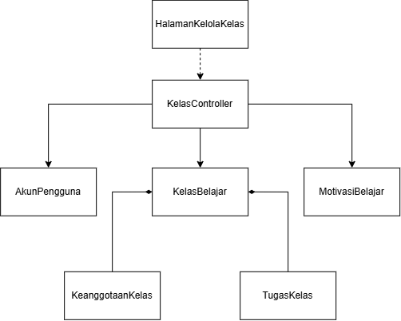

<i>Gambar 8. Diagram Kelas Use Case UC-07</i>

`KelasController` membuat kelas dan kode bergabung, mengelola anggota, serta menerbitkan tugas. `MotivasiBelajar` mendukung scoreboard kelas ketika fitur tersebut diaktifkan Pengajar.

| ID Kelas | Nama Kelas | Atribut Utama | Metode Utama |
| :--- | :--- | :--- | :--- |
| C12 | `HalamanKelolaKelas` | `dataKelasInput`, `instruksiTugas`, `tenggat`, `statusScoreboard` | `buatKelas()`, `kelolaAnggota()`, `buatTugas()`, `aturScoreboard()` |
| C20 | `KelasController` | `idPengajar`, `idKelas` | `buatKelas()`, `hasilkanKodeUnik()`, `kelolaAnggota()`, `terbitkanTugas()` |
| C22 | `MotivasiBelajar` | `idPelajar`, `streak`, `poin`, `daftarBadge` | `ambilPoinKelas()`, `susunScoreboard()` |
| C23 | `KelasBelajar` | `idKelas`, `nama`, `pemilikId`, `kodeBergabung`, `statusScoreboard` | `simpan()`, `buatKodeBergabung()` |
| C24 | `KeanggotaanKelas` | `idKeanggotaan`, `idKelas`, `idPelajar`, `status` | `daftarAnggota()`, `ubahStatus()` |
| C25 | `TugasKelas` | `idTugas`, `idKelas`, `instruksi`, `komponenTugas`, `tenggat` | `simpan()`, `terbitkan()` |
| C01 | `AkunPengguna` | `idAkun`, `peran` | `verifikasiHakAkses()` |

### 4.2.8 Use Case UC-08

**Nama Use Case:** Memantau dan Menindaklanjuti Progres

#### Identifikasi Kelas

| ID Kelas | Nama Kelas | Deskripsi Kelas |
| :--- | :--- | :--- |
| C12 | `HalamanKelolaKelas` | Antarmuka Pengajar untuk mengelola kelas dan memantau anggotanya. |
| C20 | `KelasController` | Memproses keanggotaan, kelas, tugas, dan pengambilan data kelas. |
| C19 | `ProgresController` | Mengolah riwayat dan progres, menyiapkan rekomendasi serta scoreboard. |
| C23 | `KelasBelajar` | Menyimpan data kelas, pemilik, kode bergabung, dan pengaturan kelas. |
| C24 | `KeanggotaanKelas` | Menyimpan hubungan Pelajar dengan kelas dan status keanggotaannya. |
| C03 | `RiwayatLatihan` | Menyimpan hasil latihan, status, dan waktu pengerjaan Pelajar. |
| C01 | `AkunPengguna` | Menyimpan kredensial, profil, dan peran Pelajar, Pengajar, atau Tim Materi. |

#### Diagram Kelas

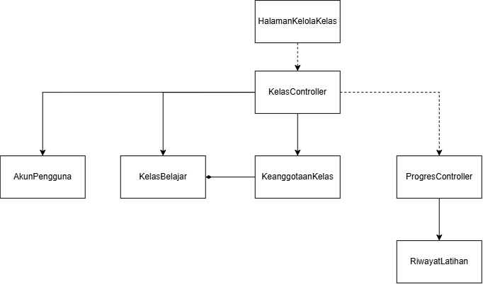

<i>Gambar 9. Diagram Kelas Use Case UC-08</i>

`KelasController` mengambil kelas dan anggota yang diampu Pengajar, lalu meminta `ProgresController` mengolah `RiwayatLatihan`. Hasilnya ditampilkan melalui `HalamanKelolaKelas` untuk membantu Pengajar menentukan tindak lanjut.

| ID Kelas | Nama Kelas | Atribut Utama | Metode Utama |
| :--- | :--- | :--- | :--- |
| C12 | `HalamanKelolaKelas` | `idKelasTerpilih`, `daftarAnggota`, `ringkasanProgres` | `tampilkanAnggota()`, `tampilkanProgres()`, `pilihAnggota()` |
| C20 | `KelasController` | `idPengajar`, `idKelas` | `ambilKelasPengajar()`, `ambilDaftarAnggota()` |
| C19 | `ProgresController` | `idPelajar`, `periode` | `agregasiProgres()`, `hitungPolaKesalahan()` |
| C23 | `KelasBelajar` | `idKelas`, `nama`, `pemilikId` | `daftarKelasPengajar()` |
| C24 | `KeanggotaanKelas` | `idKeanggotaan`, `idKelas`, `idPelajar`, `status` | `daftarAnggotaAktif()` |
| C03 | `RiwayatLatihan` | `idRiwayat`, `idPelajar`, `mode`, `skor`, `tanggalPengerjaan`, `status` | `ambilRiwayatPelajar()`, `hitungPolaKesalahan()` |
| C01 | `AkunPengguna` | `idAkun`, `namaTampilan`, `peran` | `getProfil()` |

### 4.2.9 Use Case UC-09

**Nama Use Case:** Menyampaikan Feedback

#### Identifikasi Kelas

| ID Kelas | Nama Kelas | Deskripsi Kelas |
| :--- | :--- | :--- |
| C10 | `HalamanFeedback` | Form untuk mengirim feedback aplikasi, materi, atau pengalaman penggunaan. |
| C18 | `FeedbackController` | Memvalidasi dan menyimpan feedback serta menyiapkan konfirmasi. |
| C04 | `DataFeedback` | Menyimpan feedback, pengirim, waktu kirim, dan status tindak lanjut. |
| C01 | `AkunPengguna` | Menyimpan kredensial, profil, dan peran Pelajar, Pengajar, atau Tim Materi. |

#### Diagram Kelas

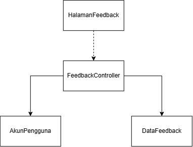

<i>Gambar 10. Diagram Kelas Use Case UC-09</i>

`FeedbackController` memvalidasi masukan, menghubungkannya dengan akun pengirim, menyimpan data feedback, dan menyiapkan konfirmasi. Alur ini sesuai dengan KF18–KF20.

| ID Kelas | Nama Kelas | Atribut Utama | Metode Utama |
| :--- | :--- | :--- | :--- |
| C10 | `HalamanFeedback` | `kategoriFeedback`, `pesanFeedback`, `statusKirim` | `tampilkanFormFeedback()`, `kirimFeedback()`, `tampilkanKonfirmasi()` |
| C18 | `FeedbackController` | `dataMasukan`, `statusValidasi` | `validasiFeedback()`, `simpanFeedback()`, `kirimKonfirmasi()` |
| C04 | `DataFeedback` | `idFeedback`, `idAkun`, `kategori`, `pesan`, `waktuKirim`, `status` | `simpan()`, `perbaruiStatus()` |
| C01 | `AkunPengguna` | `idAkun`, `peran` | `getProfil()` |

## 5.3 Diagram Kelas Keseluruhan

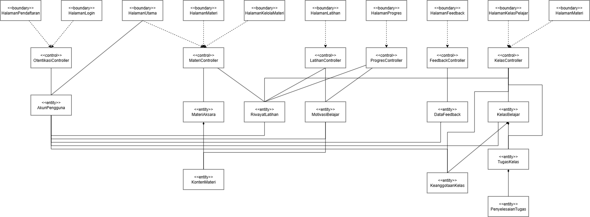

<i>Gambar 11. Diagram Kelas Keseluruhan</i>

| ID Kelas | Nama Kelas | Atribut | Metode/Operasi |
| :--- | :--- | :--- | :--- |
| C01 | `AkunPengguna` | `idAkun`, `email`, `username`, `passwordHash`, `peran`, `namaTampilan` | `buatAkunBaru()`, `getDetailAkun()`, `getProfil()`, `verifikasiHakAkses()` |
| C02 | `MateriAksara` | `idMateri`, `namaMateri`, `jenisAksara`, `tingkatKesulitan` | `simpan()`, `ambilMetadata()`, `ambilTargetLatihan()`, `ambilMateriRekomendasi()`, `perbaruiData()` |
| C03 | `RiwayatLatihan` | `idRiwayat`, `idPelajar`, `statusProgres`, `nilaiAkurasi`, `mode`, `skor`, `tanggalPengerjaan`, `modeAktivitas`, `status` | `ambilStatusProgres()`, `simpanHasil()`, `ambilRiwayat()`, `hitungPenguasaan()`, `catatAktivitas()`, `ambilRiwayatPelajar()`, `hitungPolaKesalahan()` |
| C04 | `DataFeedback` | `idFeedback`, `idAkun`, `kategori`, `pesan`, `waktuKirim`, `status` | `simpan()`, `perbaruiStatus()` |
| C05 | `HalamanPendaftaran` | `formInputData`, `statusPersetujuan` | `tampilkanOpsiPeran()`, `tampilkanTnC()`, `kirimPendaftaran()` |
| C06 | `HalamanLogin` | `emailInput`, `passwordInput` | `kirimKredensial()`, `tampilkanStatusLogin()` |
| C07 | `HalamanUtama` | - | - |
| C08 | `HalamanLatihan` | `modeLatihan`, `jawabanInput`, `hasilTampilan` | `pilihModeLatihan()`, `kirimJawaban()`, `tampilkanHasil()` |
| C09 | `HalamanKelolaMateri` | `daftarMateri`, `fileMateriInput`, `detailInput`, `pesanStatus` | `tampilkanDaftarMateri()`, `unggahFileMateri()`, `suntingMateri()`, `tampilkanStatus()` |
| C10 | `HalamanFeedback` | `kategoriFeedback`, `pesanFeedback`, `statusKirim` | `tampilkanFormFeedback()`, `kirimFeedback()`, `tampilkanKonfirmasi()` |
| C11 | `HalamanKelasPelajar` | `kodeKelasInput`, `tugasAktif`, `jawabanInput` | `kirimKodeBergabung()`, `tampilkanTugas()`, `kirimTugas()` |
| C12 | `HalamanKelolaKelas` | `dataKelasInput`, `instruksiTugas`, `tenggat`, `statusScoreboard`, `idKelasTerpilih`, `daftarAnggota`, `ringkasanProgres` | `buatKelas()`, `kelolaAnggota()`, `buatTugas()`, `aturScoreboard()`, `tampilkanAnggota()`, `tampilkanProgres()`, `pilihAnggota()` |
| C13 | `HalamanMateri` | `materiTerpilih`, `statusTampilan` | `pilihMateri()`, `tampilkanIsiMateri()`, `putarAudioPengucapan()` |
| C14 | `HalamanProgres` | `filterPeriode`, `dataTampilan` | `tampilkanProgres()`, `pilihPeriode()`, `tampilkanScoreboard()` |
| C15 | `OtentikasiController` | `statusValidasi`, `statusSesi` | `verifikasiFormatData()`, `enkripsiPassword()`, `simpanAkun()`, `validasiLogin()` |
| C16 | `LatihanController` | `soalAktif`, `jawabanPengguna`, `skor` | `siapkanSoal()`, `nilaiJawaban()`, `simpanHasil()` |
| C17 | `MateriController` | `jenisAksaraTerpilih`, `versiAplikasi`, `idMateri`, `versiKonten`, `materiSedangDiproses`, `statusValidasi` | `ambilDaftarMateri()`, `muatPaketMateri()`, `ambilAudioPengucapan()`, `ambilKontenLatihan()`, `validasiFormatFile()`, `tambahMateri()`, `perbaruiMateri()` |
| C18 | `FeedbackController` | `dataMasukan`, `statusValidasi` | `validasiFeedback()`, `simpanFeedback()`, `kirimKonfirmasi()` |
| C19 | `ProgresController` | `idPelajar`, `periode` | `ambilRiwayat()`, `hitungProgres()`, `siapkanRekomendasi()`, `ambilScoreboard()`, `agregasiProgres()`, `hitungPolaKesalahan()` |
| C20 | `KelasController` | `idPelajar`, `idKelas`, `idPengajar` | `validasiKodeBergabung()`, `gabungkanPelajar()`, `ambilTugasAktif()`, `simpanPengumpulan()`, `buatKelas()`, `hasilkanKodeUnik()`, `kelolaAnggota()`, `terbitkanTugas()`, `ambilKelasPengajar()`, `ambilDaftarAnggota()` |
| C21 | `KontenMateri` | `bentukAksara`, `aturan`, `contoh`, `urlAudio`, `versiKonten` | `ambilKonten()`, `ambilAudio()`, `simpanKonten()`, `perbaruiKonten()`, `arsipkanVersi()` |
| C22 | `MotivasiBelajar` | `idPelajar`, `streak`, `poin`, `daftarBadge` | `perbaruiStreak()`, `tambahPoin()`, `berikanBadge()`, `ambilMotivasi()`, `susunScoreboard()`, `ambilPoinKelas()` |
| C23 | `KelasBelajar` | `idKelas`, `nama`, `kodeBergabung`, `status`, `pemilikId`, `statusScoreboard` | `validasiKode()`, `simpan()`, `buatKodeBergabung()`, `daftarKelasPengajar()` |
| C24 | `KeanggotaanKelas` | `idKeanggotaan`, `idKelas`, `idPelajar`, `status` | `simpanKeanggotaan()`, `ubahStatus()`, `daftarAnggota()`, `daftarAnggotaAktif()` |
| C25 | `TugasKelas` | `idTugas`, `idKelas`, `instruksi`, `tenggat`, `komponenTugas` | `ambilTugasAktif()`, `simpan()`, `terbitkan()` |
| C26 | `PenyelesaianTugas` | `idPenyelesaian`, `idTugas`, `idPelajar`, `waktuKumpul`, `status` | `simpanPengumpulan()`, `tentukanStatusKetepatan()` |

---

# BAB 6: Traceability
| ID Kelas | ID Use Case | ID KF |
| :--- | :--- | :--- |
| C01 | UC-01–UC-09 | KF01–KF28 |
| C02 | UC-02–UC-04, UC-06 | KF02–KF04, KF08–KF12, KF14–KF17, KF21–KF24 |
| C03 | UC-02–UC-05, UC-08 | KF02–KF04, KF08–KF14, KF17, KF21–KF24, KF26, KF28 |
| C04 | UC-09 | KF02–KF03, KF17–KF20 |
| C05 | UC-01 | KF01–KF07, KF17 |
| C06 | UC-01 | KF01–KF07, KF17 |
| C07 | UC-02–UC-09 | KF02–KF04, KF08–KF28 |
| C08 | UC-03 | KF02–KF03, KF10–KF12, KF14, KF17, KF21–KF23 |
| C09 | UC-06 | KF02–KF03, KF15–KF17 |
| C10 | UC-09 | KF02–KF03, KF17–KF20 |
| C11 | UC-05 | KF02–KF03, KF14, KF17, KF26, KF28 |
| C12 | UC-07–UC-08 | KF02–KF04, KF13–KF14, KF17, KF25, KF27 |
| C13 | UC-02 | KF02–KF04, KF08–KF09, KF17 |
| C14 | UC-04 | KF02–KF03, KF14, KF17, KF24 |
| C15 | UC-01 | KF01–KF07, KF17 |
| C16 | UC-03 | KF02–KF03, KF10–KF12, KF14, KF17, KF21–KF23 |
| C17 | UC-02–UC-03, UC-06 | KF02–KF04, KF08–KF12, KF14–KF17, KF21–KF23 |
| C18 | UC-09 | KF02–KF03, KF17–KF20 |
| C19 | UC-04, UC-08 | KF02–KF04, KF13–KF14, KF17, KF24 |
| C20 | UC-05, UC-07–UC-08 | KF02–KF04, KF13–KF14, KF17, KF25–KF28 |
| C21 | UC-02–UC-03, UC-06 | KF02–KF04, KF08–KF12, KF14–KF17, KF21–KF23 |
| C22 | UC-03–UC-04, UC-07 | KF02–KF03, KF10–KF12, KF14, KF17, KF21–KF25, KF27 |
| C23 | UC-05, UC-07–UC-08 | KF02–KF04, KF13–KF14, KF17, KF25–KF28 |
| C24 | UC-05, UC-07–UC-08 | KF02–KF04, KF13–KF14, KF17, KF25–KF28 |
| C25 | UC-05, UC-07 | KF02–KF03, KF14, KF17, KF25–KF28 |
| C26 | UC-05 | KF02–KF03, KF14, KF17, KF26, KF28 |

---

# Referensi
- Diagram UML: [https://www.drawio.com/](https://www.drawio.com/), [https://staruml.io/](https://staruml.io/)
