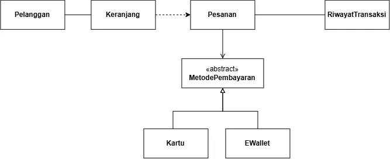

<h1>
IF2150 REKAYASA PERANGKAT LUNAK
 
TUGAS 5
 
SPESIFIKASI KEBUTUHAN PERANGKAT LUNAK (SKPL)
</h1>
 

## *Nama Perangkat Lunak*

### Untuk: *[Nama Asisten]*

Dipersiapkan oleh:
| Informasi | Keterangan |
| --- | --- |
| Kelas | *\[Kelas\]* |
| Kelompok | *\[Nomor Kelompok\]*  |

| NIM | Nama |
|---|---|
| *[NIM 1]* | *[Nama Anggota 1]* |
| *[NIM 2]* | *[Nama Anggota 2]* |
| *[NIM 3]* | *[Nama Anggota 3]* |
| *[NIM 4]* | *[Nama Anggota 4]* |
| *[NIM 5]* | *[Nama Anggota 5]* |
---

## Daftar Perubahan

| Revisi | Deskripsi |
| :--- | :--- |
| *A* | *Deskripsikan perubahan yang dilakukan dari dokumen sebelumnya pada dokumen ini. Jika tidak terdapat perubahan, harap kosongkan tabel.* |
| *B* |  |
| *C* |  |
| ... |  |

 

# BAB 1: Pendahuluan

## 1.1 Tujuan Penulisan Dokumen
Tuliskan dengan ringkas tujuan dokumen SKPL ini dibuat dan siapa saja yang akan menggunakan dokumen ini.

## 1.2 Lingkup Masalah
Tuliskan dengan ringkas nama aplikasi dan deskripsi singkatnya. Bagian ini maksimal berisi satu paragraf, dapat diringkas dari BAB 1 *Analisis Permasalahan* pada dokumen *Topic Brainstorming*.

## 1.3 Definisi, Istilah, dan Singkatan
Semua definisi dan singkatan yang digunakan dalam dokumen ini beserta penjelasannya.

Tabel 1.3. Definisi Istilah dan Singkatan

| Singkatan, Akronim, atau Istilah | Penjelasan |
| :--- | :--- |
| *P/L* | *Singkatan dari Perangkat Lunak, yaitu aplikasi yang memberikan perintah kepada komputer untuk menjalankan tugas tertentu.* |
| *SKPL* | *Singkatan dari Spesifikasi Kebutuhan Perangkat Lunak, yaitu dokumen yang merangkum kriteria-kriteria yang diperlukan untuk membangun aplikasi menjalankan tugasnya.* |
| *KF* | *Singkatan dari Kebutuhan Fungsional.* |
| *KNF* | *Singkatan dari Kebutuhan Non-Fungsional.* |
| *UC* | *Singkatan dari Use Case.* |
| *EARS* | *Easy Approach to Requirements Syntax, yaitu pola penulisan kebutuhan agar konsisten dan mudah diuji.* |
| *...* | *...* |

## 1.4 Aturan Penomoran
Tuliskan aturan penomoran (ID) yang digunakan dalam dokumen ini. Gunakan pola ID yang **sama** dengan yang sudah dipakai pada dokumen-dokumen sebelumnya, jangan membuat pola baru di dokumen ini.

Tabel 1.4. Aturan Penomoran

| Hal/Bagian | Penomoran | Keterangan |
| :--- | :--- | :--- |
| *Kebutuhan Fungsional* | *KFXX* | |
| *Kebutuhan Non-Fungsional* | *KNFXX* | |
| *Aktor* | *AXX* | |
| *Use Case* | *UCXX* | |
| *Kelas* | *CXX* | |
| *...* | *...* |

## 1.5 Referensi
Dokumentasi P/L yang dirujuk oleh dokumen ini. Referensi dapat berupa buku, panduan, ataupun dokumentasi lain yang dipakai dalam pengembangan P/L ini.

## 1.6 Deskripsi Umum Dokumen (Ikhtisar)
Tuliskan sistematika pembahasan dokumen SKPL ini secara runut (misalnya: BAB 2 membahas deskripsi umum P/L, BAB 3 membahas kebutuhan fungsional dan non-fungsional, dst).

---

# BAB 2: Deskripsi Perangkat Lunak

## 2.1 Deskripsi Umum Sistem
Bagian ini dapat disalin dari BAB 1.1 *Deskripsi Umum Sistem* pada dokumen *Requirement Gathering*, disesuaikan bila ada perubahan alur bisnis. Lengkapi dengan gambaran proses bisnis dalam bentuk *Activity Diagram* (boleh disalin dan diperbarui dari 3.3 *Model Proses Bisnis* pada dokumen *Topic Brainstorming*).

<i>Gambar 1. Contoh Activity Diagram Proses Bisnis</i>

## 2.2 Deskripsi Umum Perangkat Lunak
Diisi dengan deskripsi umum perangkat lunak untuk mendukung proses bisnis yang telah diuraikan pada sub-bab sebelumnya. Uraian harus menunjukkan lingkup perangkat lunak, mencakup keterkaitan perangkat lunak dengan sistem lain di luar (misalnya *Payment Gateway* atau layanan pihak ketiga lain yang dipakai).

*Contoh narasi:* "*[Nama P/L]* merupakan aplikasi *[deskripsi singkat]* yang berinteraksi dengan *Payment Gateway (dummy)* untuk memproses otorisasi pembayaran. Sistem menerima input dari *Pelanggan* melalui antarmuka aplikasi dan mengirimkan permintaan transaksi ke *Payment Gateway* setiap kali pelanggan melakukan checkout."

## 2.3 Pengguna dan Kebutuhan Pengguna Perangkat Lunak
Tuliskan seluruh jenis pengguna (*role*/aktor) yang terlibat dalam perangkat lunak (P/L), beserta kebutuhannya secara umum. Bagian ini dapat disalin dari 1.2 *Deskripsi Pengguna Perangkat Lunak* (dokumen Requirement Gathering) atau 3.1 *Identifikasi Aktor* (dokumen Use Case), pastikan sudah konsisten dengan aktor final yang dipakai di BAB 4.

| Pengguna | Kebutuhan |
| :--- | :--- |
| *Pelanggan* | *Pelanggan harus dapat memesan produk, mengelola keranjang, dan menyelesaikan pembayaran melalui sistem.* |
| *...* | *...* |

## 2.4 Batasan Perangkat Lunak
Batasan yang harus dituliskan, di antaranya:
1. *P/L harus memakai file data/API dari sistem lain (sebutkan, misal Payment Gateway dummy).*
2. *P/L harus memakai format data yang sama dengan sistem lain.*
3. *P/L harus berfungsi pada platform tertentu (misal: web browser modern, atau desktop Windows dan Linux).*
4. *...*

## 2.5 Lingkungan Operasi Perangkat Lunak
Spesifikasi *operating system* atau lingkungan yang dibutuhkan P/L untuk beroperasi. Bagian ini digunakan untuk memastikan pengguna memiliki spesifikasi yang cukup untuk menjalankan P/L. Misalnya mencakup komponen server, client, OS, DBMS, tetapi tidak menutupi kemungkinan komponen lain.

| Komponen | Spesifikasi |
| :--- | :--- |
| *Server* | *[contoh: Node.js v20, dijalankan pada layanan cloud]* |
| *Client* | *[contoh: Web Browser modern (Chrome, Firefox terbaru)]* |
| *DBMS* | *[contoh: PostgreSQL 15]* |
| *OS* | *[contoh: Cross-platform (Windows/Linux/MacOS) melalui browser]* |
| *...* | *...* |

---

# BAB 3: Deskripsi Kebutuhan Perangkat Lunak

## 3.1 Kebutuhan Fungsional (KF)

Tabel 3.1. Kebutuhan Fungsional

| ID KF | ID Kebutuhan | Penjelasan |
| --- | --- | --- |
| KF01 | R01 | Sistem harus menampilkan pilihan antarmuka pendaftaran akun untuk setiap opsi pengguna (pelajar dan pengajar) |
| KF02 | R01 | Sistem harus memberikan akses kontrol/privilege berbeda untuk setiap jenis pengguna |
| KF03 | R02 | Sistem harus menampilkan pilihan antarmuka log-in untuk setiap opsi pengguna (pelajar dan pengajar) |
| KF04 | R02 | Ketika pengguna melakukan pendaftaran akun, log in, atau logout, sistem harus memproses permintaan tersebut melalui pengecekan validitas kredensial |
| KF05 | R03 | Setelah pengguna membuat kata sandi, sistem harus menyimpan password dalam bentuk hash adaptif bersalt sebelum disimpan di database |
| KF06 | R04 | Sistem harus menampilkan dokumen Terms & Conditions kepada pengguna saat membuat akun |
| KF07 | R04 | Bila pengguna belum memberikan persetujuan eksplisit terhadap Terms & Conditions, sistem harus menolak menyelesaikan pembuatan akun |
| KF08 | R05 | Sistem harus menampilkan antarmuka materi dan latihan sesuai fitur pembelajaran yang dipilih pengguna |
| KF09 | R06 | Ketika pengguna berada di halaman utama, sistem harus menampilkan daftar materi secara terurut berdasarkan jenis aksara atau tingkat kesulitan |
| KF10 | R08 | Jika tersedia opsi menampilkan outline, sistem harus menampilkan tampilan antarmuka fitur menggambar aksara sesuai dengan opsi outline yang dipilih pengguna |
| KF11 | R08 | Ketika pengguna menggambar aksara, sistem harus merekam dan memproses urutan goresan secara berkelanjutan |
| KF12 | R09 | Ketika pengguna menggoreskan aksara di layar, sistem harus menilai akurasi goresan tersebut terhadap template dengan algoritma yang sesuai |
| KF13 | R11 | Sistem harus menampilkan tampilan antarmuka riwayat pengerjaan latihan pelajar bagi pengajar |
| KF14 | R12 | Setelah pelajar melakukan aktivitas pembelajaran, sistem harus mencatat dan menyimpan riwayat aktivitas tersebut agar dapat diakses pengajar |
| KF15 | R13 | Ketika Tim Materi mengunggah modul atau latihan, sistem harus menyimpan konten tersebut pada penyimpanan terpusat sebagai draf |
| KF16 | R14 | Ketika Tim Materi memilih tindakan yang diizinkan, sistem harus mengubah atau menghapus konten sesuai hak aksesnya |
| KF17 | R16 | Dalam interval waktu yang rutin, sistem harus mencatat dan menyimpan log aktivitas dan error yang terjadi |
| KF18 | R18, R28 | Saat Pelajar atau Pengajar memiliki keluhan atau feedback, sistem harus menerima feedback tersebut melalui form yang tersedia |
| KF19 | R18, R28 | Ketika sistem menerima feedback yang valid dari Pelajar atau Pengajar, sistem harus memvalidasi dan menyimpannya pada server |
| KF20 | R18, R28 | Setelah server menyimpan feedback, sistem harus memberikan konfirmasi kepada pengirim dan menyediakan data feedback untuk pengelolaan sistem |
| KF21 | R19 | Ketika Pelajar memulai latihan bunyi, sistem harus memutar atau merekam pelafalan dan mencocokkannya dengan aksara target |
| KF22 | R20 | Ketika Pelajar mengirim susunan aksara, sistem harus mengevaluasi urutan tersebut terhadap urutan yang benar |
| KF23 | R21 | Ketika Pelajar mengirim hasil transliterasi, sistem harus mengevaluasi kesesuaian aksara dan teks latin |
| KF24 | R22 | Ketika Pelajar membuka halaman progres, sistem harus menampilkan progres, streak, poin, lencana, dan scoreboard |
| KF25 | R23 | Ketika Pengajar mengirim data kelas yang valid, sistem harus membuat kelas dan menghasilkan kode bergabung unik |
| KF26 | R24 | Ketika Pelajar mengirim kode bergabung yang aktif, sistem harus menambahkan Pelajar sebagai anggota kelas |
| KF27 | R25 | Ketika Pengajar menerbitkan tugas, sistem harus menyimpan komponen tugas, instruksi, dan tenggat |
| KF28 | R26 | Ketika Pelajar membuka atau mengirim tugas, sistem harus menampilkan tugas aktif dan menyimpan status pengumpulan termasuk keterlambatan |

## 3.2 Kebutuhan Non-Fungsional (KNF)
Salin ulang Kebutuhan Non-Fungsional dari BAB 2.5 dokumen *Requirement Gathering*, sesuaikan ID Kebutuhan (kolom "ID Kebutuhan") apabila terjadi perubahan penomoran pada BAB 3.1 di atas.

Tabel 3.2. Kebutuhan Non-Fungsional

| ID KNF | ID Kebutuhan | Parameter | Deskripsi Kebutuhan |
| :--- | :--- | :--- | :--- |
| *KNF01* | *R03* | *Reliability* | *Proses transaksi pembayaran harus memenuhi prinsip ACID untuk mencegah terjadinya data tersangkut (lost update) apabila terjadi kegagalan jaringan di tengah proses.* |
| *KNF02* | *R04* | *Security* | *Sistem harus mengenkripsi PIN atau password pengguna menggunakan algoritma SHA-256 sebelum data dikirimkan ke server, serta tidak menyimpannya dalam bentuk plain-text di database.* |
| *...* | *...* | *...* | *...* |

*Silakan pilih parameter yang relevan dengan P/L kalian (Availability, Reliability, Ergonomy, Portability, Memory, Response time, Safety, Security, dsb), tidak perlu semua parameter diisi. Lihat kembali dokumen Requirement Gathering untuk penjelasan tiap parameter.*

---

# BAB 4: Pemodelan Use Case

## 4.1 Identifikasi Aktor
Salin ulang daftar aktor final dari BAB 3.1 dokumen *Use Case & Scenario Use Case* atau *Class Diagram*. Tambahkan ID Aktor mengikuti Aturan Penomoran pada 1.4.

| ID Aktor | Aktor | Deskripsi |
| :--- | :--- | :--- |
| *A01* | *Pelanggan* | *Pengguna yang memesan produk, mengelola keranjang, dan menyelesaikan pembayaran melalui sistem.* |
| *...* | *...* | *...* |

## 4.2 Identifikasi Use Case
Salin ulang daftar Use Case versi terbaru dari BAB 3.2 dokumen *Class Diagram*, pastikan seluruh ID KF yang dirujuk sudah sesuai dengan tabel pada 3.1.

| ID UC | Nama Use Case | Deskripsi Singkat | Aktor | ID KF |
| :--- | :--- | :--- | :--- | :--- |
| *UC01* | *Memesan Produk* | *Pelanggan memilih produk hingga pesanan tersimpan di sistem.* | *Pelanggan* | *KF01, KF02* |
| *UC02* | *Melihat Keranjang* | *Pelanggan melihat daftar item yang telah dipilih sebelum checkout.* | *Pelanggan* | *KF02* |
| *UC03* | *Melakukan Pembayaran* | *Pelanggan menyelesaikan pembayaran atas pesanan yang dibuat.* | *Pelanggan* | *KF03, KF04, KF05* |
| *UC04* | *Memilih Metode Pembayaran* | *Pelanggan memilih metode pembayaran alternatif (kartu atau e-wallet).* | *Pelanggan* | *KF03* |
| *UC05* | *Melihat Riwayat Pesanan* | *Pelanggan melihat daftar pesanan yang pernah dibuat beserta statusnya.* | *Pelanggan* | *KF06* |
| *...* | *...* | *...* | *...* | *...* |

## 4.3 Use Case Diagram
Salin ulang Use Case Diagram dari BAB 3.3 dokumen *Use Case & Scenario Use Case* atau *Class Diagram* (gunakan versi paling akhir/terbaru apabila terdapat perubahan).

<i>Gambar 2. Contoh Use Case Diagram</i>

## 4.4 Skenario Use Case
Salin ulang skenario **setiap** use case (skenario normal dan alternatif) dari BAB 3.4 dokumen *Use Case & Scenario Use Case*, sesuaikan dengan daftar UC final pada 4.2. Jika use case melibatkan lebih dari satu aktor manusia yang benar-benar berinteraksi langsung (misalnya *Kasir* yang memverifikasi transaksi setelah *Pelanggan* membayar), tambahkan kolom aksi tersendiri untuk aktor tersebut di samping kolom "Reaksi Perangkat Lunak". Sistem eksternal otomatis seperti *payment gateway* **bukan aktor**, sehingga interaksinya cukup dituliskan sebagai bagian dari "Reaksi Perangkat Lunak", bukan kolom aktor terpisah.

### 4.4.1 Skenario UC01

**Nama Use Case:** *Memesan Produk*

**Skenario Normal**

| No | Aksi Aktor | Reaksi Perangkat Lunak |
| :--- | :--- | :--- |
| 1 | *Pelanggan memilih produk dari katalog* | *Sistem menampilkan detail produk dan menambahkannya ke keranjang* |
| 2 | *Pelanggan menekan tombol checkout* | *Sistem membuat pesanan baru dari isi keranjang dan menampilkan ringkasan pesanan* |
| ... | *...* | *...* |

**Skenario Alternatif 1: Produk Tidak Tersedia**

| No | Aksi Aktor | Reaksi Perangkat Lunak |
| :--- | :--- | :--- |
| 1 | *Pelanggan memilih produk dari katalog* | *Sistem menampilkan pesan "Produk tidak tersedia" karena stok habis* |
| 2 | *Pelanggan memilih produk lain* | *Sistem kembali ke langkah 1 skenario normal* |
| ... | *...* | *...* |

*Lanjutkan pola 4.4.x ini untuk setiap ID UC pada 4.2, sampai seluruh use case memiliki skenarionya masing-masing.*

---

# BAB 5: Pemodelan Kelas

## 5.1 Identifikasi Kelas
Salin ulang seluruh kelas yang telah diidentifikasi dari BAB 4.1 dokumen *Class Diagram*.

| ID Kelas | Nama Kelas | Deskripsi Kelas | ID Use Case |
| :--- | :--- | :--- | :--- |
| *C01* | *Pelanggan* | *Menyimpan data akun pelanggan yang membuat pesanan.* | *UC01, UC05* |
| *C02* | *Pesanan* | *Menyimpan data pesanan beserta status pembayarannya.* | *UC01, UC03, UC05* |
| *C03* | *Keranjang* | *Menyimpan sementara item yang dipilih sebelum checkout.* | *UC01, UC02* |
| *...* | *...* | *...* | *...* |

## 5.2 Diagram Kelas per Use Case
Salin ulang diagram kelas untuk setiap use case dari BAB 4.2 dokumen *Class Diagram*, lengkap dengan tabel atribut dan metode/operasinya.

### 5.2.1 Use Case UC01

**Nama Use Case:** *Memesan Produk*

<i>Gambar 3. Contoh Diagram Kelas Use Case UC01</i>

| ID Kelas | Nama Kelas | Atribut | Metode/Operasi |
| :--- | :--- | :--- | :--- |
| *C02* | *Pesanan* | *idPesanan, total, status* | *buatPesanan(), hitungTotal()* |
| *C03* | *Keranjang* | *daftarItem* | *tambahItem(), checkout()* |
| *...* | *...* | *...* | *...* |

> Lanjutkan pola **5.2.x** untuk setiap use case pada 4.2.

## 5.3 Diagram Kelas Keseluruhan
Gabungkan seluruh kelas dan hubungan antarkelas dari BAB 4.3 dokumen *Class Diagram* menjadi satu diagram kelas keseluruhan. Pastikan tidak ada kelas yang terduplikasi atau tertinggal.

<i>Gambar 4. Contoh Diagram Kelas Keseluruhan</i>

| ID Kelas | Nama Kelas | Atribut | Metode/Operasi |
| :--- | :--- | :--- | :--- |
| *C01* | *Pelanggan* | *idPelanggan, nama, email* | *lihatRiwayatPesanan()* |
| *C02* | *Pesanan* | *idPesanan, total, status* | *hitungTotal(), perbaruiStatus()* |
| *...* | *...* | *...* | *...* |

---

# BAB 6: Traceability
Salin ulang tabel Traceability dari BAB 5 dokumen *Class Diagram*, cocokkan setiap Kebutuhan Fungsional, Use Case, dan Kelas yang saling terkait.

| ID Kelas | ID Use Case | ID KF |
| :--- | :--- | :--- |
| *C01* | *UC01, UC05* | *KF01, KF06* |
| *C02* | *UC01, UC03, UC05* | *KF01, KF02, KF05, KF06* |
| *C03* | *UC01, UC02* | *KF01, KF02* |
| *...* | *...* | *...* |

---

# Referensi
- Diagram UML: [https://www.drawio.com/](https://www.drawio.com/), [https://staruml.io/](https://staruml.io/)
