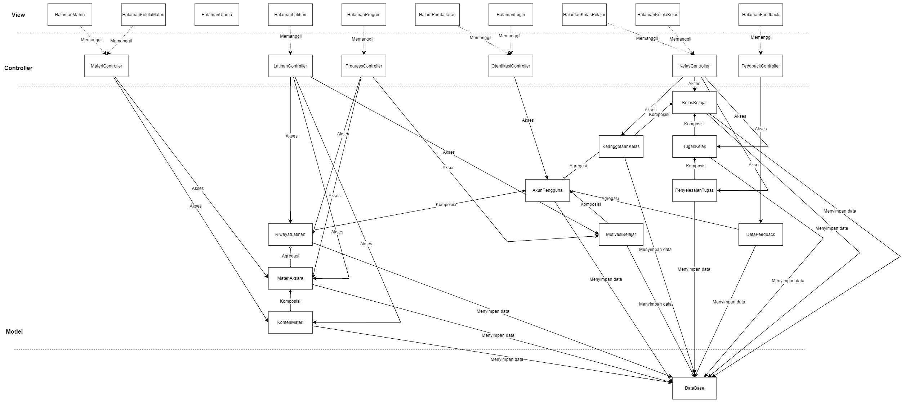

<h1>
IF2150 REKAYASA PERANGKAT LUNAK
 
TUGAS 6
 
ARSITEKTUR PERANGKAT LUNAK (APL)
</h1>
 

## Ngaksara

### Untuk: Amanda Aurellia Salsabilla

Dipersiapkan oleh:
| Informasi | Keterangan |
| --- | --- |
| Kelas | K2 |
| Kelompok | 4 |

| NIM      | Nama                           |
| -------- | ------------------------------ |
| 13525026 | Ryuza Nadif Aldebaran          |
| 13525029 | Muhammad Naufal Hilmi          |
| 13525077 | Muhammad Abduh                 |
| 13525107 | Nathaniel Marvelo              |
| 13525113 | Diandra Aria Yufana            |
| 13525143 | Natan Danuarta Ariel Wicaksana |

---

 
 

# BAB 1: Style/Pattern Arsitektur Acuan

## 1.1 Style/Pattern yang Dipilih

Ngaksara menggunakan arsitektur client-server dengan pola Model-View-Controller (MVC). Pengguna mengakses aplikasi melalui browser sebagai client, sedangkan server mengolah permintaan dan menyimpan data. Bagian server dibangun sebagai satu aplikasi Laravel dengan pembagian tugas sebagai berikut:

- Model mengelola data dan aturan aplikasi, seperti akun pengguna, materi, hasil latihan, dan kelas.
- View menampilkan halaman yang digunakan Pelajar, Pengajar, dan Tim Materi.
- Controller menerima permintaan dari pengguna, memprosesnya dengan bantuan Model, lalu menyiapkan hasil untuk ditampilkan melalui View.

Data aplikasi disimpan pada `Database` (MySQL 8.4), berkas materi, gambar, audio, dan template aksara disimpan pada `PenyimpananBerkas`, sedangkan log aktivitas dan error dicatat pada `LogAplikasi`.

## 1.2 Alasan Pemilihan

Kami memilih client-server karena Ngaksara digunakan oleh tiga jenis pengguna yang mengakses data yang saling berkaitan. Misalnya, hasil latihan Pelajar perlu disimpan agar dapat ditampilkan pada halaman progres dan dipantau oleh Pengajar sesuai hak aksesnya. Pengelolaan data di server mendukung kebutuhan tersebut, termasuk pembatasan akses pengguna pada KF02 dan pencatatan riwayat pada KF14.

Pola MVC dipilih agar tampilan, pengolahan permintaan, dan pengelolaan data memiliki tanggung jawab yang jelas. Pembagian ini memudahkan anggota kelompok mengerjakan bagian aplikasi dan melakukan perbaikan. Contohnya, perubahan tampilan latihan tidak perlu mengubah cara penyimpanan riwayat belajar.

Untuk memenuhi kebutuhan respons menggambar pada KNF04, goresan langsung ditampilkan melalui Canvas di browser tanpa menunggu server. Server tetap menangani penilaian akhir dan penyimpanan hasil. Pemeriksaan hak akses serta penyimpanan kata sandi dalam bentuk hash juga dilakukan di server untuk mendukung KF05 dan KNF02. Server juga mencatat log aktivitas dan error untuk mendukung KF17 dan KNF01. Rancangan ini cukup sederhana untuk demonstrasi melalui localhost atau LAN, meskipun pengguna tetap membutuhkan koneksi ke server untuk menyimpan data.

## 1.3 Diagram Penerapan Arsitektur
Diagram berikut menunjukkan pembagian komponen Ngaksara berdasarkan pola MVC serta hubungannya dengan penyimpanan dan pencatatan log.

<i>Gambar 1. Contoh Arsitektur MVC</i>

Halaman View dirender menggunakan Blade di server, lalu hasilnya ditampilkan di browser. Permintaan pengguna dikirim ke Controller, sedangkan Model digunakan untuk mengelola data yang dibutuhkan.

## 1.4 Lingkungan Operasi Perangkat Lunak

Tabel 1.1. Lingkungan Operasi Perangkat Lunak

| Komponen | Spesifikasi |
| :--- | :--- |
| Server aplikasi | Laravel 13 dengan PHP 8.4. |
| OS lingkungan demonstrasi | Windows 11 64-bit dan Linux|
| Cara menjalankan demonstrasi | Server pengembangan Laravel pada localhost atau jaringan lokal. |
| Rencana OS jika dipublikasikan | Ubuntu Server 24.04 LTS dengan Nginx dan PHP-FPM 8.4.|
| Basis data | MySQL 8.4 dengan `utf8mb4`. |
| Antarmuka | Blade, HTML, CSS, Bootstrap 5.3, dan JavaScript. Aset disimpan bersama aplikasi. |
| Interaksi menggambar | Canvas API dan Pointer Events. |
| Penyimpanan | Laravel Filesystem pada disk lokal untuk materi, audio, gambar, dan data template. |
| Alokasi awal server | Dua inti CPU, RAM 4 GB untuk proses server dan ruang kosong 10 GB untuk aplikasi serta data awal.|
| Client | Chrome, Edge, atau Firefox versi stabil yang tersedia.|
| Perangkat pengguna | Mouse atau layar sentuh, browser dengan JavaScript aktif, serta speaker/headphone untuk latihan audio. |
| Jaringan demonstrasi | Localhost atau LAN. Koneksi internet tidak menjadi ketergantungan runtime apabila seluruh aset dan server tersedia secara lokal. |
| Integrasi eksternal | Tidak digunakan pada implementasi awal. |
| Pemeliharaan | Pengembang memeriksa log aplikasi dan kondisi server menggunakan sarana operasional. Tidak ditambahkan aktor Administrator maupun antarmuka pemeliharaan baru. |

---

# BAB 2: Identifikasi Komponen / Modul / Subsistem

Tabel 2.1. Identifikasi Komponen/Modul/Subsistem

| Nama Komponen/Modul/Subsistem | Jenis | Penjelasan |
| :--- | :--- | :--- |
| `HalamanPendaftaran` | View | Menampilkan form pendaftaran, pemilihan peran pengguna, dan persetujuan Terms & Conditions. |
| `HalamanLogin` | View | Menampilkan form untuk memasukkan kredensial login. |
| `HalamanUtama` | View | Menampilkan navigasi utama setelah pengguna berhasil masuk ke sistem. |
| `HalamanMateri` | View | Menampilkan antarmuka bagi Pelajar untuk memilih dan mempelajari materi, termasuk memutar audio pengucapan. |
| `HalamanLatihan` | View | Menampilkan antarmuka latihan menulis, mencocokkan bunyi, merangkai aksara, dan transliterasi. |
| `HalamanProgres` | View | Menampilkan riwayat, progres, rekomendasi materi, dan indikator motivasi belajar Pelajar. |
| `HalamanKelasPelajar` | View | Menampilkan antarmuka bagi Pelajar untuk bergabung ke kelas, melihat tugas, dan mengumpulkan tugas. |
| `HalamanKelolaKelas` | View | Menampilkan antarmuka bagi Pengajar untuk mengelola kelas dan memantau anggotanya. |
| `HalamanKelolaMateri` | View | Menampilkan antarmuka bagi Tim Materi untuk mengunggah dan menyunting materi. |
| `HalamanFeedback` | View | Menampilkan form untuk mengirim feedback aplikasi, materi, atau pengalaman penggunaan. |
| `OtentikasiController` | Controller | Memvalidasi pendaftaran dan login, serta memproses autentikasi pengguna. |
| `MateriController` | Controller | Mengambil, mengurutkan, memuat, dan memperbarui data materi. |
| `LatihanController` | Controller | Menyiapkan soal latihan, menilai jawaban, serta memperbarui riwayat dan motivasi belajar. |
| `ProgresController` | Controller | Mengolah riwayat dan progres belajar, menyiapkan rekomendasi materi serta papan peringkat. |
| `KelasController` | Controller | Memproses keanggotaan kelas, data kelas, tugas, dan pengambilan data kelas. |
| `FeedbackController` | Controller | Memvalidasi dan menyimpan feedback, serta menyiapkan konfirmasi pengiriman. |
| `AkunPengguna` | Model | Menyimpan kredensial, profil, dan peran Pelajar, Pengajar, atau Tim Materi. |
| `MateriAksara` | Model | Menyimpan metadata materi, jenis aksara, dan tingkat kesulitan. |
| `KontenMateri` | Model | Menyimpan isi materi, contoh, aturan, template aksara, referensi audio, dan versi konten. |
| `RiwayatLatihan` | Model | Menyimpan hasil latihan, status, dan waktu pengerjaan Pelajar. |
| `MotivasiBelajar` | Model | Menyimpan streak, poin, dan badge Pelajar untuk motivasi dan papan peringkat. |
| `KelasBelajar` | Model | Menyimpan data kelas, pemilik kelas, kode bergabung, dan pengaturan kelas. |
| `KeanggotaanKelas` | Model | Menyimpan hubungan Pelajar dengan kelas dan status keanggotaannya. |
| `TugasKelas` | Model | Menyimpan instruksi, komponen, dan tenggat tugas. |
| `PenyelesaianTugas` | Model | Menyimpan status dan waktu pengumpulan tugas oleh Pelajar. |
| `DataFeedback` | Model | Menyimpan feedback, pengirim, waktu kirim, dan status tindak lanjut. |
| `Database` | Penyimpanan Data | Menyimpan seluruh data Model secara persisten pada MySQL 8.4 yang digunakan aplikasi. |
| `PenyimpananBerkas` | Penyimpanan Data | Menyimpan berkas materi, gambar, audio pengucapan, dan template aksara pada disk lokal server melalui Laravel Filesystem. |
| `LogAplikasi` | Komponen Pendukung | Mencatat log aktivitas dan error aplikasi untuk keperluan pemeliharaan oleh pengembang. |

---

# BAB 3: Model Arsitektur Perangkat Lunak

## 3.1 Logical View

Logical View dipilih untuk menggambarkan Ngaksara karena view ini menunjukkan pembagian tanggung jawab antarkomponen secara langsung yang merupakan inti dari pola MVC. Selain itu, Logical View juga cocok dengan Ngaksara karena Ngaksara dipakai oleh peran Pelajar, Pengajar, juga Tim Materi dengan halaman dan akses yang berbeda. Logical View dapat memperlihatkan perbedaan halaman yang melayani tiap peran.

<i>Gambar 2. Contoh Logical View pada P/L E-Commerce</i>

Hubungan Antarkomponen pada diagram tersebut adalah sebagai berikut.

| Label | Arah | Makna |
| :--- | :--- | :--- |
| Memanggil | *View* → *Controller* | Halaman meneruskan permintaan pengguna ke Controller yang menangani fiturnya |
| Akses | *Controller* → *Model* | Controller membaca atau mengubah data melalui Model |
| Menyimpan data | *Model* → `Database` | Model menyimpan datanya pada MySQL |
| Komposisi | antar-*Model* | Satu Model menjadi bagian yang tidak berdiri sendiri dari Model lain |
| Agregasi | antar-*Model* | Satu Model terhubung ke Model lain, tetapi keduanya tetap dapat berdiri sendiri |

Hubungan mengalir dari lapisan atas ke bawah: *View*, *Controller*, *Model*, lalu `Database`. *View* tidak mengakses *Model* secara langsung, dan *Model* tidak memanggil *Controller*. Dengan begitu, perubahan tampilan tidak memengaruhi cara data disimpan, sesuai alasan pemilihan MVC pada Bab 1.

Hubungan antar-*Model* pada diagram adalah sebagai berikut.
- **Komposisi:** `AkunPengguna` dengan `RiwayatLatihan` dan `MotivasiBelajar`, karena riwayat dan motivasi selalu milik satu akun. `MateriAksara` dengan `KontenMateri`, karena isi materi tidak berdiri tanpa metadatanya. `KelasBelajar` dengan `KeanggotaanKelas` dan `TugasKelas`, serta `TugasKelas` dengan `PenyelesaianTugas`.
- **Agregasi:** `RiwayatLatihan` dengan `MateriAksara`, serta `AkunPengguna` dengan `KeanggotaanKelas` dan `DataFeedback`.

Alur Interaksi 

1. `HalamanPendaftaran` dan `HalamanLogin` memanggil `OtentikasiController`. Controller memvalidasi kredensial dan mengakses `AkunPengguna`. Akun yang tersimpan menjadi dasar hak akses ketiga peran pada alur berikutnya.
2. `HalamanMateri` memanggil `MateriController`, yang mengakses `MateriAksara` untuk daftar dan metadata materi serta `KontenMateri` untuk isi dan audio pengucapan. `HalamanUtama` berperan sebagai navigasi menuju halaman-halaman tersebut.
3. `HalamanLatihan` memanggil `LatihanController`. Controller mengakses `MateriAksara` dan `KontenMateri` untuk menyiapkan soal, menilai jawaban, lalu mengakses `RiwayatLatihan` untuk menyimpan hasilnya dan `MotivasiBelajar` untuk memperbarui streak dan poin.
4. `HalamanProgres` memanggil `ProgressController`, yang mengakses `RiwayatLatihan` untuk menghitung penguasaan, `MateriAksara` untuk rekomendasi materi, dan `MotivasiBelajar` untuk streak, poin, badge, dan papan peringkat.
5. `HalamanKelolaKelas` (Pengajar) dan `HalamanKelasPelajar` (Pelajar) sama-sama memanggil `KelasController`. Controller ini mengakses `KelasBelajar`, `KeanggotaanKelas`, `TugasKelas`, dan `PenyelesaianTugas` untuk membuat kelas, memproses kode bergabung, menerbitkan tugas, dan mencatat status pengumpulan.
6. `HalamanKelolaMateri` memanggil `MateriController`, yang mengakses `MateriAksara` dan `KontenMateri` untuk menambah atau memperbarui materi.
7. `HalamanFeedback` memanggil `FeedbackController`, yang mengakses `DataFeedback` untuk menyimpan masukan.

Pada semua alur tersebut, data pada setiap Model akhirnya disimpan ke `Database` melalui hubungan "Menyimpan data".

---

# Referensi

- Sommerville, I. (2016). *Software Engineering* (10th ed.). Pearson. Chapter 6: *Architectural Design*: [https://software-engineering-book.com/slides/](https://software-engineering-book.com/slides/)
- Diagram arsitektur: [https://www.drawio.com/](https://www.drawio.com/), [https://staruml.io/](https://staruml.io/)
